# Hugging Face Transformers 总览

[返回 Section 1](index.md)

授课课件：Meng Jiang · CSE 60556 · Fall 2026。来源 `Chapter1-L00 (L02).pdf`，共 **38 页**。

[下载完整原课件 PDF](../../assets/llm/section1/01-hugging-face/slides.pdf)

## 中文复习导读

本讲把整个 Section 1 串起来：先区分 encoder-only、decoder-only 和 encoder-decoder，再用 Hugging Face 加载 tokenizer 和模型，观察 hidden states、mask prediction、文本续写及微调。

复习时沿着“文本 → token IDs → hidden states → 任务输出”读代码。`AutoModel` 提供模型表示，`AutoModelForCausalLM` 面向自回归生成，`AutoModelForSeq2SeqLM` 面向编码器—解码器生成。不要把 token 的编号与它的向量表示混为一谈。

课件后半段介绍 scaling laws、GPT-3、MoE、Seq2Seq 和 instruction fine-tuning，并列出深入阅读材料。微调示例中的训练损失下降，不能单独证明模型能处理未见过的任务。

## 全部 Beamer 页面

下面按原 PDF 页序完整呈现，包括目录、公式、图表、代码、例子与参考文献。点击图片可放大；每页下方可展开文字并搜索或复制。文字由 PDF 提取，公式和代码排版以原图及 PDF 为准；这里没有重建原始 LaTeX 源码。

### 001 · Hugging Face Transformers

[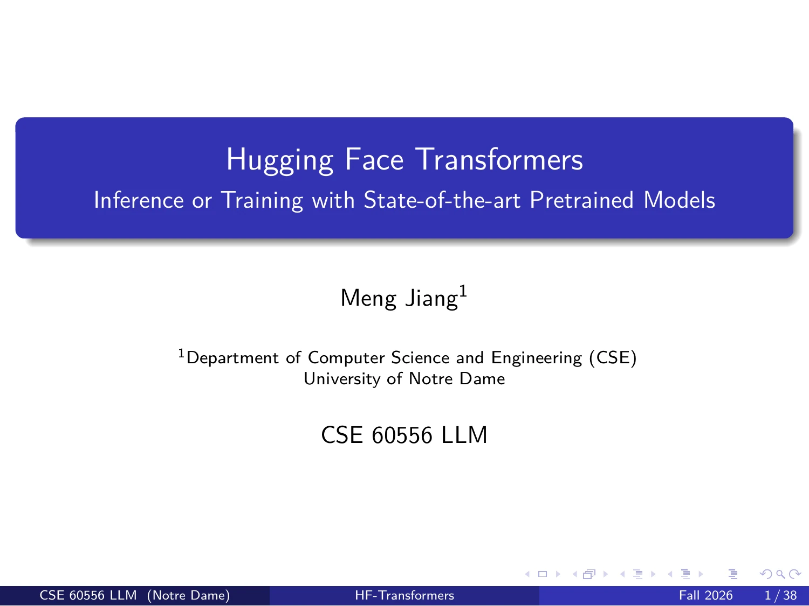{ loading=lazy }](../../assets/llm/section1/01-hugging-face/page-001.webp)

展开本页文字

<pre style="white-space:pre-wrap;overflow-wrap:anywhere">Hugging Face Transformers
Inference or Training with State-of-the-art Pretrained Models
Meng Jiang 1
1Department of Computer Science and Engineering (CSE)
University of Notre Dame
CSE 60556 LLM</pre>

### 002 · Table of Contents

[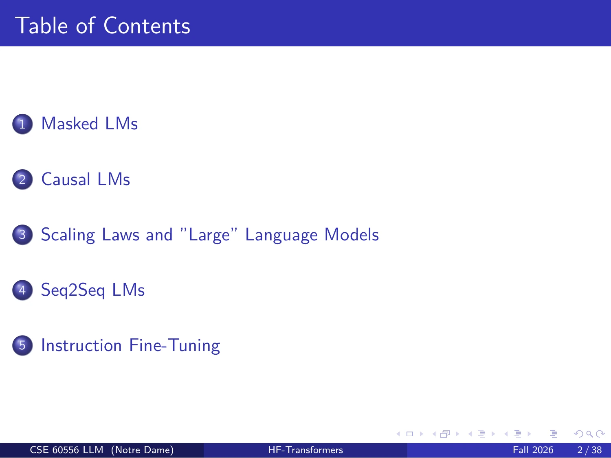{ loading=lazy }](../../assets/llm/section1/01-hugging-face/page-002.webp)

展开本页文字

<pre style="white-space:pre-wrap;overflow-wrap:anywhere">Table of Contents
1 Masked LMs
2 Causal LMs
3 Scaling Laws and ”Large” Language Models
4 Seq2Seq LMs
5 Instruction Fine-Tuning</pre>

### 003 · Table of Contents

[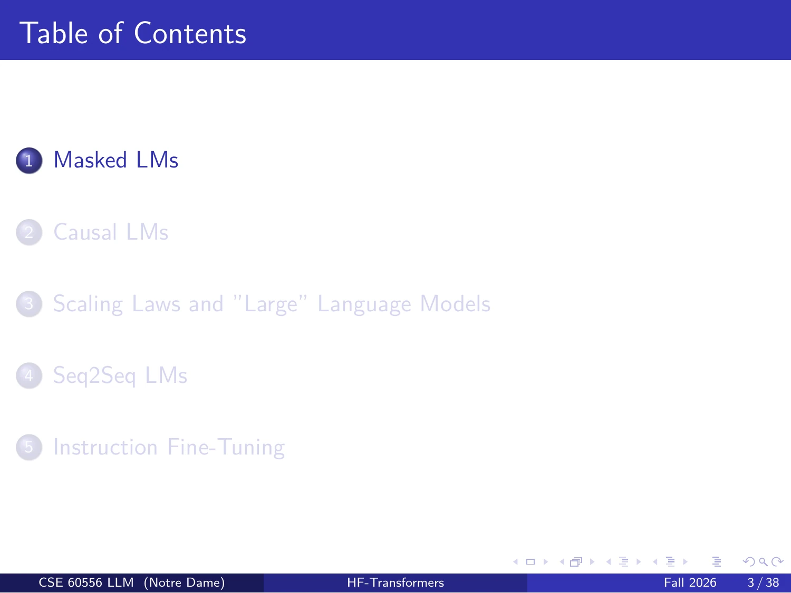{ loading=lazy }](../../assets/llm/section1/01-hugging-face/page-003.webp)

展开本页文字

<pre style="white-space:pre-wrap;overflow-wrap:anywhere">Table of Contents
1 Masked LMs
2 Causal LMs
3 Scaling Laws and ”Large” Language Models
4 Seq2Seq LMs
5 Instruction Fine-Tuning</pre>

### 004 · Word Embeddings via Masked Word Prediction

[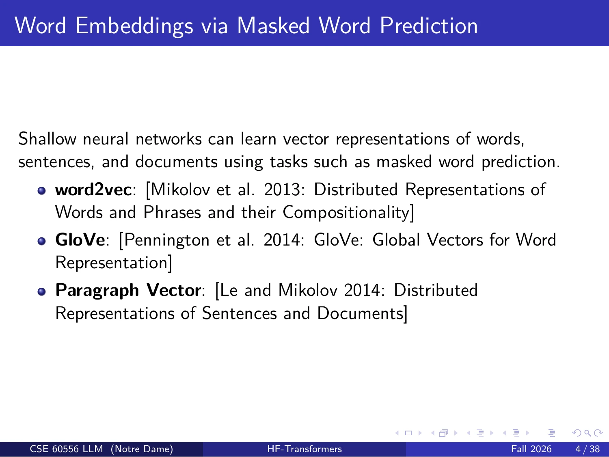{ loading=lazy }](../../assets/llm/section1/01-hugging-face/page-004.webp)

展开本页文字

<pre style="white-space:pre-wrap;overflow-wrap:anywhere">Word Embeddings via Masked Word Prediction
Shallow neural networks can learn vector representations of words,
sentences, and documents using tasks such as masked word prediction.
word2vec: [ Mikolov et al. 2013 : Distributed Representations of
Words and Phrases and their Compositionality]
GloVe: [ Pennington et al. 2014 : GloVe: Global Vectors for Word
Representation]
Paragraph Vector: [ Le and Mikolov 2014 : Distributed
Representations of Sentences and Documents]</pre>

### 005 · Transformers on Hugging Face

[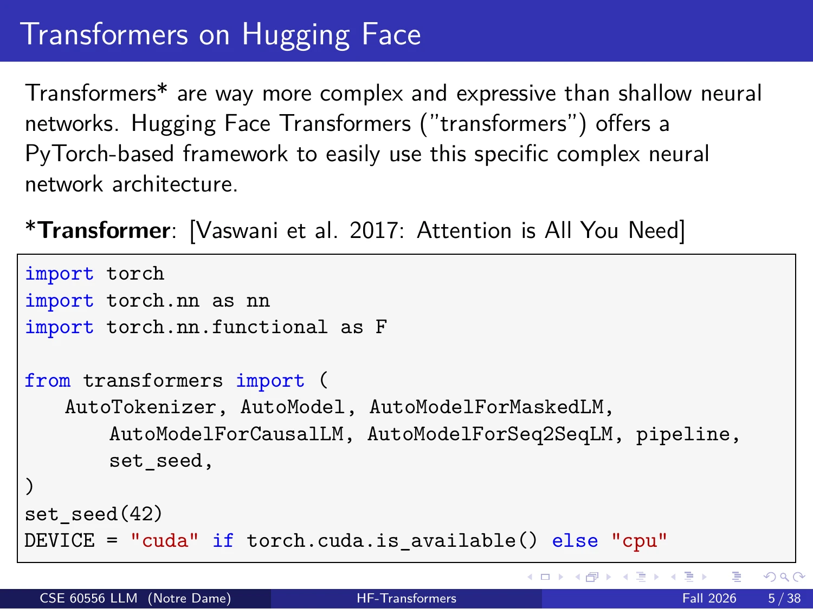{ loading=lazy }](../../assets/llm/section1/01-hugging-face/page-005.webp)

展开本页文字

<pre style="white-space:pre-wrap;overflow-wrap:anywhere">Transformers on Hugging Face
Transformers* are way more complex and expressive than shallow neural
networks. Hugging Face Transformers (”transformers”) offers a
PyTorch-based framework to easily use this specific complex neural
network architecture.
*Transformer: [ Vaswani et al. 2017 : Attention is All You Need]
import torch
import torch.nn as nn
import torch.nn.functional as F
from transformers import (
AutoTokenizer, AutoModel, AutoModelForMaskedLM,
AutoModelForCausalLM, AutoModelForSeq2SeqLM, pipeline,
set_seed,
)
set_seed(42)
DEVICE = &quot;cuda&quot; if torch.cuda.is_available() else &quot;cpu&quot;</pre>

### 006 · Three Types of Transformer-based Language Models

[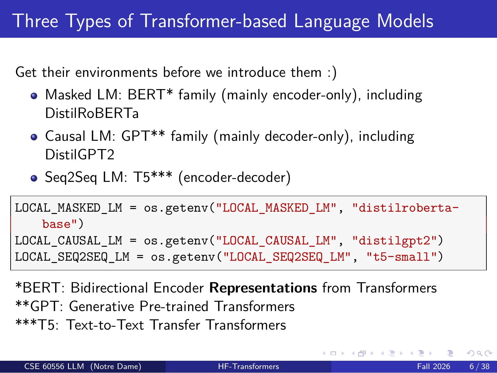{ loading=lazy }](../../assets/llm/section1/01-hugging-face/page-006.webp)

展开本页文字

<pre style="white-space:pre-wrap;overflow-wrap:anywhere">Three Types of Transformer-based Language Models
Get their environments before we introduce them :)
Masked LM: BERT* family (mainly encoder-only), including
DistilRoBERTa
Causal LM: GPT** family (mainly decoder-only), including
DistilGPT2
Seq2Seq LM: T5*** (encoder-decoder)
LOCAL_MASKED_LM = os.getenv( &quot;LOCAL_MASKED_LM&quot;, &quot;distilroberta-
base&quot;)
LOCAL_CAUSAL_LM = os.getenv( &quot;LOCAL_CAUSAL_LM&quot;, &quot;distilgpt2&quot;)
LOCAL_SEQ2SEQ_LM = os.getenv( &quot;LOCAL_SEQ2SEQ_LM&quot;, &quot;t5-small&quot;)
*BERT: Bidirectional Encoder Representations from Transformers
**GPT: Generative Pre-trained Transformers
***T5: Text-to-Text Transfer Transformers</pre>

### 007 · Three Architectures

[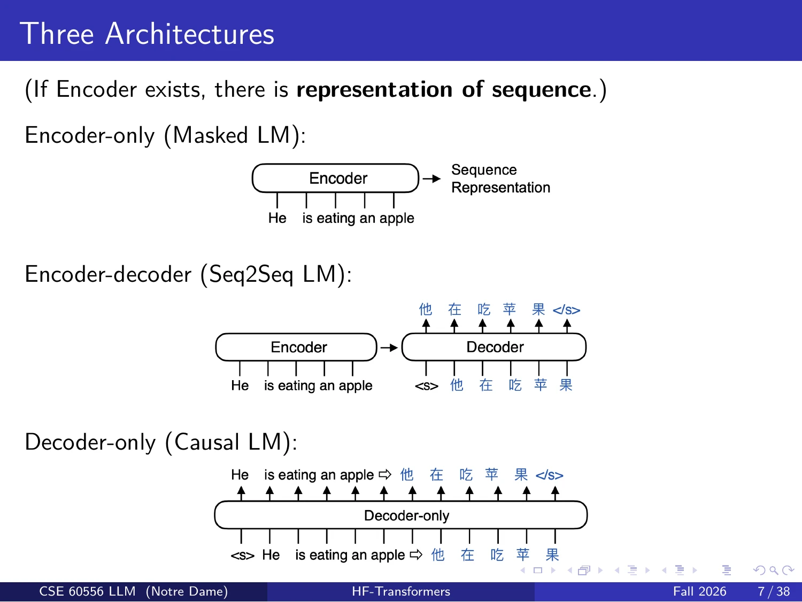{ loading=lazy }](../../assets/llm/section1/01-hugging-face/page-007.webp)

展开本页文字

<pre style="white-space:pre-wrap;overflow-wrap:anywhere">Three Architectures
(If Encoder exists, there is representation of sequence .)
Encoder-only (Masked LM):
Encoder-decoder (Seq2Seq LM):
Decoder-only (Causal LM):</pre>

### 008 · Tokenization

[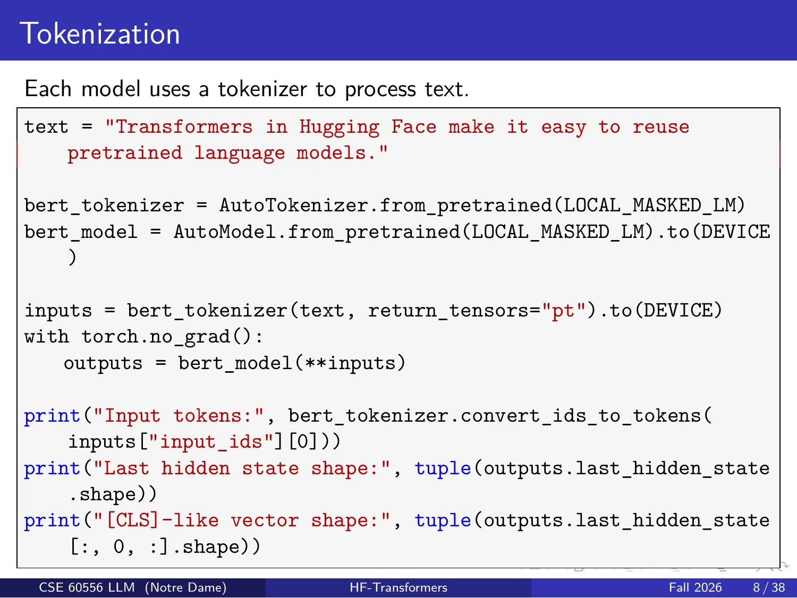{ loading=lazy }](../../assets/llm/section1/01-hugging-face/page-008.webp)

展开本页文字

<pre style="white-space:pre-wrap;overflow-wrap:anywhere">Tokenization
Each model uses a tokenizer to process text.
text = &quot;Transformers in Hugging Face make it easy to reuse
pretrained language models.&quot;
bert_tokenizer = AutoTokenizer.from_pretrained(LOCAL_MASKED_LM)
bert_model = AutoModel.from_pretrained(LOCAL_MASKED_LM).to(DEVICE
)
inputs = bert_tokenizer(text, return_tensors= &quot;pt&quot;).to(DEVICE)
with torch.no_grad():
outputs = bert_model(**inputs)
print(&quot;Input tokens:&quot;, bert_tokenizer.convert_ids_to_tokens(
inputs[&quot;input_ids&quot;][0]))
print(&quot;Last hidden state shape:&quot;, tuple(outputs.last_hidden_state
.shape))
print(&quot;[CLS]-like vector shape:&quot;, tuple(outputs.last_hidden_state
[:, 0, :].shape))</pre>

### 009 · Hidden State

[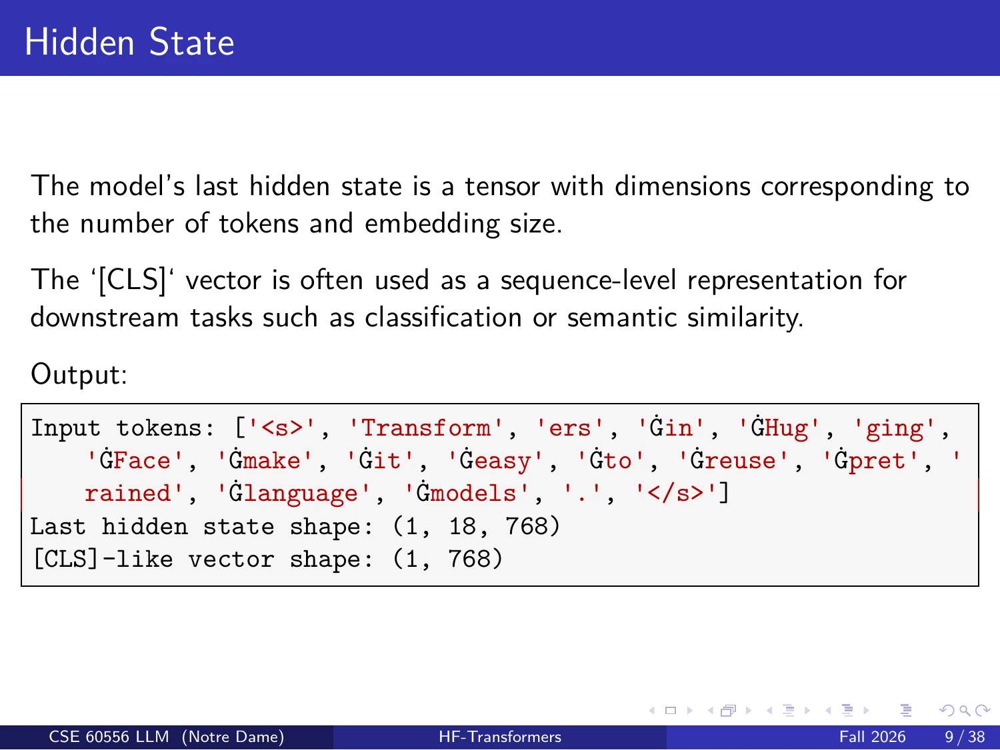{ loading=lazy }](../../assets/llm/section1/01-hugging-face/page-009.webp)

展开本页文字

<pre style="white-space:pre-wrap;overflow-wrap:anywhere">Hidden State
The model’s last hidden state is a tensor with dimensions corresponding to
the number of tokens and embedding size.
The ‘[CLS]‘ vector is often used as a sequence-level representation for
downstream tasks such as classification or semantic similarity.
Output:
Input tokens: [ &#x27;&lt;s&gt;&#x27;, &#x27;Transform&#x27;, &#x27;ers&#x27;, &#x27;Ġin&#x27;, &#x27;ĠHug&#x27;, &#x27;ging&#x27;,
&#x27;ĠFace&#x27;, &#x27;Ġmake&#x27;, &#x27;Ġit&#x27;, &#x27;Ġeasy&#x27;, &#x27;Ġto&#x27;, &#x27;Ġreuse&#x27;, &#x27;Ġpret&#x27;, &#x27;
rained&#x27;, &#x27;Ġlanguage&#x27;, &#x27;Ġmodels&#x27;, &#x27;.&#x27;, &#x27;&lt;/s&gt;&#x27;]
Last hidden state shape: (1, 18, 768)
[CLS]-like vector shape: (1, 768)</pre>

### 010 · Masked Token Prediction

[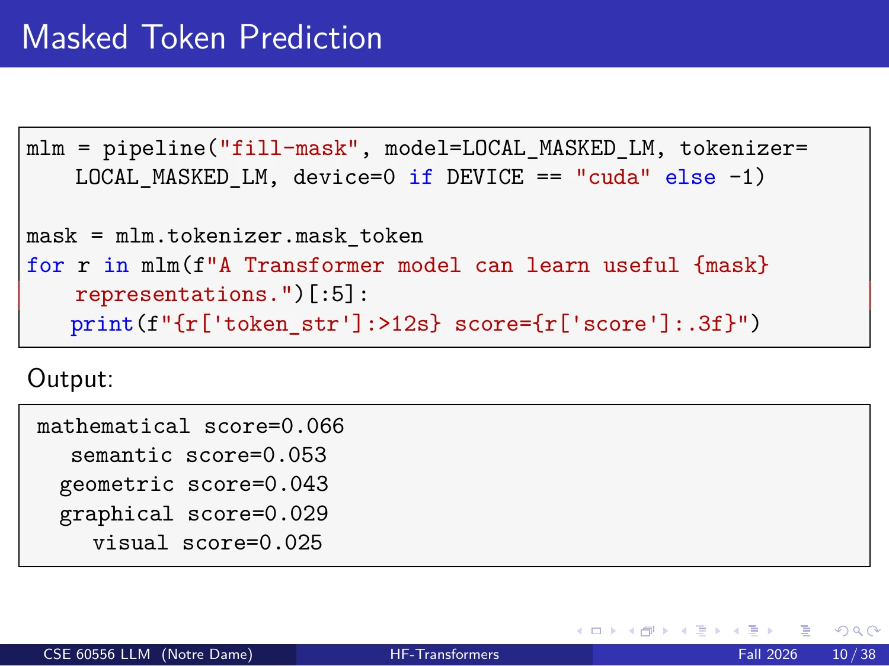{ loading=lazy }](../../assets/llm/section1/01-hugging-face/page-010.webp)

展开本页文字

<pre style="white-space:pre-wrap;overflow-wrap:anywhere">Masked Token Prediction
mlm = pipeline( &quot;fill-mask&quot;, model=LOCAL_MASKED_LM, tokenizer=
LOCAL_MASKED_LM, device=0 if DEVICE == &quot;cuda&quot; else -1)
mask = mlm.tokenizer.mask_token
for r in mlm(f&quot;A Transformer model can learn useful {mask}
representations.&quot;)[:5]:
print(f&quot;{r[&#x27;token_str&#x27;]:&gt;12s} score={r[&#x27;score&#x27;]:.3f}&quot;)
Output:
mathematical score=0.066
semantic score=0.053
geometric score=0.043
graphical score=0.029
visual score=0.025</pre>

### 011 · Masked Token Prediction

[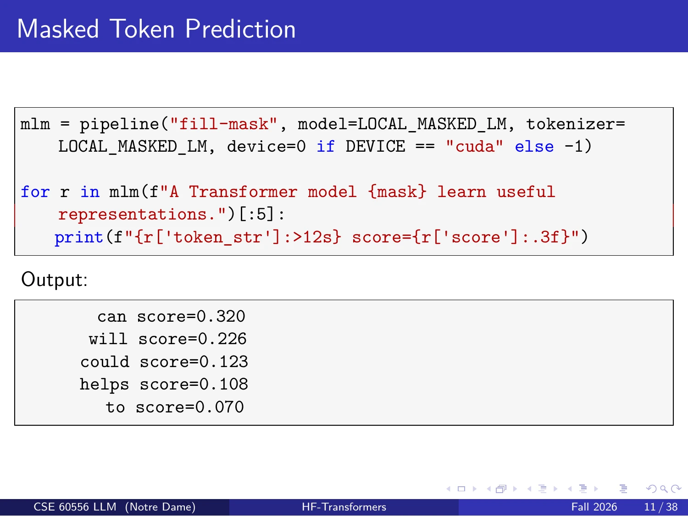{ loading=lazy }](../../assets/llm/section1/01-hugging-face/page-011.webp)

展开本页文字

<pre style="white-space:pre-wrap;overflow-wrap:anywhere">Masked Token Prediction
mlm = pipeline( &quot;fill-mask&quot;, model=LOCAL_MASKED_LM, tokenizer=
LOCAL_MASKED_LM, device=0 if DEVICE == &quot;cuda&quot; else -1)
for r in mlm(f&quot;A Transformer model {mask} learn useful
representations.&quot;)[:5]:
print(f&quot;{r[&#x27;token_str&#x27;]:&gt;12s} score={r[&#x27;score&#x27;]:.3f}&quot;)
Output:
can score=0.320
will score=0.226
could score=0.123
helps score=0.108
to score=0.070</pre>

### 012 · Dive Deep into Masked LMs

[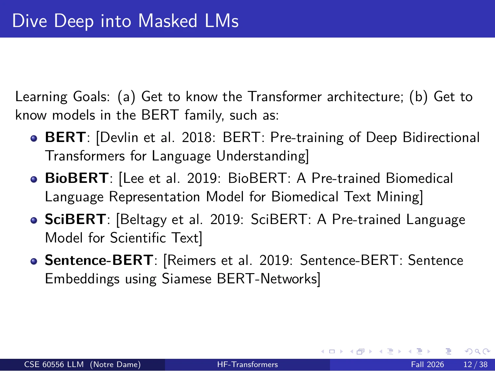{ loading=lazy }](../../assets/llm/section1/01-hugging-face/page-012.webp)

展开本页文字

<pre style="white-space:pre-wrap;overflow-wrap:anywhere">Dive Deep into Masked LMs
Learning Goals: (a) Get to know the Transformer architecture; (b) Get to
know models in the BERT family, such as:
BERT: [ Devlin et al. 2018 : BERT: Pre-training of Deep Bidirectional
Transformers for Language Understanding]
BioBERT: [ Lee et al. 2019 : BioBERT: A Pre-trained Biomedical
Language Representation Model for Biomedical Text Mining]
SciBERT: [ Beltagy et al. 2019 : SciBERT: A Pre-trained Language
Model for Scientific Text]
Sentence-BERT: [ Reimers et al. 2019 : Sentence-BERT: Sentence
Embeddings using Siamese BERT-Networks]</pre>

### 013 · Table of Contents

[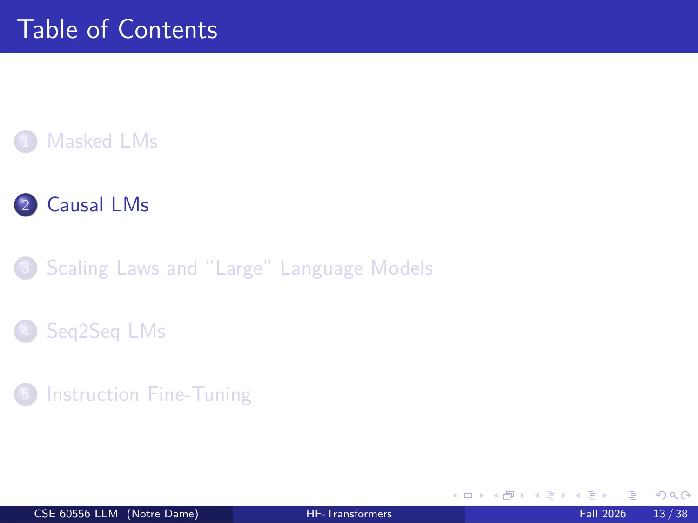{ loading=lazy }](../../assets/llm/section1/01-hugging-face/page-013.webp)

展开本页文字

<pre style="white-space:pre-wrap;overflow-wrap:anywhere">Table of Contents
1 Masked LMs
2 Causal LMs
3 Scaling Laws and ”Large” Language Models
4 Seq2Seq LMs
5 Instruction Fine-Tuning</pre>

### 014 · GPT Completes Sentences

[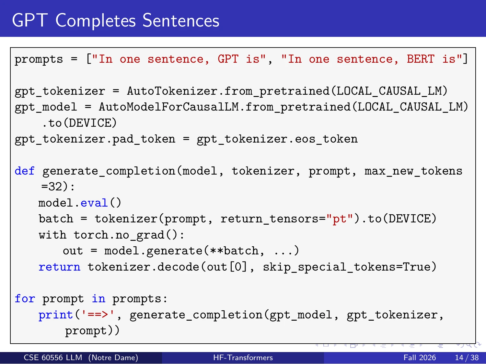{ loading=lazy }](../../assets/llm/section1/01-hugging-face/page-014.webp)

展开本页文字

<pre style="white-space:pre-wrap;overflow-wrap:anywhere">GPT Completes Sentences
prompts = [ &quot;In one sentence, GPT is&quot;, &quot;In one sentence, BERT is&quot;]
gpt_tokenizer = AutoTokenizer.from_pretrained(LOCAL_CAUSAL_LM)
gpt_model = AutoModelForCausalLM.from_pretrained(LOCAL_CAUSAL_LM)
.to(DEVICE)
gpt_tokenizer.pad_token = gpt_tokenizer.eos_token
def generate_completion(model, tokenizer, prompt, max_new_tokens
=32):
model.eval()
batch = tokenizer(prompt, return_tensors= &quot;pt&quot;).to(DEVICE)
with torch.no_grad():
out = model.generate(**batch, ...)
return tokenizer.decode(out[0], skip_special_tokens=True)
for prompt in prompts:
print(&#x27;==&gt;&#x27;, generate_completion(gpt_model, gpt_tokenizer,
prompt))</pre>

### 015 · GPT Completes Sentences

[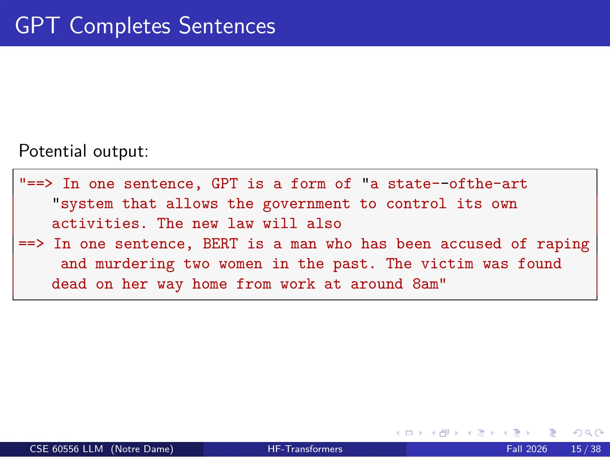{ loading=lazy }](../../assets/llm/section1/01-hugging-face/page-015.webp)

展开本页文字

<pre style="white-space:pre-wrap;overflow-wrap:anywhere">GPT Completes Sentences
Potential output:
&quot;==&gt; In one sentence, GPT is a form of “a state-‑ofthe-art
”system that allows the government to control its own
activities. The new law will also
==&gt; In one sentence, BERT is a man who has been accused of raping
and murdering two women in the past. The victim was found
dead on her way home from work at around 8am&quot;</pre>

### 016 · Fine-Tuning GPTs

[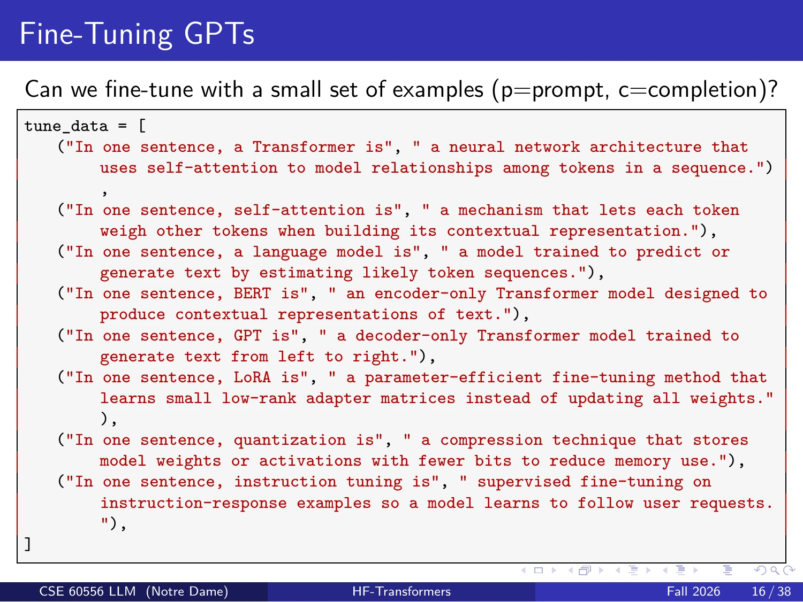{ loading=lazy }](../../assets/llm/section1/01-hugging-face/page-016.webp)

展开本页文字

<pre style="white-space:pre-wrap;overflow-wrap:anywhere">Fine-Tuning GPTs
Can we fine-tune with a small set of examples (p=prompt, c=completion)?
tune_data = [
(&quot;In one sentence, a Transformer is&quot;, &quot; a neural network architecture that
uses self-attention to model relationships among tokens in a sequence.&quot;)
,
(&quot;In one sentence, self-attention is&quot;, &quot; a mechanism that lets each token
weigh other tokens when building its contextual representation.&quot;),
(&quot;In one sentence, a language model is&quot;, &quot; a model trained to predict or
generate text by estimating likely token sequences.&quot;),
(&quot;In one sentence, BERT is&quot;, &quot; an encoder-only Transformer model designed to
produce contextual representations of text.&quot;),
(&quot;In one sentence, GPT is&quot;, &quot; a decoder-only Transformer model trained to
generate text from left to right.&quot;),
(&quot;In one sentence, LoRA is&quot;, &quot; a parameter-efficient fine-tuning method that
learns small low-rank adapter matrices instead of updating all weights.&quot;
),
(&quot;In one sentence, quantization is&quot;, &quot; a compression technique that stores
model weights or activations with fewer bits to reduce memory use.&quot;),
(&quot;In one sentence, instruction tuning is&quot;, &quot; supervised fine-tuning on
instruction-response examples so a model learns to follow user requests.
&quot;),
]</pre>

### 017 · Fine-Tuning GPTs

[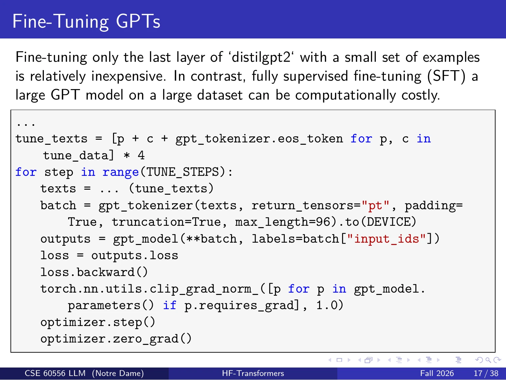{ loading=lazy }](../../assets/llm/section1/01-hugging-face/page-017.webp)

展开本页文字

<pre style="white-space:pre-wrap;overflow-wrap:anywhere">Fine-Tuning GPTs
Fine-tuning only the last layer of ‘distilgpt2‘ with a small set of examples
is relatively inexpensive. In contrast, fully supervised fine-tuning (SFT) a
large GPT model on a large dataset can be computationally costly.
tune_texts = [p + c + gpt_tokenizer.eos_token for p, c in
tune_data] * 4
for step in range(TUNE_STEPS):
texts = ... (tune_texts)
batch = gpt_tokenizer(texts, return_tensors= &quot;pt&quot;, padding=
True, truncation=True, max_length=96).to(DEVICE)
outputs = gpt_model(**batch, labels=batch[ &quot;input_ids&quot;])
loss = outputs.loss
loss.backward()
torch.nn.utils.clip_grad_norm_([p for p in gpt_model.
parameters() if p.requires_grad], 1.0)
optimizer.step()
optimizer.zero_grad()</pre>

### 018 · Fine-Tuning GPTs

[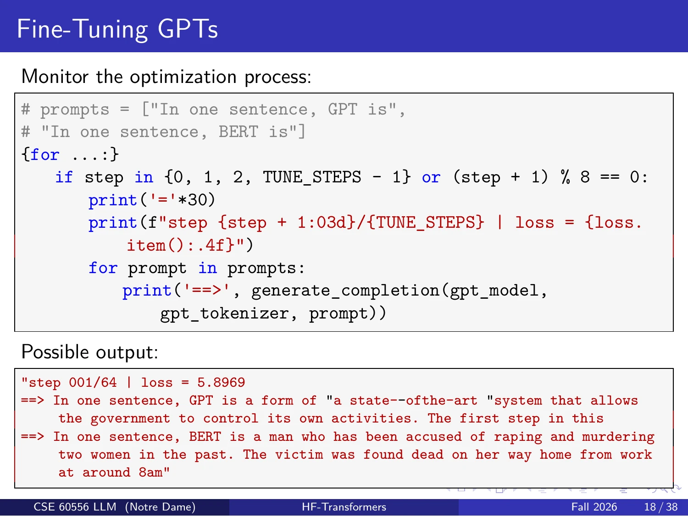{ loading=lazy }](../../assets/llm/section1/01-hugging-face/page-018.webp)

展开本页文字

<pre style="white-space:pre-wrap;overflow-wrap:anywhere">Fine-Tuning GPTs
Monitor the optimization process:
# prompts = [&quot;In one sentence, GPT is&quot;,
# &quot;In one sentence, BERT is&quot;]
{for ...:}
if step in {0, 1, 2, TUNE_STEPS - 1} or (step + 1) % 8 == 0:
print(&#x27;=&#x27;*30)
print(f&quot;step {step + 1:03d}/{TUNE_STEPS} | loss = {loss.
item():.4f}&quot;)
for prompt in prompts:
print(&#x27;==&gt;&#x27;, generate_completion(gpt_model,
gpt_tokenizer, prompt))
Possible output:
&quot;step 001/64 | loss = 5.8969
==&gt; In one sentence, GPT is a form of “a state-‑ofthe-art ”system that allows
the government to control its own activities. The first step in this
==&gt; In one sentence, BERT is a man who has been accused of raping and murdering
two women in the past. The victim was found dead on her way home from work
at around 8am&quot;</pre>

### 019 · Fine-Tuning GPTs

[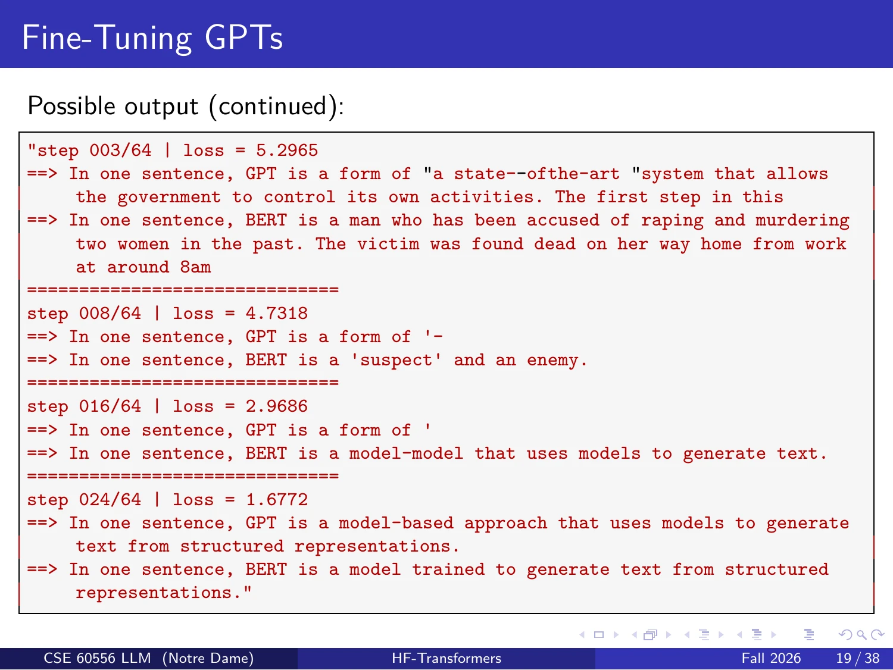{ loading=lazy }](../../assets/llm/section1/01-hugging-face/page-019.webp)

展开本页文字

<pre style="white-space:pre-wrap;overflow-wrap:anywhere">Fine-Tuning GPTs
Possible output (continued):
&quot;step 003/64 | loss = 5.2965
==&gt; In one sentence, GPT is a form of “a state-‑ofthe-art ”system that allows
the government to control its own activities. The first step in this
==&gt; In one sentence, BERT is a man who has been accused of raping and murdering
two women in the past. The victim was found dead on her way home from work
at around 8am
==============================
step 008/64 | loss = 4.7318
==&gt; In one sentence, GPT is a form of &#x27;-
==&gt; In one sentence, BERT is a &#x27;suspect&#x27; and an enemy.
==============================
step 016/64 | loss = 2.9686
==&gt; In one sentence, GPT is a form of &#x27;
==&gt; In one sentence, BERT is a model-model that uses models to generate text.
==============================
step 024/64 | loss = 1.6772
==&gt; In one sentence, GPT is a model-based approach that uses models to generate
text from structured representations.
==&gt; In one sentence, BERT is a model trained to generate text from structured
representations.&quot;</pre>

### 020 · Fine-Tuning GPTs

[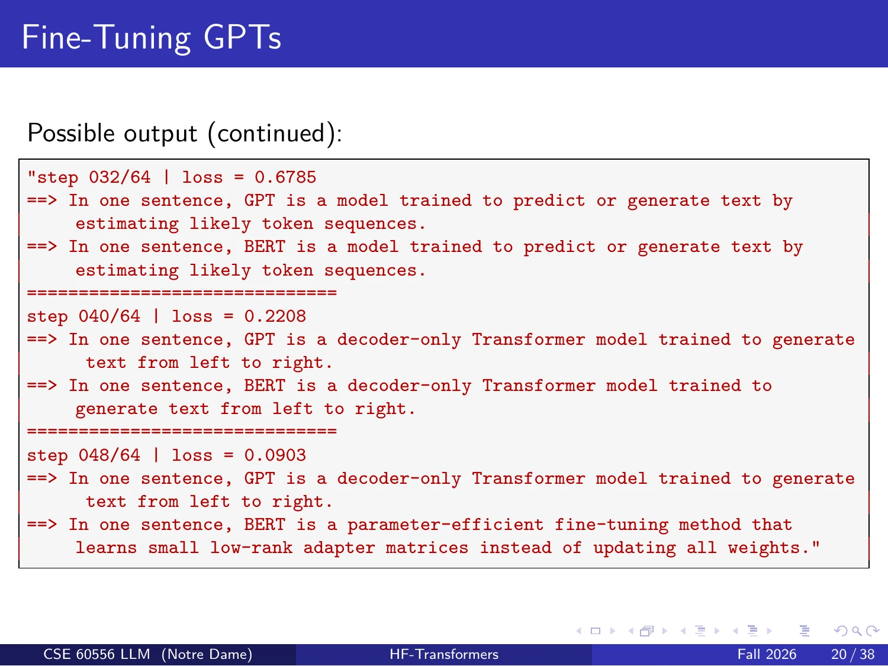{ loading=lazy }](../../assets/llm/section1/01-hugging-face/page-020.webp)

展开本页文字

<pre style="white-space:pre-wrap;overflow-wrap:anywhere">Fine-Tuning GPTs
Possible output (continued):
&quot;step 032/64 | loss = 0.6785
==&gt; In one sentence, GPT is a model trained to predict or generate text by
estimating likely token sequences.
==&gt; In one sentence, BERT is a model trained to predict or generate text by
estimating likely token sequences.
==============================
step 040/64 | loss = 0.2208
==&gt; In one sentence, GPT is a decoder-only Transformer model trained to generate
text from left to right.
==&gt; In one sentence, BERT is a decoder-only Transformer model trained to
generate text from left to right.
==============================
step 048/64 | loss = 0.0903
==&gt; In one sentence, GPT is a decoder-only Transformer model trained to generate
text from left to right.
==&gt; In one sentence, BERT is a parameter-efficient fine-tuning method that
learns small low-rank adapter matrices instead of updating all weights.&quot;</pre>

### 021 · Fine-Tuning GPTs

[{ loading=lazy }](../../assets/llm/section1/01-hugging-face/page-021.webp)

展开本页文字

<pre style="white-space:pre-wrap;overflow-wrap:anywhere">Fine-Tuning GPTs
Possible output (finally):
&quot;step 056/64 | loss = 0.0813
==&gt; In one sentence, GPT is a decoder-only Transformer model trained to generate
text from left to right.
==&gt; In one sentence, BERT is an encoder-only Transformer model designed to
produce contextual representations of text.
==============================
step 064/64 | loss = 0.0797
==&gt; In one sentence, GPT is a decoder-only Transformer model trained to generate
text from left to right.
==&gt; In one sentence, BERT is an encoder-only Transformer model designed to
produce contextual representations of text.&quot;</pre>

### 022 · Fine-Tuning GPTs

[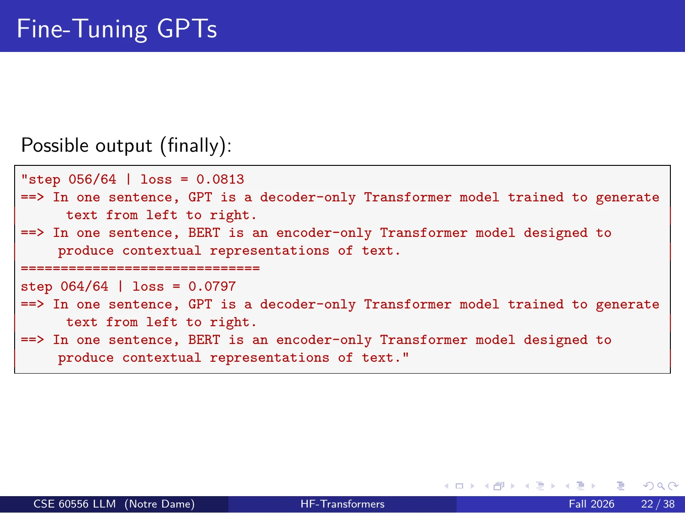{ loading=lazy }](../../assets/llm/section1/01-hugging-face/page-022.webp)

展开本页文字

<pre style="white-space:pre-wrap;overflow-wrap:anywhere">Fine-Tuning GPTs
Possible output (finally):
&quot;step 056/64 | loss = 0.0813
==&gt; In one sentence, GPT is a decoder-only Transformer model trained to generate
text from left to right.
==&gt; In one sentence, BERT is an encoder-only Transformer model designed to
produce contextual representations of text.
==============================
step 064/64 | loss = 0.0797
==&gt; In one sentence, GPT is a decoder-only Transformer model trained to generate
text from left to right.
==&gt; In one sentence, BERT is an encoder-only Transformer model designed to
produce contextual representations of text.&quot;</pre>

### 023 · GPT Model Family and Insights on the Architecture

[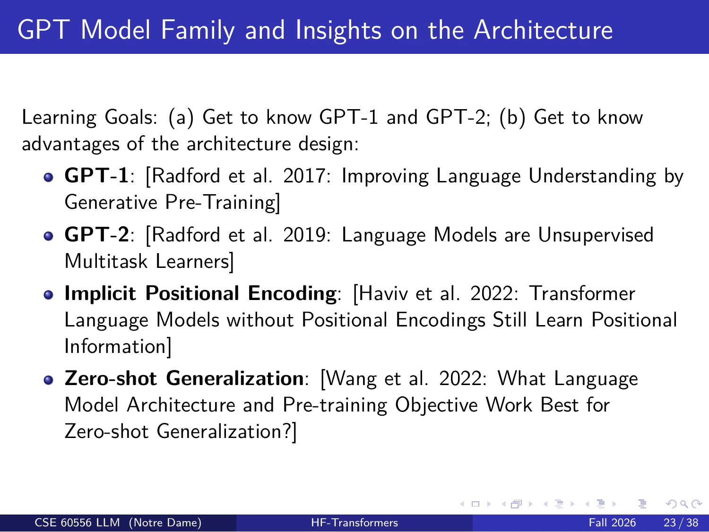{ loading=lazy }](../../assets/llm/section1/01-hugging-face/page-023.webp)

展开本页文字

<pre style="white-space:pre-wrap;overflow-wrap:anywhere">GPT Model Family and Insights on the Architecture
Learning Goals: (a) Get to know GPT-1 and GPT-2; (b) Get to know
advantages of the architecture design:
GPT-1: [ Radford et al. 2017 : Improving Language Understanding by
Generative Pre-Training]
GPT-2: [ Radford et al. 2019 : Language Models are Unsupervised
Multitask Learners]
Implicit Positional Encoding : [ Haviv et al. 2022 : Transformer
Language Models without Positional Encodings Still Learn Positional
Information]
Zero-shot Generalization : [ Wang et al. 2022 : What Language
Model Architecture and Pre-training Objective Work Best for
Zero-shot Generalization?]</pre>

### 024 · Table of Contents

[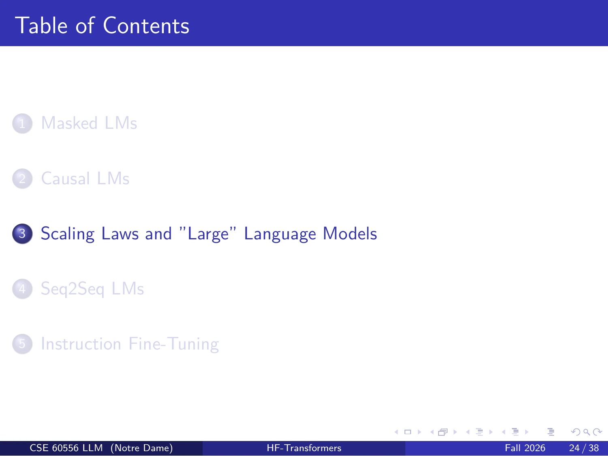{ loading=lazy }](../../assets/llm/section1/01-hugging-face/page-024.webp)

展开本页文字

<pre style="white-space:pre-wrap;overflow-wrap:anywhere">Table of Contents
1 Masked LMs
2 Causal LMs
3 Scaling Laws and ”Large” Language Models
4 Seq2Seq LMs
5 Instruction Fine-Tuning</pre>

### 025 · Scaling Laws (Model Training)

[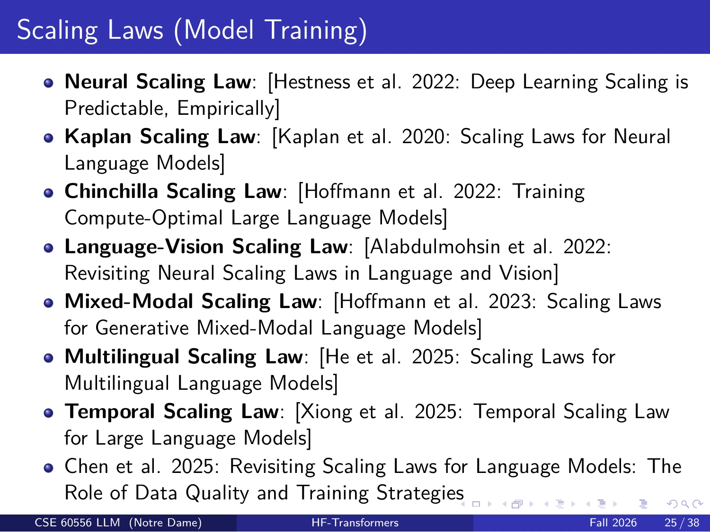{ loading=lazy }](../../assets/llm/section1/01-hugging-face/page-025.webp)

展开本页文字

<pre style="white-space:pre-wrap;overflow-wrap:anywhere">Scaling Laws (Model Training)
Neural Scaling Law : [ Hestness et al. 2022 : Deep Learning Scaling is
Predictable, Empirically]
Kaplan Scaling Law : [ Kaplan et al. 2020 : Scaling Laws for Neural
Language Models]
Chinchilla Scaling Law : [ Hoffmann et al. 2022 : Training
Compute-Optimal Large Language Models]
Language-Vision Scaling Law : [ Alabdulmohsin et al. 2022 :
Revisiting Neural Scaling Laws in Language and Vision]
Mixed-Modal Scaling Law : [ Hoffmann et al. 2023 : Scaling Laws
for Generative Mixed-Modal Language Models]
Multilingual Scaling Law : [ He et al. 2025 : Scaling Laws for
Multilingual Language Models]
Temporal Scaling Law : [ Xiong et al. 2025 : Temporal Scaling Law
for Large Language Models]
Chen et al. 2025 : Revisiting Scaling Laws for Language Models: The
Role of Data Quality and Training Strategies</pre>

### 026 · GPT-3: A New Way to Learn

[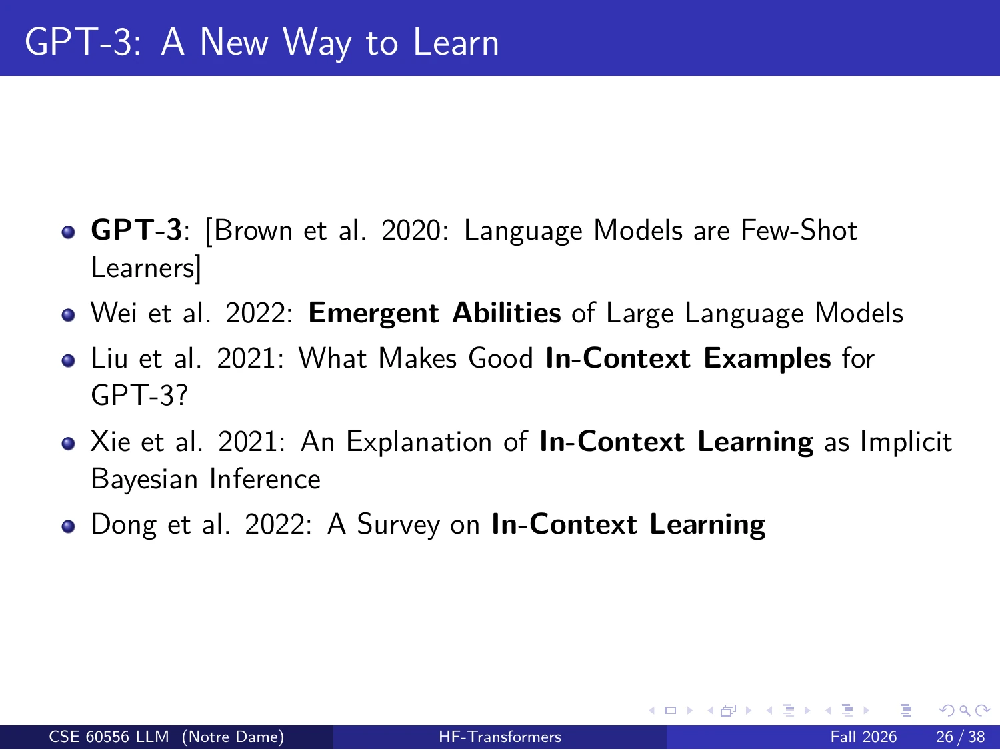{ loading=lazy }](../../assets/llm/section1/01-hugging-face/page-026.webp)

展开本页文字

<pre style="white-space:pre-wrap;overflow-wrap:anywhere">GPT-3: A New Way to Learn
GPT-3: [ Brown et al. 2020 : Language Models are Few-Shot
Learners]
Wei et al. 2022 : Emergent Abilities of Large Language Models
Liu et al. 2021 : What Makes Good In-Context Examples for
GPT-3?
Xie et al. 2021 : An Explanation of In-Context Learning as Implicit
Bayesian Inference
Dong et al. 2022 : A Survey on In-Context Learning</pre>

### 027 · Mixture-of-Experts (MoE)

[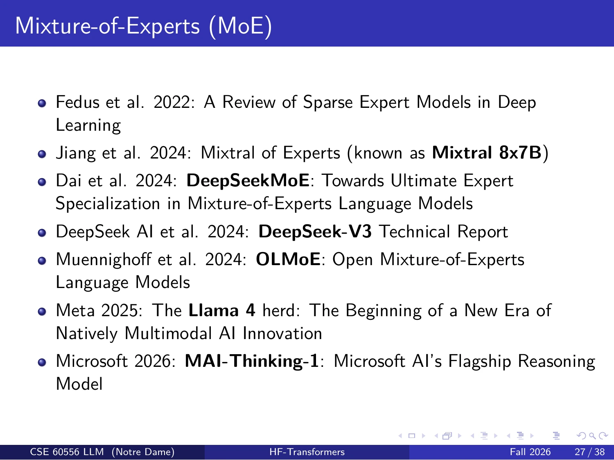{ loading=lazy }](../../assets/llm/section1/01-hugging-face/page-027.webp)

展开本页文字

<pre style="white-space:pre-wrap;overflow-wrap:anywhere">Mixture-of-Experts (MoE)
Fedus et al. 2022 : A Review of Sparse Expert Models in Deep
Learning
Jiang et al. 2024 : Mixtral of Experts (known as Mixtral 8x7B )
Dai et al. 2024 : DeepSeekMoE: Towards Ultimate Expert
Specialization in Mixture-of-Experts Language Models
DeepSeek AI et al. 2024 : DeepSeek-V3 Technical Report
Muennighoff et al. 2024 : OLMoE: Open Mixture-of-Experts
Language Models
Meta 2025 : The Llama 4 herd: The Beginning of a New Era of
Natively Multimodal AI Innovation
Microsoft 2026 : MAI-Thinking-1: Microsoft AI’s Flagship Reasoning
Model</pre>

### 028 · Introducing Gemma 4 (Google 2026)

[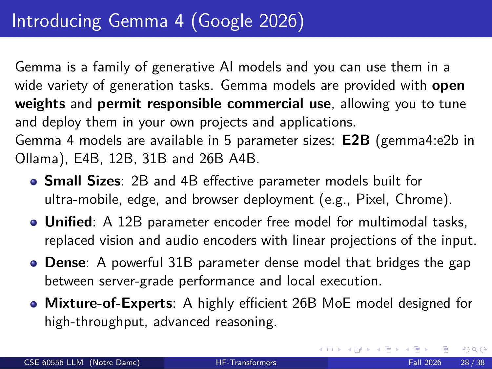{ loading=lazy }](../../assets/llm/section1/01-hugging-face/page-028.webp)

展开本页文字

<pre style="white-space:pre-wrap;overflow-wrap:anywhere">Introducing Gemma 4 (Google 2026)
Gemma is a family of generative AI models and you can use them in a
wide variety of generation tasks. Gemma models are provided with open
weights and permit responsible commercial use , allowing you to tune
and deploy them in your own projects and applications.
Gemma 4 models are available in 5 parameter sizes: E2B (gemma4:e2b in
Ollama), E4B, 12B, 31B and 26B A4B.
Small Sizes : 2B and 4B effective parameter models built for
ultra-mobile, edge, and browser deployment (e.g., Pixel, Chrome).
Unified: A 12B parameter encoder free model for multimodal tasks,
replaced vision and audio encoders with linear projections of the input.
Dense: A powerful 31B parameter dense model that bridges the gap
between server-grade performance and local execution.
Mixture-of-Experts: A highly efficient 26B MoE model designed for
high-throughput, advanced reasoning.</pre>

### 029 · Introducing Gemma 4 (Google 2026)

[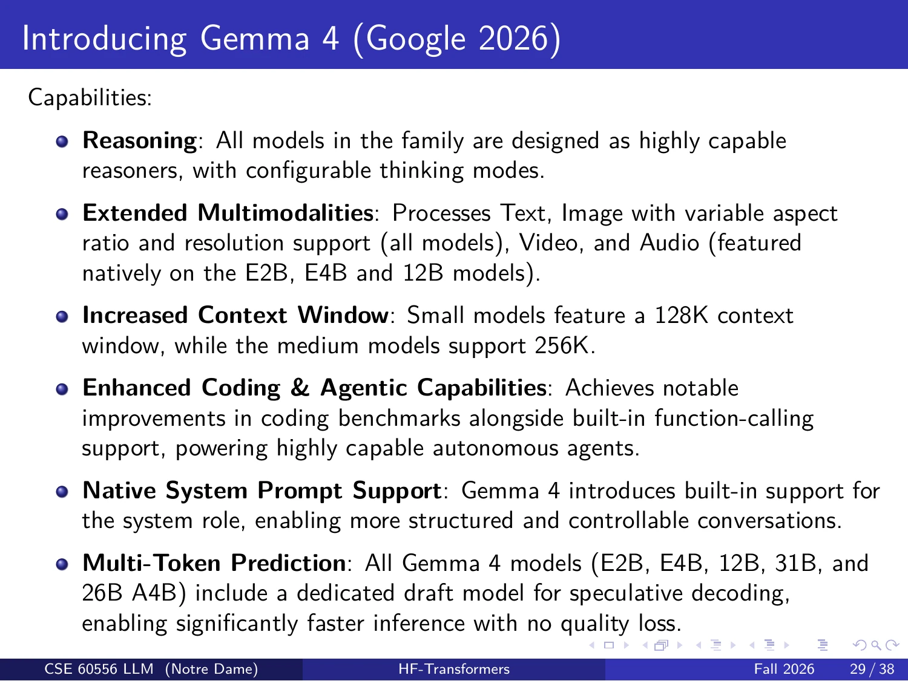{ loading=lazy }](../../assets/llm/section1/01-hugging-face/page-029.webp)

展开本页文字

<pre style="white-space:pre-wrap;overflow-wrap:anywhere">Introducing Gemma 4 (Google 2026)
Capabilities:
Reasoning: All models in the family are designed as highly capable
reasoners, with configurable thinking modes.
Extended Multimodalities : Processes Text, Image with variable aspect
ratio and resolution support (all models), Video, and Audio (featured
natively on the E2B, E4B and 12B models).
Increased Context Window : Small models feature a 128K context
window, while the medium models support 256K.
Enhanced Coding &amp; Agentic Capabilities : Achieves notable
improvements in coding benchmarks alongside built-in function-calling
support, powering highly capable autonomous agents.
Native System Prompt Support : Gemma 4 introduces built-in support for
the system role, enabling more structured and controllable conversations.
Multi-Token Prediction: All Gemma 4 models (E2B, E4B, 12B, 31B, and
26B A4B) include a dedicated draft model for speculative decoding,
enabling significantly faster inference with no quality loss.</pre>

### 030 · Table of Contents

[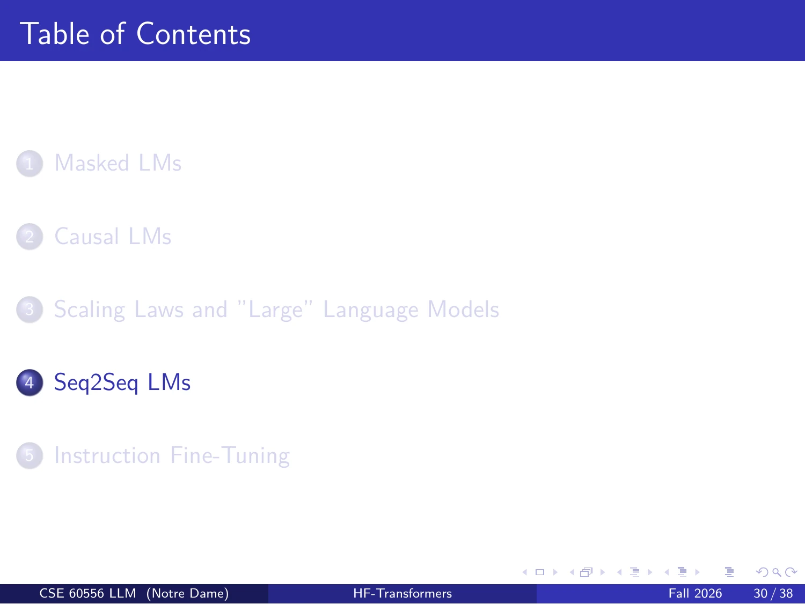{ loading=lazy }](../../assets/llm/section1/01-hugging-face/page-030.webp)

展开本页文字

<pre style="white-space:pre-wrap;overflow-wrap:anywhere">Table of Contents
1 Masked LMs
2 Causal LMs
3 Scaling Laws and ”Large” Language Models
4 Seq2Seq LMs
5 Instruction Fine-Tuning</pre>

### 031 · Sequence-to-Sequence: Encoder-Decoder

[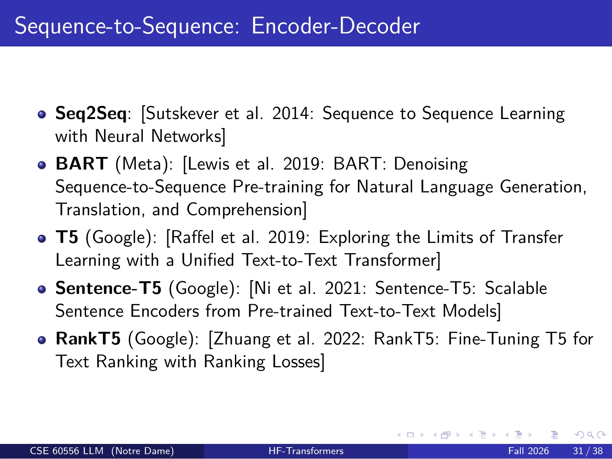{ loading=lazy }](../../assets/llm/section1/01-hugging-face/page-031.webp)

展开本页文字

<pre style="white-space:pre-wrap;overflow-wrap:anywhere">Sequence-to-Sequence: Encoder-Decoder
Seq2Seq: [ Sutskever et al. 2014 : Sequence to Sequence Learning
with Neural Networks]
BART (Meta): [ Lewis et al. 2019 : BART: Denoising
Sequence-to-Sequence Pre-training for Natural Language Generation,
Translation, and Comprehension]
T5 (Google): [ Raffel et al. 2019 : Exploring the Limits of Transfer
Learning with a Unified Text-to-Text Transformer]
Sentence-T5 (Google): [ Ni et al. 2021 : Sentence-T5: Scalable
Sentence Encoders from Pre-trained Text-to-Text Models]
RankT5 (Google): [ Zhuang et al. 2022 : RankT5: Fine-Tuning T5 for
Text Ranking with Ranking Losses]</pre>

### 032 · Run T5 on Hugging Face

[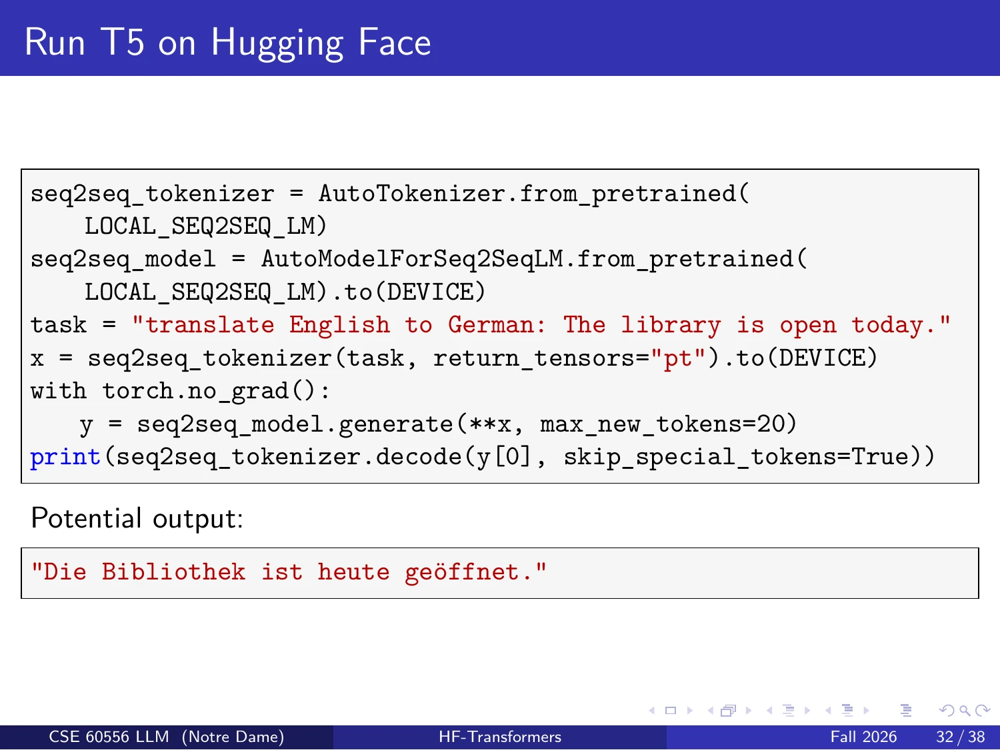{ loading=lazy }](../../assets/llm/section1/01-hugging-face/page-032.webp)

展开本页文字

<pre style="white-space:pre-wrap;overflow-wrap:anywhere">Run T5 on Hugging Face
seq2seq_tokenizer = AutoTokenizer.from_pretrained(
LOCAL_SEQ2SEQ_LM)
seq2seq_model = AutoModelForSeq2SeqLM.from_pretrained(
LOCAL_SEQ2SEQ_LM).to(DEVICE)
task = &quot;translate English to German: The library is open today.&quot;
x = seq2seq_tokenizer(task, return_tensors= &quot;pt&quot;).to(DEVICE)
with torch.no_grad():
y = seq2seq_model.generate(**x, max_new_tokens=20)
print(seq2seq_tokenizer.decode(y[0], skip_special_tokens=True))
Potential output:
&quot;Die Bibliothek ist heute geöffnet.&quot;</pre>

### 033 · Table of Contents

[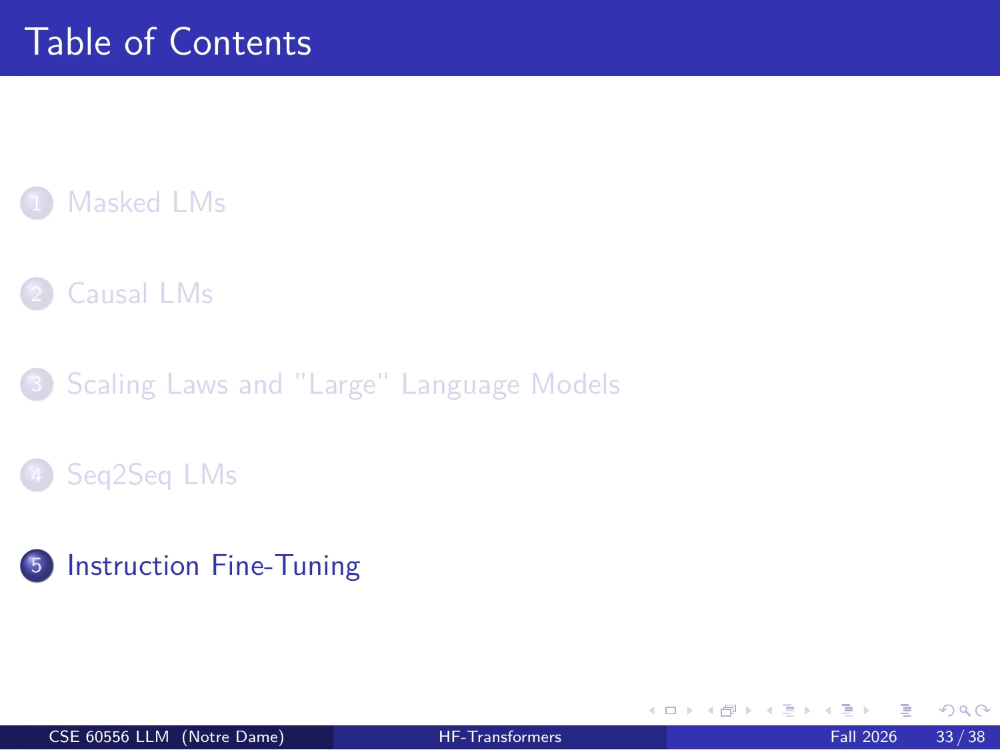{ loading=lazy }](../../assets/llm/section1/01-hugging-face/page-033.webp)

展开本页文字

<pre style="white-space:pre-wrap;overflow-wrap:anywhere">Table of Contents
1 Masked LMs
2 Causal LMs
3 Scaling Laws and ”Large” Language Models
4 Seq2Seq LMs
5 Instruction Fine-Tuning</pre>

### 034 · Instructed Models on Hugging Face

[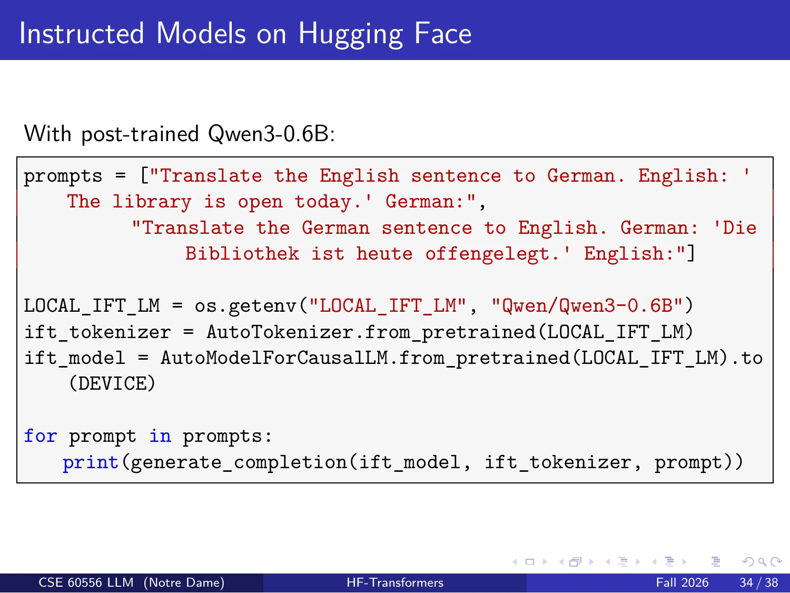{ loading=lazy }](../../assets/llm/section1/01-hugging-face/page-034.webp)

展开本页文字

<pre style="white-space:pre-wrap;overflow-wrap:anywhere">Instructed Models on Hugging Face
With post-trained Qwen3-0.6B:
prompts = [ &quot;Translate the English sentence to German. English: &#x27;
The library is open today.&#x27; German:&quot;,
&quot;Translate the German sentence to English. German: &#x27;Die
Bibliothek ist heute offengelegt.&#x27; English:&quot;]
LOCAL_IFT_LM = os.getenv( &quot;LOCAL_IFT_LM&quot;, &quot;Qwen/Qwen3-0.6B&quot;)
ift_tokenizer = AutoTokenizer.from_pretrained(LOCAL_IFT_LM)
ift_model = AutoModelForCausalLM.from_pretrained(LOCAL_IFT_LM).to
(DEVICE)
for prompt in prompts:
print(generate_completion(ift_model, ift_tokenizer, prompt))</pre>

### 035 · Instructed Models on Hugging Face

[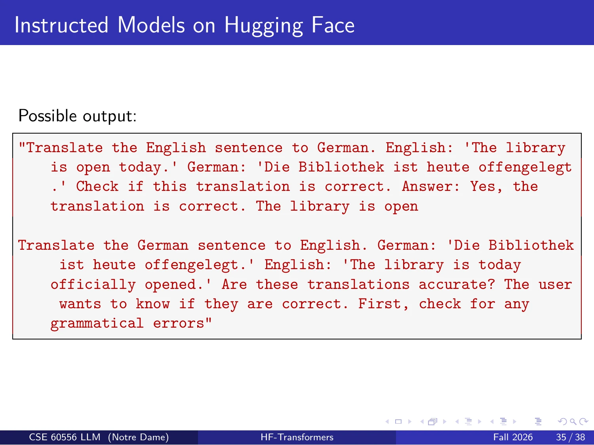{ loading=lazy }](../../assets/llm/section1/01-hugging-face/page-035.webp)

展开本页文字

<pre style="white-space:pre-wrap;overflow-wrap:anywhere">Instructed Models on Hugging Face
Possible output:
&quot;Translate the English sentence to German. English: &#x27;The library
is open today.&#x27; German: &#x27;Die Bibliothek ist heute offengelegt
.&#x27; Check if this translation is correct. Answer: Yes, the
translation is correct. The library is open
Translate the German sentence to English. German: &#x27;Die Bibliothek
ist heute offengelegt.&#x27; English: &#x27;The library is today
officially opened.&#x27; Are these translations accurate? The user
wants to know if they are correct. First, check for any
grammatical errors&quot;</pre>

### 036 · IFT Data and Models

[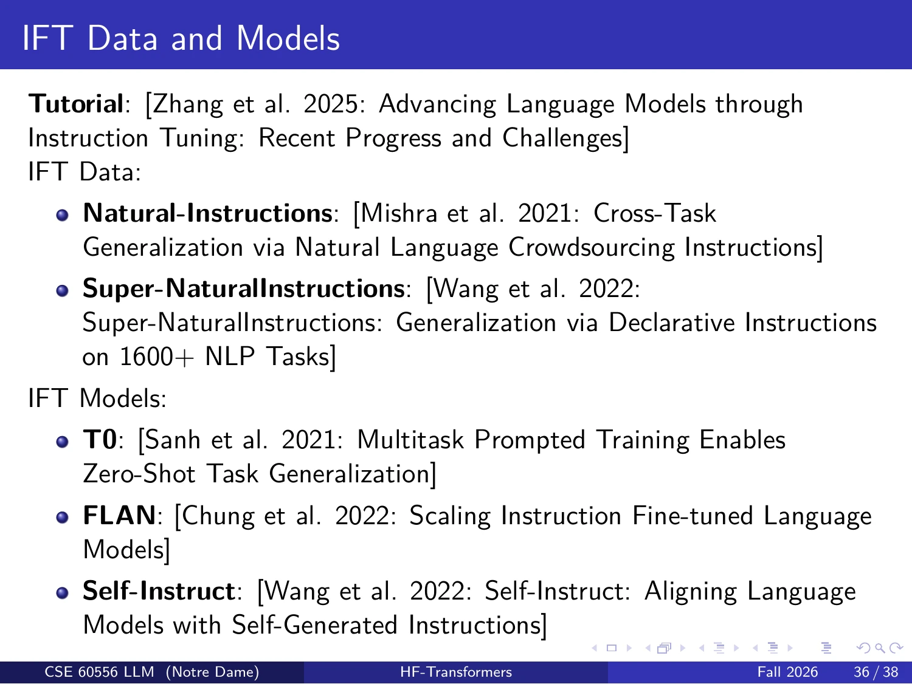{ loading=lazy }](../../assets/llm/section1/01-hugging-face/page-036.webp)

展开本页文字

<pre style="white-space:pre-wrap;overflow-wrap:anywhere">IFT Data and Models
Tutorial: [ Zhang et al. 2025 : Advancing Language Models through
Instruction Tuning: Recent Progress and Challenges]
IFT Data:
Natural-Instructions: [ Mishra et al. 2021 : Cross-Task
Generalization via Natural Language Crowdsourcing Instructions]
Super-NaturalInstructions: [ Wang et al. 2022 :
Super-NaturalInstructions: Generalization via Declarative Instructions
on 1600+ NLP Tasks]
IFT Models:
T0: [ Sanh et al. 2021 : Multitask Prompted Training Enables
Zero-Shot Task Generalization]
FLAN: [ Chung et al. 2022 : Scaling Instruction Fine-tuned Language
Models]
Self-Instruct: [ Wang et al. 2022 : Self-Instruct: Aligning Language
Models with Self-Generated Instructions]</pre>

### 037 · IFT Techniques and Evaluation

[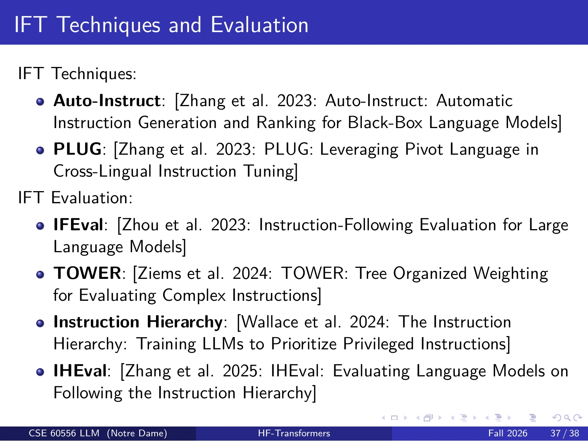{ loading=lazy }](../../assets/llm/section1/01-hugging-face/page-037.webp)

展开本页文字

<pre style="white-space:pre-wrap;overflow-wrap:anywhere">IFT Techniques and Evaluation
IFT Techniques:
Auto-Instruct: [ Zhang et al. 2023 : Auto-Instruct: Automatic
Instruction Generation and Ranking for Black-Box Language Models]
PLUG: [ Zhang et al. 2023 : PLUG: Leveraging Pivot Language in
Cross-Lingual Instruction Tuning]
IFT Evaluation:
IFEval: [ Zhou et al. 2023 : Instruction-Following Evaluation for Large
Language Models]
TOWER: [ Ziems et al. 2024 : TOWER: Tree Organized Weighting
for Evaluating Complex Instructions]
Instruction Hierarchy : [ Wallace et al. 2024 : The Instruction
Hierarchy: Training LLMs to Prioritize Privileged Instructions]
IHEval: [ Zhang et al. 2025 : IHEval: Evaluating Language Models on
Following the Instruction Hierarchy]</pre>

### 038 · Takeaways

[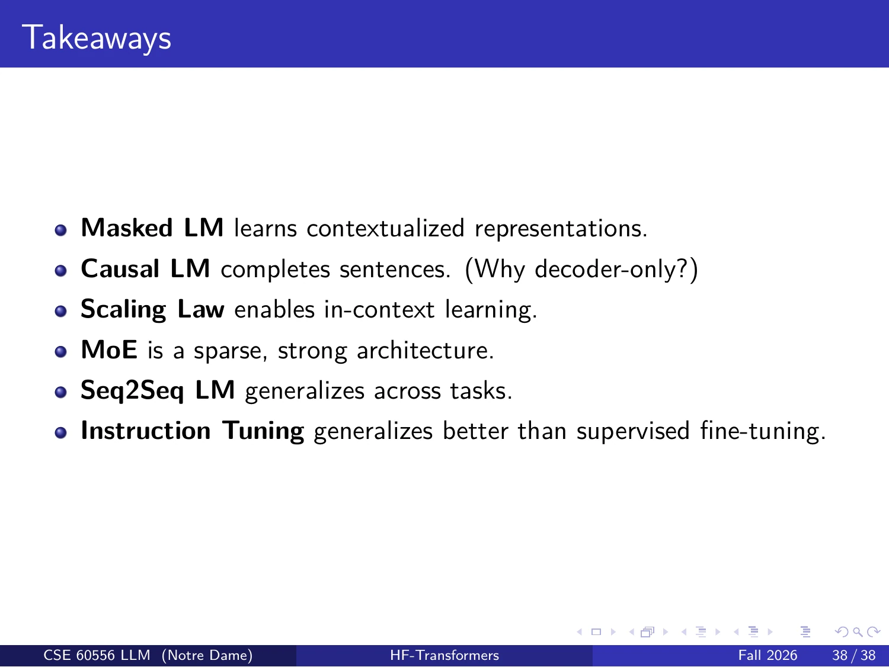{ loading=lazy }](../../assets/llm/section1/01-hugging-face/page-038.webp)

展开本页文字

<pre style="white-space:pre-wrap;overflow-wrap:anywhere">Takeaways
Masked LM learns contextualized representations.
Causal LM completes sentences. (Why decoder-only?)
Scaling Law enables in-context learning.
MoE is a sparse, strong architecture.
Seq2Seq LM generalizes across tasks.
Instruction Tuning generalizes better than supervised fine-tuning.</pre>

