# Masked LM、Transformer 与 BERT

[返回 Section 1](index.md)

授课课件：Meng Jiang · CSE 60556 · Fall 2026。来源 `Chapter1-L01 (L03).pdf`，共 **26 页**。

[下载完整原课件 PDF](../../assets/llm/section1/02-masked-lm/slides.pdf)

## 中文复习导读

本讲从 unigram、n-gram 和前馈语言模型出发，解释长距离依赖为什么难学，再引入 RNN、attention、Transformer 和 BERT。

语言建模的概率分解是 \(P(x_{1:T})=\prod_{t=1}^{T}P(x_t\mid x_{<t})\)。n-gram 截短历史；神经网络通过向量表示共享统计信息。Attention 用 query 与 key 的相似度决定如何汇总 value：

\[
\operatorname{Attention}(Q,K,V)=\operatorname{softmax}\!\left(\frac{QK^\top}{\sqrt{d_k}}\right)V.
\]

BERT 使用双向上下文做 masked language modeling；原版 BERT 还使用 next sentence prediction。复习时要能解释预训练和下游微调的关系，以及 token、segment、position 三种 embedding 的作用。最后比较 SciBERT、BioBERT 的领域适配与 Sentence-BERT 的句向量目标。

## 全部 Beamer 页面

下面按原 PDF 页序完整呈现，包括目录、公式、图表、代码、例子与参考文献。点击图片可放大；每页下方可展开文字并搜索或复制。文字由 PDF 提取，公式和代码排版以原图及 PDF 为准；这里没有重建原始 LaTeX 源码。

### 001 · Masked Language Models

[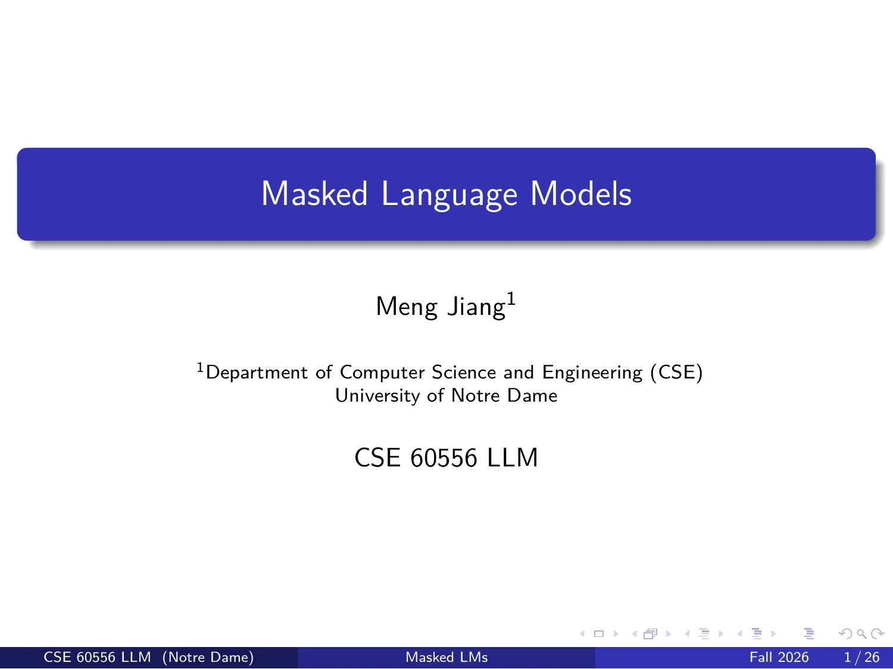{ loading=lazy }](../../assets/llm/section1/02-masked-lm/page-001.webp)

展开本页文字

<pre style="white-space:pre-wrap;overflow-wrap:anywhere">Masked Language Models
Meng Jiang 1
1Department of Computer Science and Engineering (CSE)
University of Notre Dame
CSE 60556 LLM</pre>

### 002 · Table of Contents

[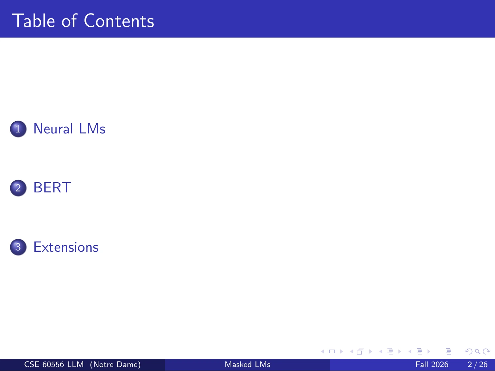{ loading=lazy }](../../assets/llm/section1/02-masked-lm/page-002.webp)

展开本页文字

<pre style="white-space:pre-wrap;overflow-wrap:anywhere">Table of Contents
1 Neural LMs
2 BERT
3 Extensions</pre>

### 003 · Table of Contents

[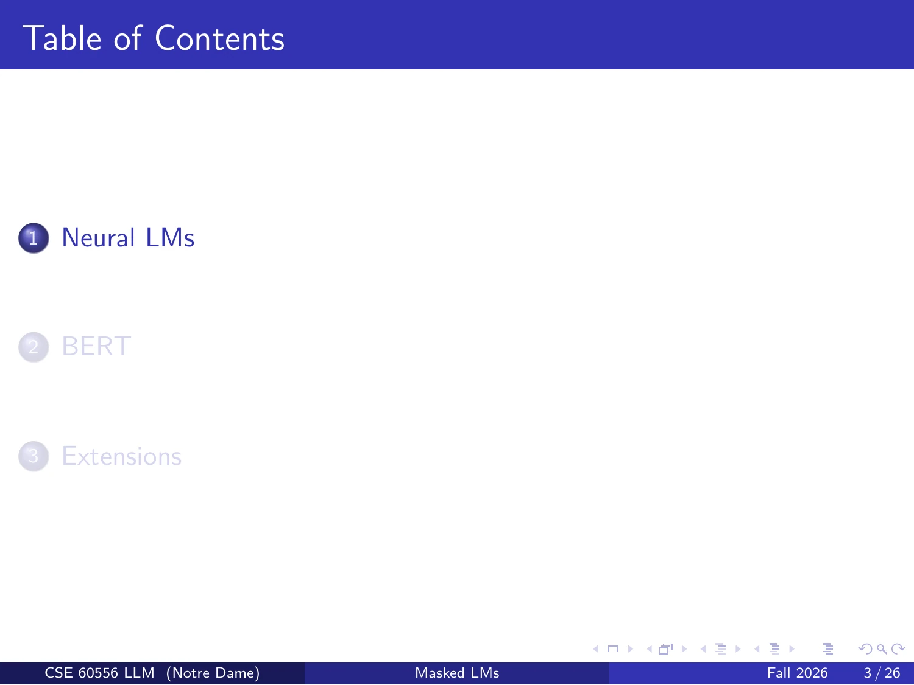{ loading=lazy }](../../assets/llm/section1/02-masked-lm/page-003.webp)

展开本页文字

<pre style="white-space:pre-wrap;overflow-wrap:anywhere">Table of Contents
1 Neural LMs
2 BERT
3 Extensions</pre>

### 004 · Autoregressive Language Modeling

[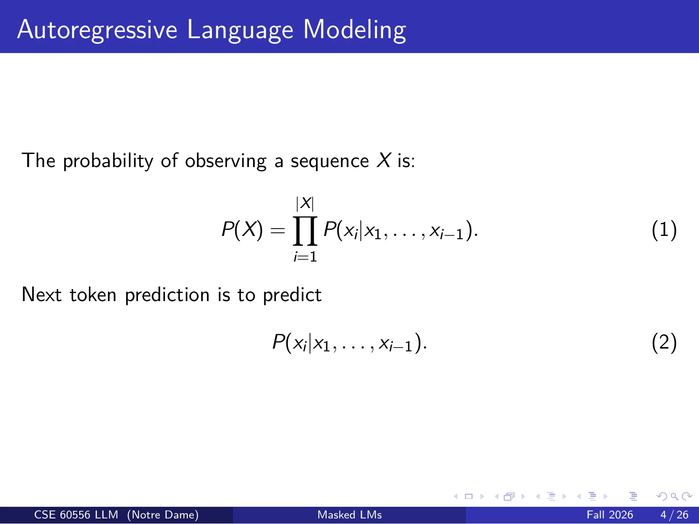{ loading=lazy }](../../assets/llm/section1/02-masked-lm/page-004.webp)

展开本页文字

<pre style="white-space:pre-wrap;overflow-wrap:anywhere">Autoregressive Language Modeling
The probability of observing a sequence X is:
P(X) =
|X|∏
i=1
P(xi|x1, . . . ,xi−1). (1)
Next token prediction is to predict
P(xi|x1, . . . ,xi−1). (2)</pre>

### 005 · Count-based Unigram Models

[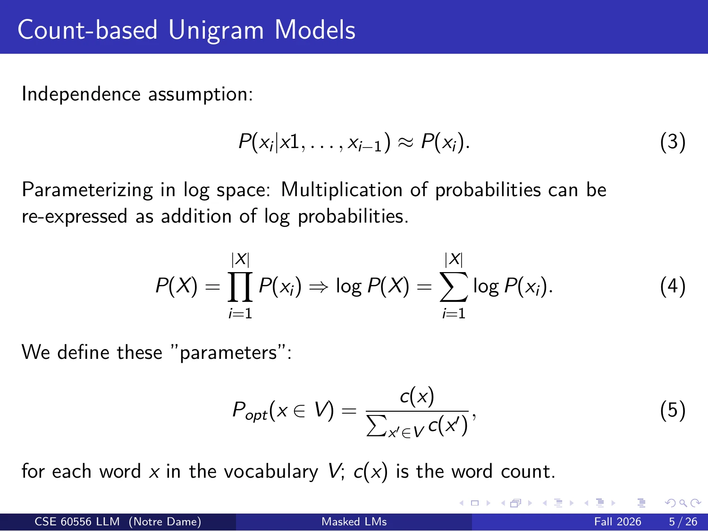{ loading=lazy }](../../assets/llm/section1/02-masked-lm/page-005.webp)

展开本页文字

<pre style="white-space:pre-wrap;overflow-wrap:anywhere">Count-based Unigram Models
Independence assumption:
P(xi|x1, . . . ,xi−1) ≈ P(xi). (3)
Parameterizing in log space: Multiplication of probabilities can be
re-expressed as addition of log probabilities.
P(X) =
|X|∏
i=1
P(xi) ⇒ log P(X) =
|X|∑
i=1
log P(xi). (4)
We define these ”parameters”:
Popt(x ∈ V) = c(x)∑
x′∈V c(x′) , (5)
for each word x in the vocabulary V; c(x) is the word count.</pre>

### 006 · Higher-order n-gram Models

[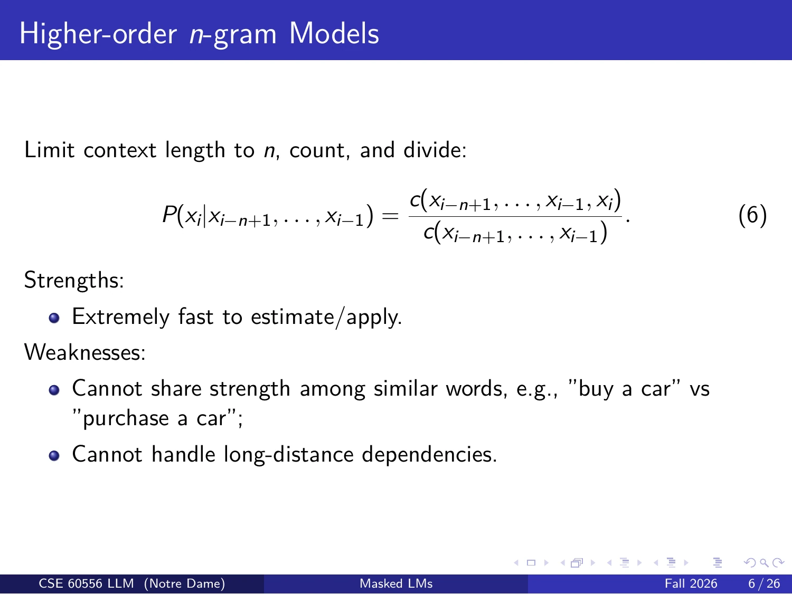{ loading=lazy }](../../assets/llm/section1/02-masked-lm/page-006.webp)

展开本页文字

<pre style="white-space:pre-wrap;overflow-wrap:anywhere">Higher-order n-gram Models
Limit context length to n, count, and divide:
P(xi|xi−n+1, . . . ,xi−1) = c(xi−n+1, . . . ,xi−1, xi)
c(xi−n+1, . . . ,xi−1) . (6)
Strengths:
Extremely fast to estimate/apply.
Weaknesses:
Cannot share strength among similar words, e.g., ”buy a car” vs
”purchase a car”;
Cannot handle long-distance dependencies.</pre>

### 007 · Feed-forward neural LMs

[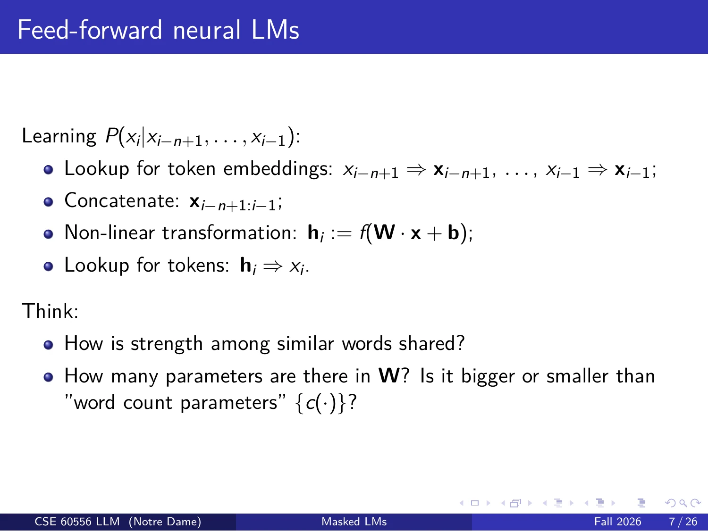{ loading=lazy }](../../assets/llm/section1/02-masked-lm/page-007.webp)

展开本页文字

<pre style="white-space:pre-wrap;overflow-wrap:anywhere">Feed-forward neural LMs
Learning P(xi|xi−n+1, . . . ,xi−1):
Lookup for token embeddings: xi−n+1 ⇒ xi−n+1, . . . , xi−1 ⇒ xi−1;
Concatenate: xi−n+1:i−1;
Non-linear transformation: hi := f(W · x + b);
Lookup for tokens: hi ⇒ xi.
Think:
How is strength among similar words shared?
How many parameters are there in W? Is it bigger or smaller than
”word count parameters” {c(·)}?</pre>

### 008 · Modeling Long-distance Dependencies is Challenging

[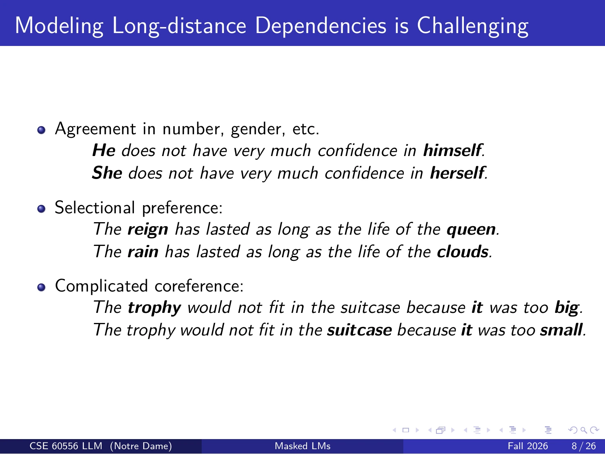{ loading=lazy }](../../assets/llm/section1/02-masked-lm/page-008.webp)

展开本页文字

<pre style="white-space:pre-wrap;overflow-wrap:anywhere">Modeling Long-distance Dependencies is Challenging
Agreement in number, gender, etc.
He does not have very much confidence in himself.
She does not have very much confidence in herself.
Selectional preference:
The reign has lasted as long as the life of the queen.
The rain has lasted as long as the life of the clouds.
Complicated coreference:
The trophy would not fit in the suitcase because it was too big.
The trophy would not fit in the suitcase because it was too small.</pre>

### 009 · Sequence Modeling to Learn Dependencies

[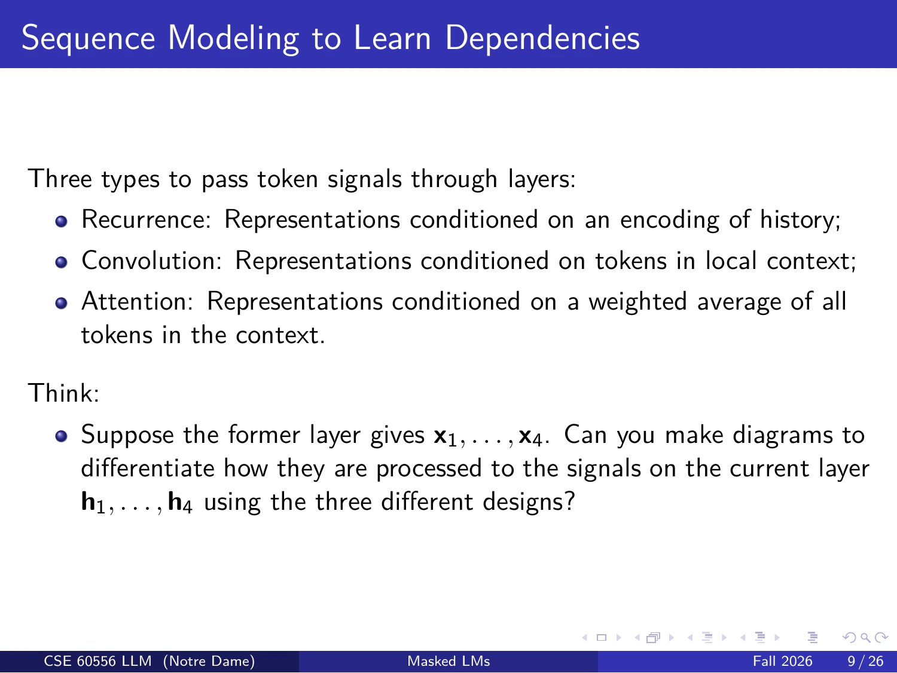{ loading=lazy }](../../assets/llm/section1/02-masked-lm/page-009.webp)

展开本页文字

<pre style="white-space:pre-wrap;overflow-wrap:anywhere">Sequence Modeling to Learn Dependencies
Three types to pass token signals through layers:
Recurrence: Representations conditioned on an encoding of history;
Convolution: Representations conditioned on tokens in local context;
Attention: Representations conditioned on a weighted average of all
tokens in the context.
Think:
Suppose the former layer gives x1, . . . ,x4. Can you make diagrams to
differentiate how they are processed to the signals on the current layer
h1, . . . ,h4 using the three different designs?</pre>

### 010 · Recurrent Neural Networks

[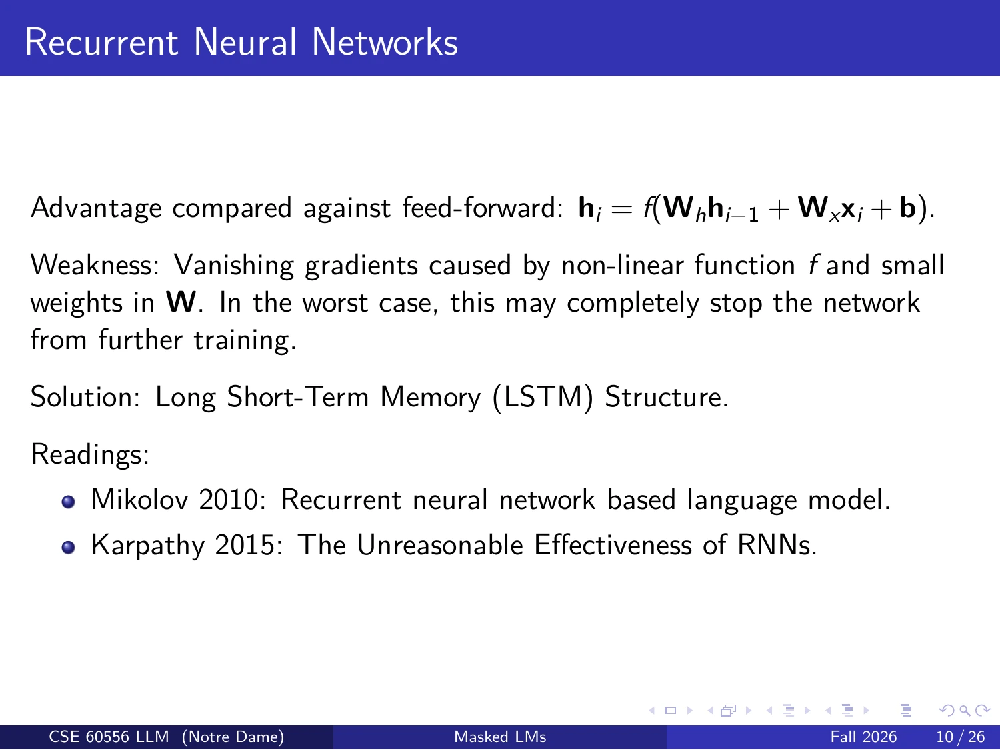{ loading=lazy }](../../assets/llm/section1/02-masked-lm/page-010.webp)

展开本页文字

<pre style="white-space:pre-wrap;overflow-wrap:anywhere">Recurrent Neural Networks
Advantage compared against feed-forward: hi = f(Whhi−1 + Wxxi + b).
Weakness: Vanishing gradients caused by non-linear function f and small
weights in W. In the worst case, this may completely stop the network
from further training.
Solution: Long Short-Term Memory (LSTM) Structure.
Readings:
Mikolov 2010 : Recurrent neural network based language model.
Karpathy 2015 : The Unreasonable Effectiveness of RNNs.</pre>

### 011 · Attention

[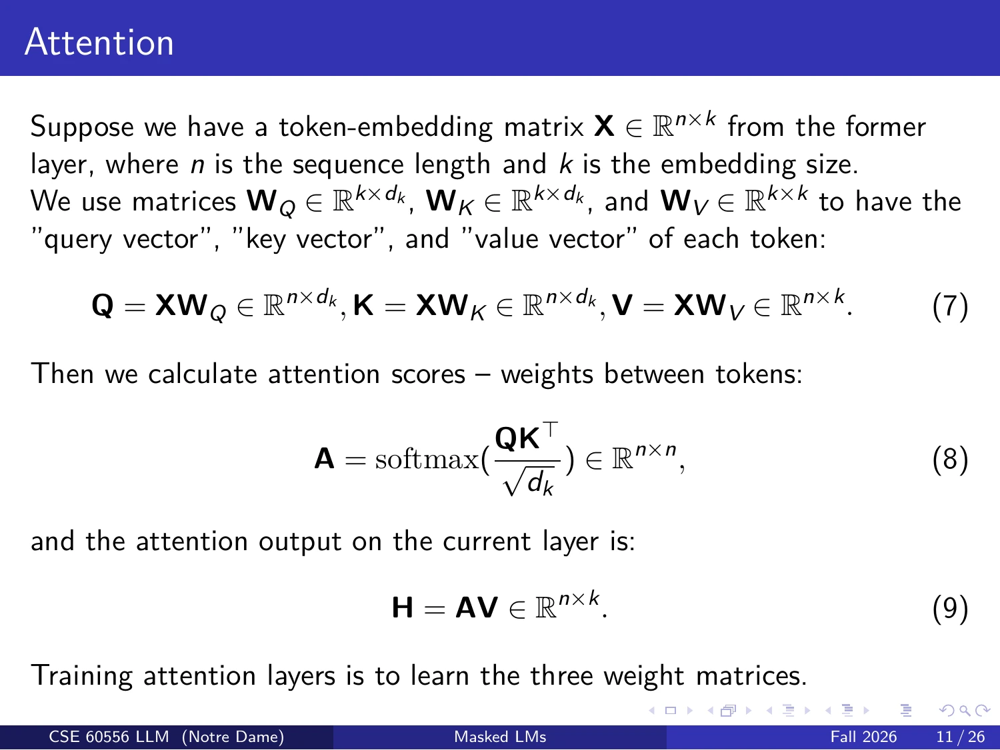{ loading=lazy }](../../assets/llm/section1/02-masked-lm/page-011.webp)

展开本页文字

<pre style="white-space:pre-wrap;overflow-wrap:anywhere">Attention
Suppose we have a token-embedding matrix X ∈ Rn×k from the former
layer, where n is the sequence length and k is the embedding size.
We use matrices WQ ∈ Rk×dk, WK ∈ Rk×dk, and WV ∈ Rk×k to have the
”query vector”, ”key vector”, and ”value vector” of each token:
Q = XWQ ∈ Rn×dk, K = XWK ∈ Rn×dk, V = XWV ∈ Rn×k. (7)
Then we calculate attention scores – weights between tokens:
A = softmax( QK⊤
√dk
) ∈ Rn×n, (8)
and the attention output on the current layer is:
H = AV ∈ Rn×k. (9)
Training attention layers is to learn the three weight matrices.</pre>

### 012 · Attention and Transformer

[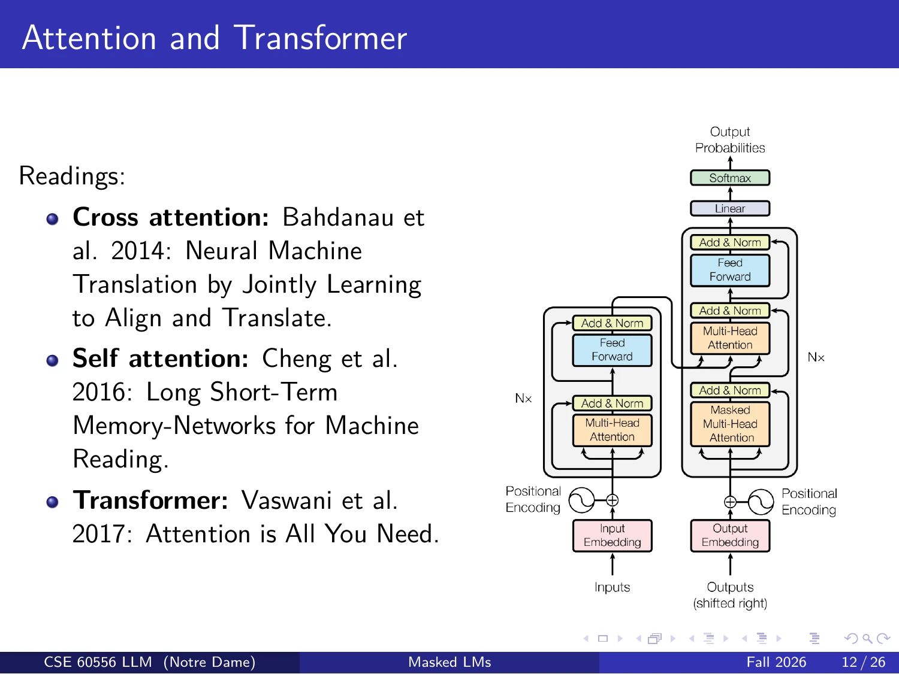{ loading=lazy }](../../assets/llm/section1/02-masked-lm/page-012.webp)

展开本页文字

<pre style="white-space:pre-wrap;overflow-wrap:anywhere">Attention and Transformer
Readings:
Cross attention: Bahdanau et
al. 2014 : Neural Machine
Translation by Jointly Learning
to Align and Translate.
Self attention: Cheng et al.
2016: Long Short-Term
Memory-Networks for Machine
Reading.
Transformer: Vaswani et al.
2017: Attention is All You Need.</pre>

### 013 · Novel Design in Transformer

[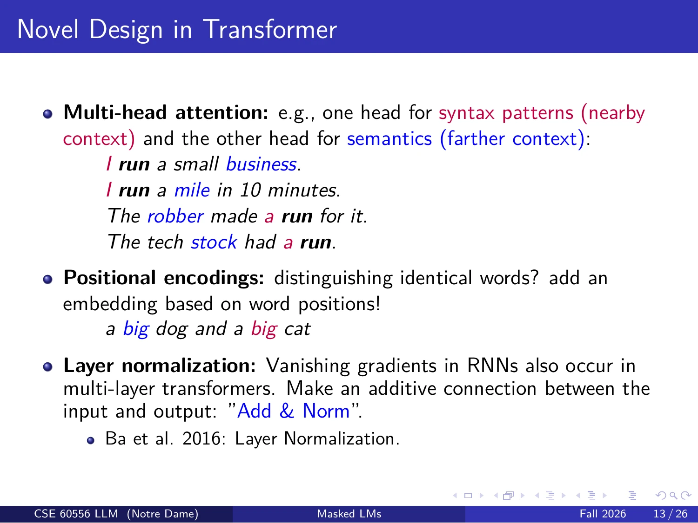{ loading=lazy }](../../assets/llm/section1/02-masked-lm/page-013.webp)

展开本页文字

<pre style="white-space:pre-wrap;overflow-wrap:anywhere">Novel Design in Transformer
Multi-head attention: e.g., one head for syntax patterns (nearby
context) and the other head for semantics (farther context) :
I run a small business.
I run a mile in 10 minutes.
The robber made a run for it.
The tech stock had a run.
Positional encodings: distinguishing identical words? add an
embedding based on word positions!
a big dog and a big cat
Layer normalization: Vanishing gradients in RNNs also occur in
multi-layer transformers. Make an additive connection between the
input and output: ” Add &amp; Norm ” .
Ba et al. 2016 : Layer Normalization.</pre>

### 014 · Transformer: Main Results

[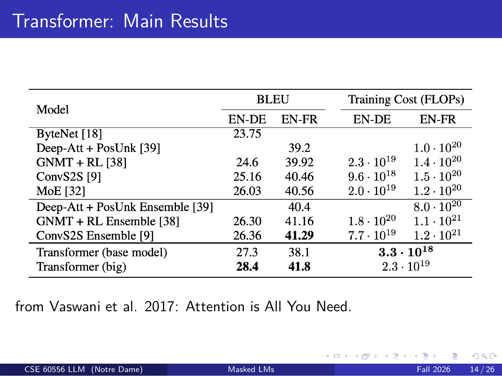{ loading=lazy }](../../assets/llm/section1/02-masked-lm/page-014.webp)

展开本页文字

<pre style="white-space:pre-wrap;overflow-wrap:anywhere">Transformer: Main Results
from Vaswani et al. 2017 : Attention is All You Need.</pre>

### 015 · Table of Contents

[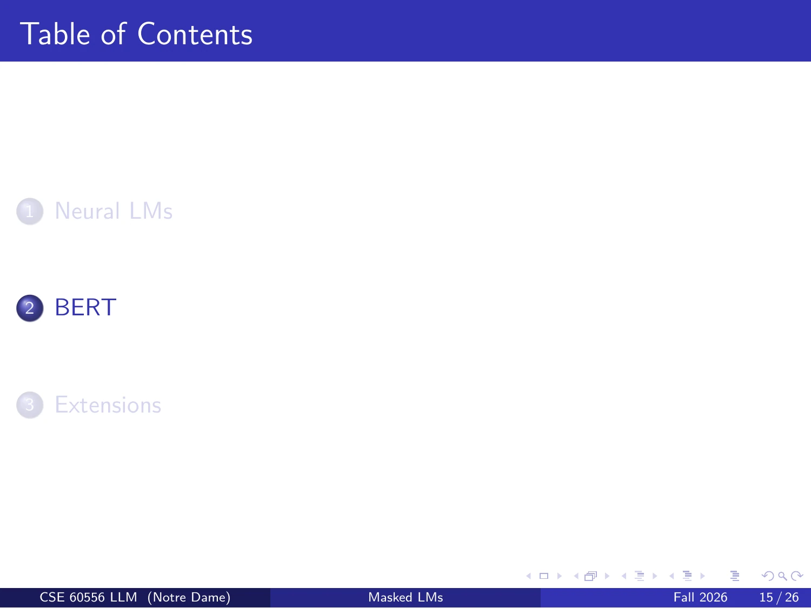{ loading=lazy }](../../assets/llm/section1/02-masked-lm/page-015.webp)

展开本页文字

<pre style="white-space:pre-wrap;overflow-wrap:anywhere">Table of Contents
1 Neural LMs
2 BERT
3 Extensions</pre>

### 016 · What is BERT?

[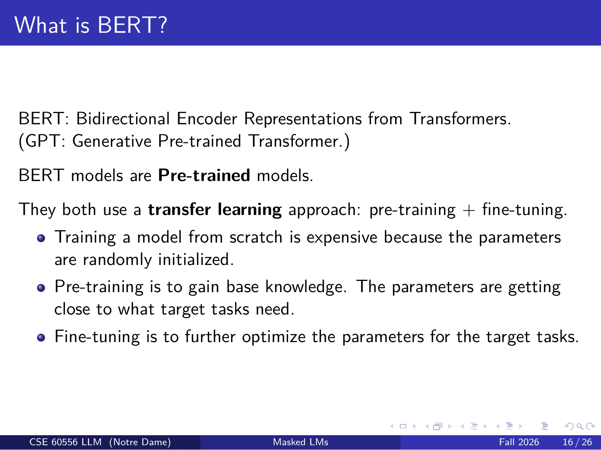{ loading=lazy }](../../assets/llm/section1/02-masked-lm/page-016.webp)

展开本页文字

<pre style="white-space:pre-wrap;overflow-wrap:anywhere">What is BERT?
BERT: Bidirectional Encoder Representations from Transformers.
(GPT: Generative Pre-trained Transformer.)
BERT models are Pre-trained models.
They both use a transfer learning approach: pre-training + fine-tuning.
Training a model from scratch is expensive because the parameters
are randomly initialized.
Pre-training is to gain base knowledge. The parameters are getting
close to what target tasks need.
Fine-tuning is to further optimize the parameters for the target tasks.</pre>

### 017 · Pre-training Tasks

[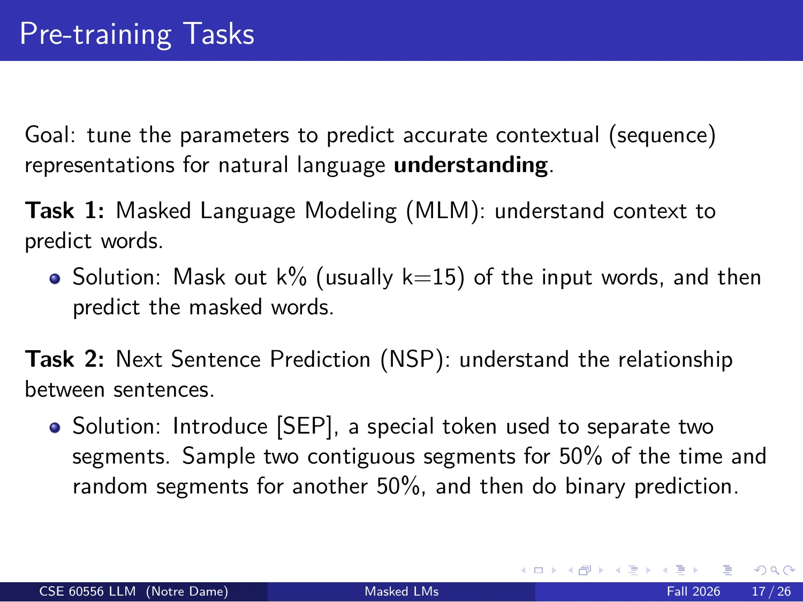{ loading=lazy }](../../assets/llm/section1/02-masked-lm/page-017.webp)

展开本页文字

<pre style="white-space:pre-wrap;overflow-wrap:anywhere">Pre-training Tasks
Goal: tune the parameters to predict accurate contextual (sequence)
representations for natural language understanding.
Task 1: Masked Language Modeling (MLM): understand context to
predict words.
Solution: Mask out k% (usually k=15) of the input words, and then
predict the masked words.
Task 2: Next Sentence Prediction (NSP): understand the relationship
between sentences.
Solution: Introduce [SEP], a special token used to separate two
segments. Sample two contiguous segments for 50% of the time and
random segments for another 50%, and then do binary prediction.</pre>

### 018 · Training BERT

[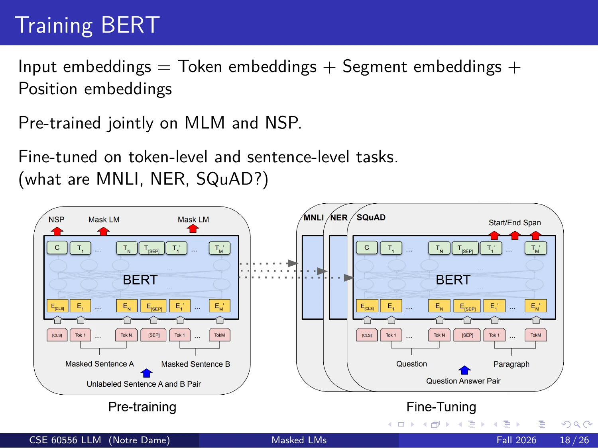{ loading=lazy }](../../assets/llm/section1/02-masked-lm/page-018.webp)

展开本页文字

<pre style="white-space:pre-wrap;overflow-wrap:anywhere">Training BERT
Input embeddings = Token embeddings + Segment embeddings +
Position embeddings
Pre-trained jointly on MLM and NSP.
Fine-tuned on token-level and sentence-level tasks.
(what are MNLI, NER, SQuAD?)</pre>

### 019 · Table of Contents

[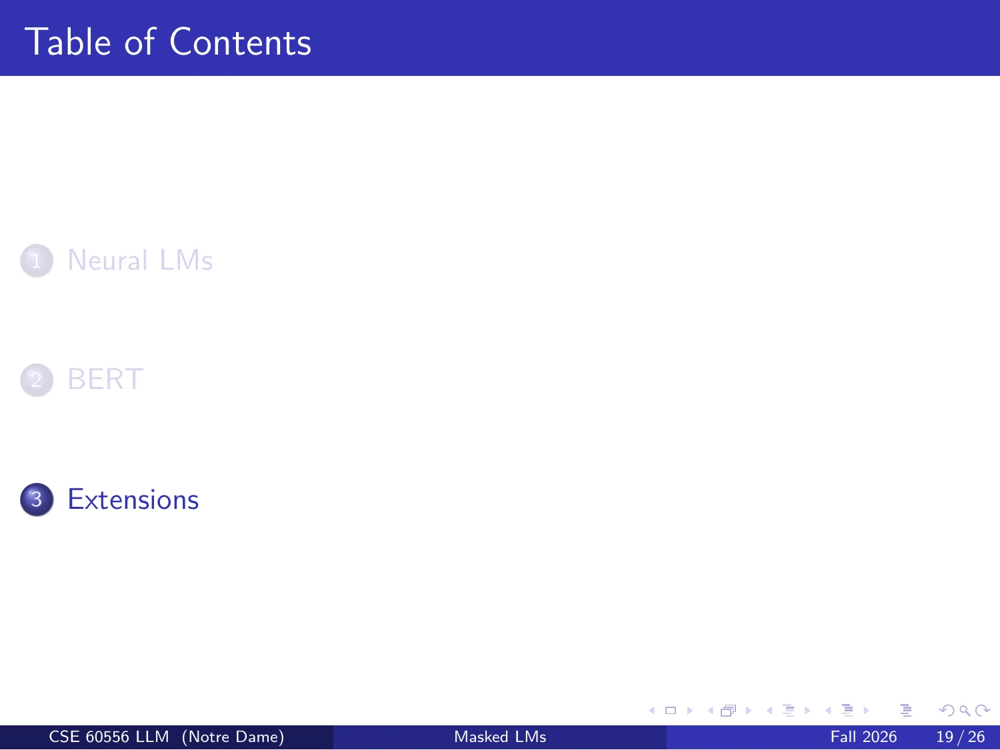{ loading=lazy }](../../assets/llm/section1/02-masked-lm/page-019.webp)

展开本页文字

<pre style="white-space:pre-wrap;overflow-wrap:anywhere">Table of Contents
1 Neural LMs
2 BERT
3 Extensions</pre>

### 020 · SciBERT: Developed by AllenAI

[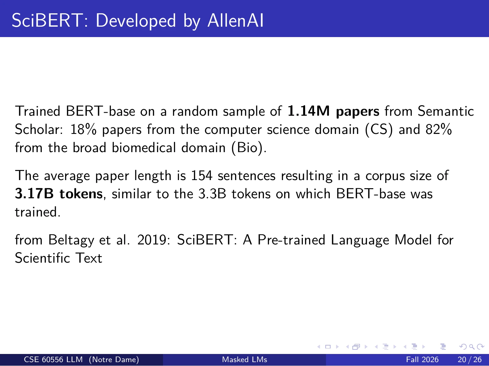{ loading=lazy }](../../assets/llm/section1/02-masked-lm/page-020.webp)

展开本页文字

<pre style="white-space:pre-wrap;overflow-wrap:anywhere">SciBERT: Developed by AllenAI
Trained BERT-base on a random sample of 1.14M papers from Semantic
Scholar: 18% papers from the computer science domain (CS) and 82%
from the broad biomedical domain (Bio).
The average paper length is 154 sentences resulting in a corpus size of
3.17B tokens , similar to the 3.3B tokens on which BERT-base was
trained.
from Beltagy et al. 2019 : SciBERT: A Pre-trained Language Model for
Scientific Text</pre>

### 021 · SciBERT: Results

[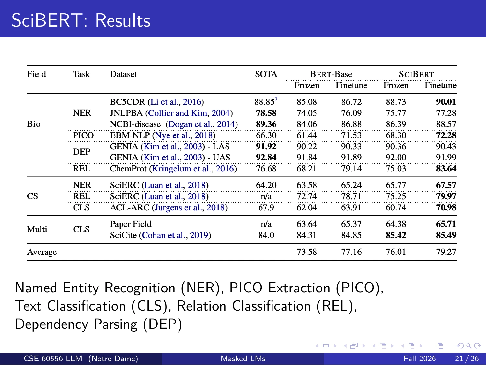{ loading=lazy }](../../assets/llm/section1/02-masked-lm/page-021.webp)

展开本页文字

<pre style="white-space:pre-wrap;overflow-wrap:anywhere">SciBERT: Results
Named Entity Recognition (NER), PICO Extraction (PICO),
Text Classification (CLS), Relation Classification (REL),
Dependency Parsing (DEP)</pre>

### 022 · BioBERT

[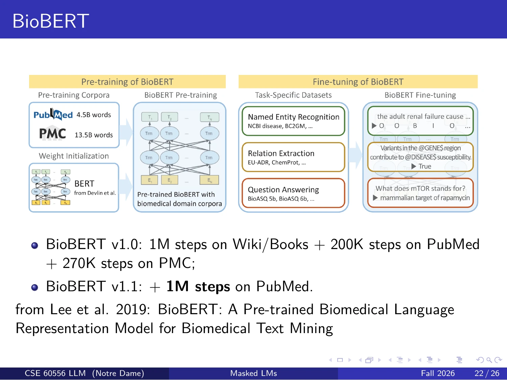{ loading=lazy }](../../assets/llm/section1/02-masked-lm/page-022.webp)

展开本页文字

<pre style="white-space:pre-wrap;overflow-wrap:anywhere">BioBERT
BioBERT v1.0: 1M steps on Wiki/Books + 200K steps on PubMed
+ 270K steps on PMC;
BioBERT v1.1: + 1M steps on PubMed.
from Lee et al. 2019 : BioBERT: A Pre-trained Biomedical Language
Representation Model for Biomedical Text Mining</pre>

### 023 · BioBERT: NER (and many other) Data for Fine-tuning

[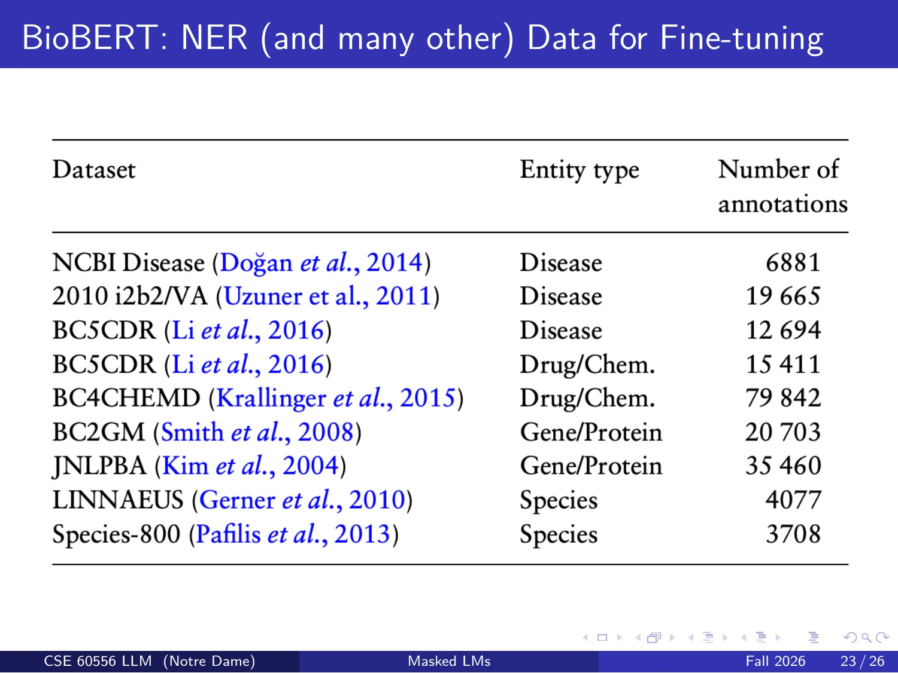{ loading=lazy }](../../assets/llm/section1/02-masked-lm/page-023.webp)

展开本页文字

<pre style="white-space:pre-wrap;overflow-wrap:anywhere">BioBERT: NER (and many other) Data for Fine-tuning</pre>

### 024 · BioBERT: Results

[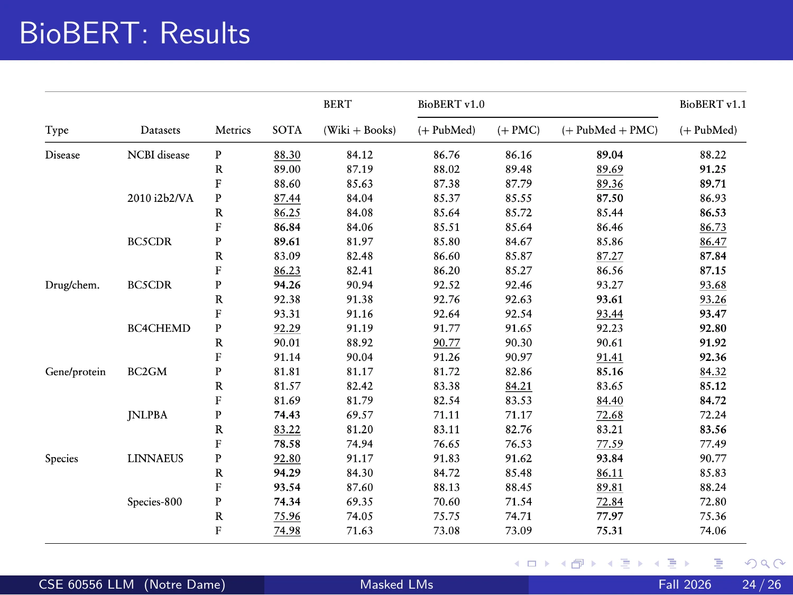{ loading=lazy }](../../assets/llm/section1/02-masked-lm/page-024.webp)

展开本页文字

<pre style="white-space:pre-wrap;overflow-wrap:anywhere">BioBERT: Results</pre>

### 025 · Sentence-BERT

[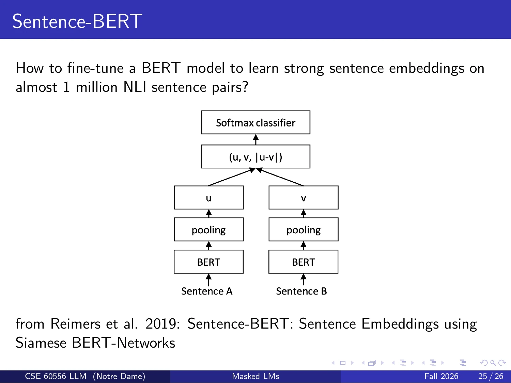{ loading=lazy }](../../assets/llm/section1/02-masked-lm/page-025.webp)

展开本页文字

<pre style="white-space:pre-wrap;overflow-wrap:anywhere">Sentence-BERT
How to fine-tune a BERT model to learn strong sentence embeddings on
almost 1 million NLI sentence pairs?
from Reimers et al. 2019 : Sentence-BERT: Sentence Embeddings using
Siamese BERT-Networks</pre>

### 026 · Takeaways

[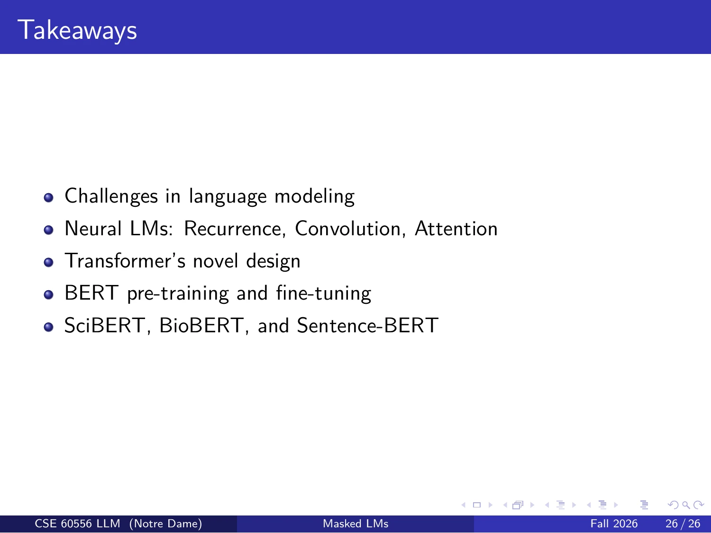{ loading=lazy }](../../assets/llm/section1/02-masked-lm/page-026.webp)

展开本页文字

<pre style="white-space:pre-wrap;overflow-wrap:anywhere">Takeaways
Challenges in language modeling
Neural LMs: Recurrence, Convolution, Attention
Transformer’s novel design
BERT pre-training and fine-tuning
SciBERT, BioBERT, and Sentence-BERT</pre>

