# Causal LM、GPT 与 Attention 实践

[返回 Section 1](index.md)

授课课件：Meng Jiang · CSE 60556 · Fall 2026。来源 `Chapter1-L02 (L04).pdf`，共 **22 页**。

[下载完整原课件 PDF](../../assets/llm/section1/03-causal-lm/slides.pdf)

## 中文复习导读

本讲比较 GPT-1、GPT-2 与 BERT，并通过 `distilgpt2` 查看模型内部。重点是左到右的 next-token prediction、decoder 的 causal mask，以及规模和数据如何影响 zero-shot 表现。

代码部分读取 hidden states 和 attention weights。Attention 张量的维度通常对应 batch、head、query token、key token；热图的一行表示某个 query 对各个 key 的权重。复习时联系 causal mask 理解为什么不能读取未来 token。

最后的架构讨论涉及位置编码和模型结构的归纳偏置。原幻灯片中的研究假说按原样保留，不应把假说当成对所有模型都成立的定理。课件架构代码页出现 DistilBERT 命名，阅读时应注意它与前面 `distilgpt2` 实例并非同一个模型类。

## 全部 Beamer 页面

下面按原 PDF 页序完整呈现，包括目录、公式、图表、代码、例子与参考文献。点击图片可放大；每页下方可展开文字并搜索或复制。文字由 PDF 提取，公式和代码排版以原图及 PDF 为准；这里没有重建原始 LaTeX 源码。

### 001 · Causal Language Models

[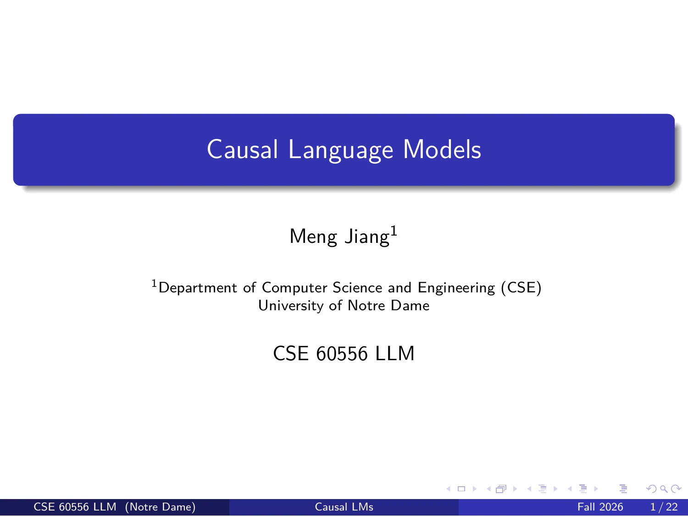{ loading=lazy }](../../assets/llm/section1/03-causal-lm/page-001.webp)

展开本页文字

<pre style="white-space:pre-wrap;overflow-wrap:anywhere">Causal Language Models
Meng Jiang 1
1Department of Computer Science and Engineering (CSE)
University of Notre Dame
CSE 60556 LLM</pre>

### 002 · Table of Contents

[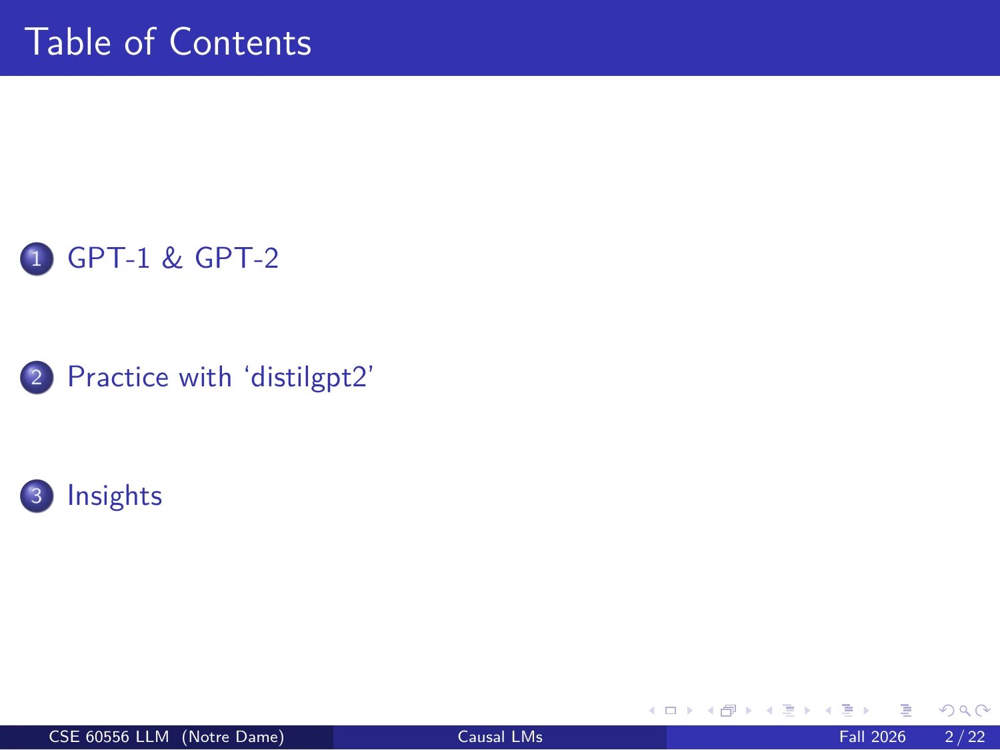{ loading=lazy }](../../assets/llm/section1/03-causal-lm/page-002.webp)

展开本页文字

<pre style="white-space:pre-wrap;overflow-wrap:anywhere">Table of Contents
1 GPT-1 &amp; GPT-2
2 Practice with ‘distilgpt2’
3 Insights</pre>

### 003 · Table of Contents

[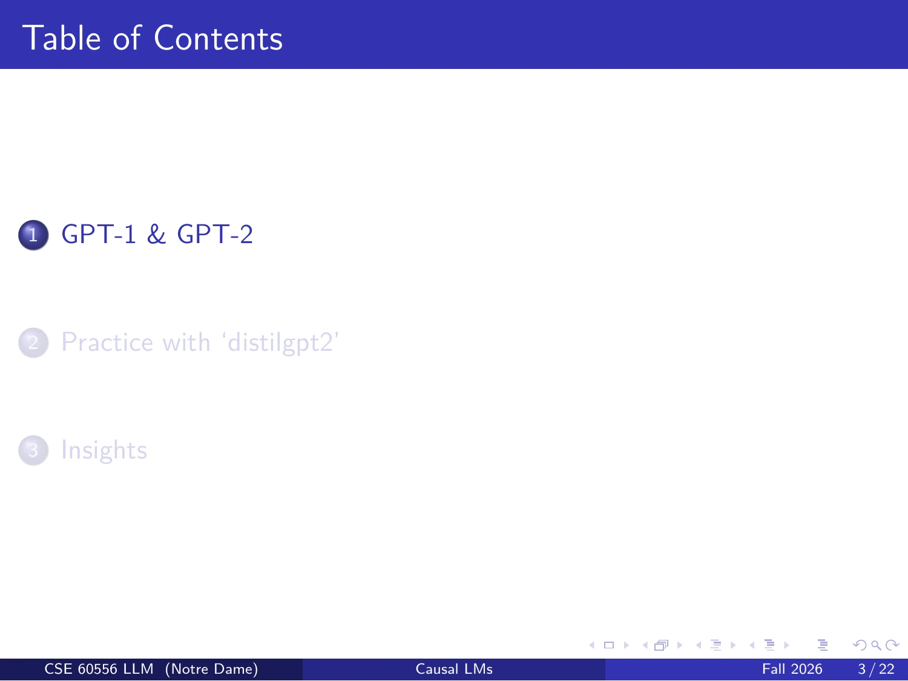{ loading=lazy }](../../assets/llm/section1/03-causal-lm/page-003.webp)

展开本页文字

<pre style="white-space:pre-wrap;overflow-wrap:anywhere">Table of Contents
1 GPT-1 &amp; GPT-2
2 Practice with ‘distilgpt2’
3 Insights</pre>

### 004 · Timeline

[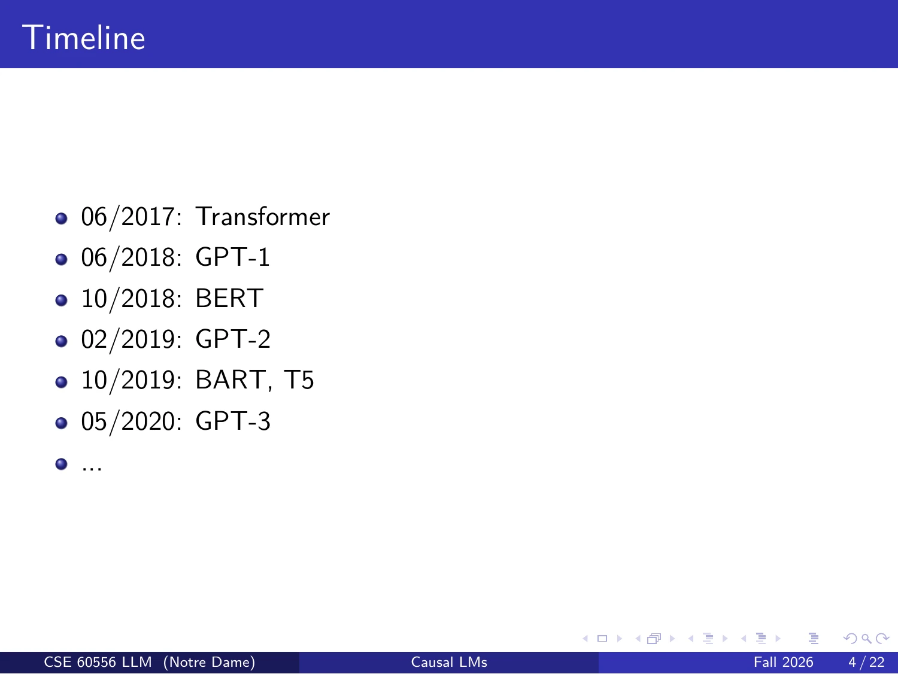{ loading=lazy }](../../assets/llm/section1/03-causal-lm/page-004.webp)

展开本页文字

<pre style="white-space:pre-wrap;overflow-wrap:anywhere">Timeline
06/2017: Transformer
06/2018: GPT-1
10/2018: BERT
02/2019: GPT-2
10/2019: BART, T5
05/2020: GPT-3</pre>

### 005 · GPT-1

[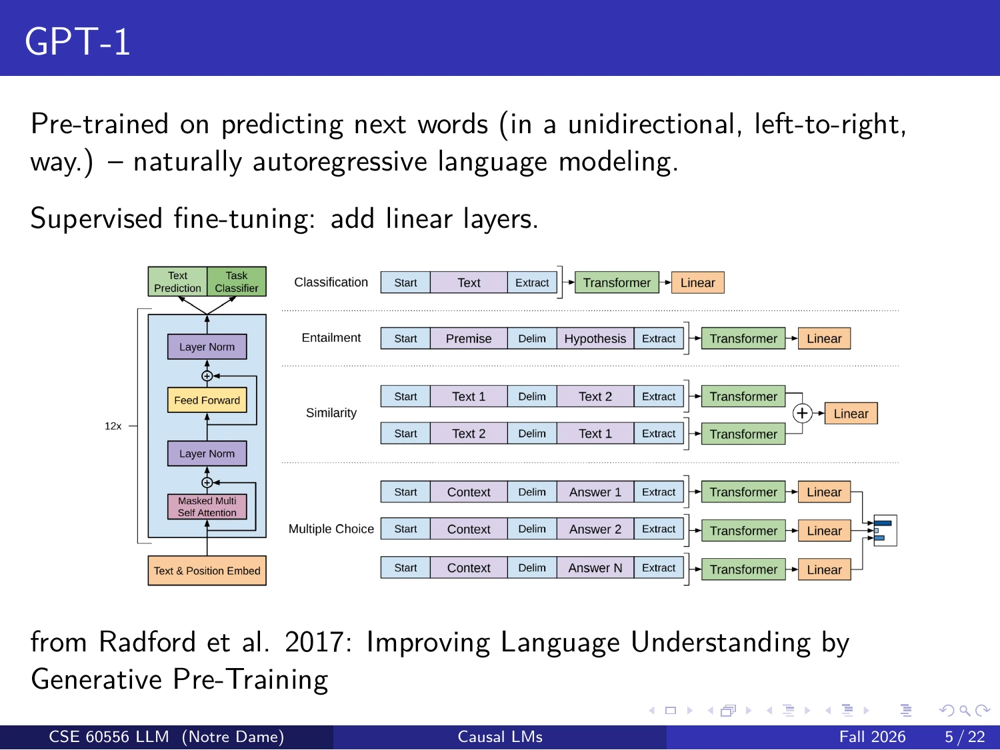{ loading=lazy }](../../assets/llm/section1/03-causal-lm/page-005.webp)

展开本页文字

<pre style="white-space:pre-wrap;overflow-wrap:anywhere">GPT-1
Pre-trained on predicting next words (in a unidirectional, left-to-right,
way.) – naturally autoregressive language modeling.
Supervised fine-tuning: add linear layers.
from Radford et al. 2017 : Improving Language Understanding by
Generative Pre-Training</pre>

### 006 · GPT-1: Fine-tuning Tasks

[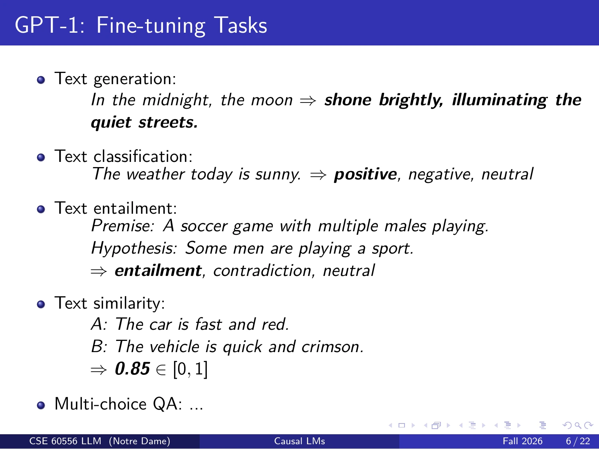{ loading=lazy }](../../assets/llm/section1/03-causal-lm/page-006.webp)

展开本页文字

<pre style="white-space:pre-wrap;overflow-wrap:anywhere">GPT-1: Fine-tuning Tasks
Text generation:
In the midnight, the moon ⇒ shone brightly, illuminating the
quiet streets.
Text classification:
The weather today is sunny. ⇒ positive, negative, neutral
Text entailment:
Premise: A soccer game with multiple males playing.
Hypothesis: Some men are playing a sport.
⇒ entailment, contradiction, neutral
Text similarity:
A: The car is fast and red.
B: The vehicle is quick and crimson.
⇒ 0.85 ∈ [0, 1]
Multi-choice QA: ...</pre>

### 007 · GPT-1 vs BERT

[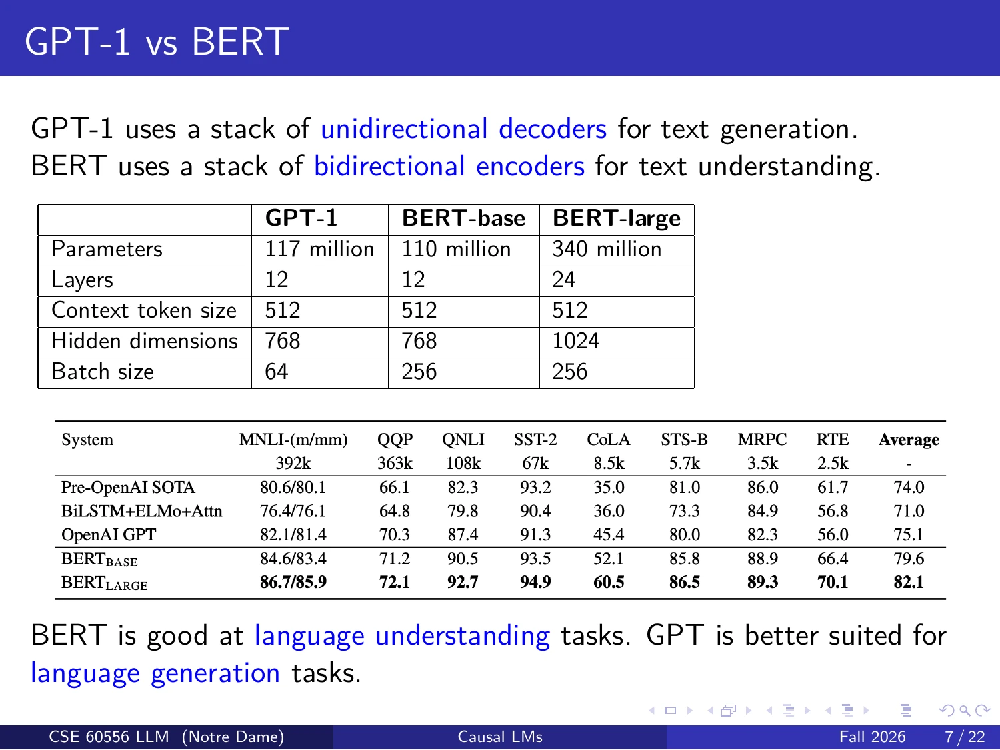{ loading=lazy }](../../assets/llm/section1/03-causal-lm/page-007.webp)

展开本页文字

<pre style="white-space:pre-wrap;overflow-wrap:anywhere">GPT-1 vs BERT
GPT-1 uses a stack of unidirectional decoders for text generation.
BERT uses a stack of bidirectional encoders for text understanding.
GPT-1 BERT-baseBERT-large
Parameters 117 million110 million 340 million
Layers 12 12 24
Context token size512 512 512
Hidden dimensions768 768 1024
Batch size 64 256 256
BERT is good at language understanding tasks. GPT is better suited for
language generation tasks.</pre>

### 008 · GPT-2

[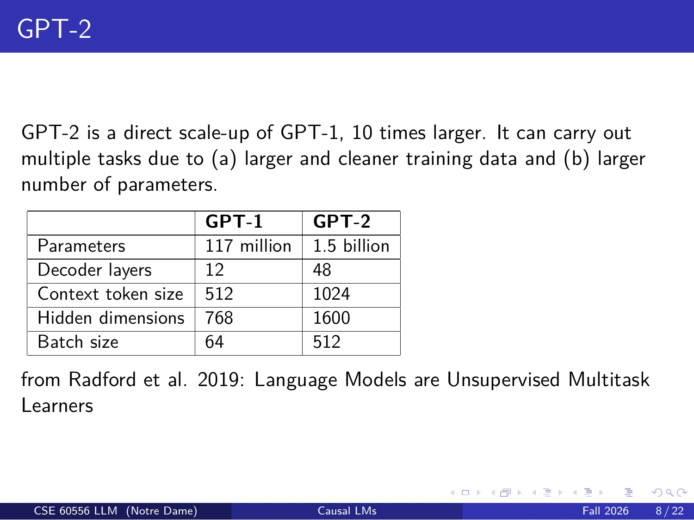{ loading=lazy }](../../assets/llm/section1/03-causal-lm/page-008.webp)

展开本页文字

<pre style="white-space:pre-wrap;overflow-wrap:anywhere">GPT-2
GPT-2 is a direct scale-up of GPT-1, 10 times larger. It can carry out
multiple tasks due to (a) larger and cleaner training data and (b) larger
number of parameters.
GPT-1 GPT-2
Parameters 117 million 1.5 billion
Decoder layers 12 48
Context token size 512 1024
Hidden dimensions 768 1600
Batch size 64 512
from Radford et al. 2019 : Language Models are Unsupervised Multitask
Learners</pre>

### 009 · GPT-2: Results

[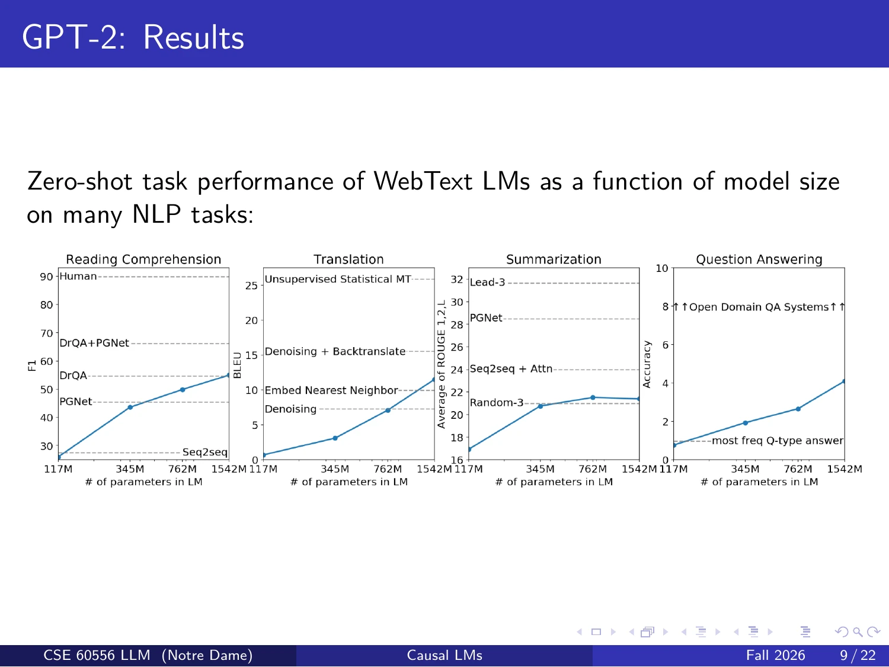{ loading=lazy }](../../assets/llm/section1/03-causal-lm/page-009.webp)

展开本页文字

<pre style="white-space:pre-wrap;overflow-wrap:anywhere">GPT-2: Results
Zero-shot task performance of WebText LMs as a function of model size
on many NLP tasks:</pre>

### 010 · GPT-2: Scaling Law started to emerge

[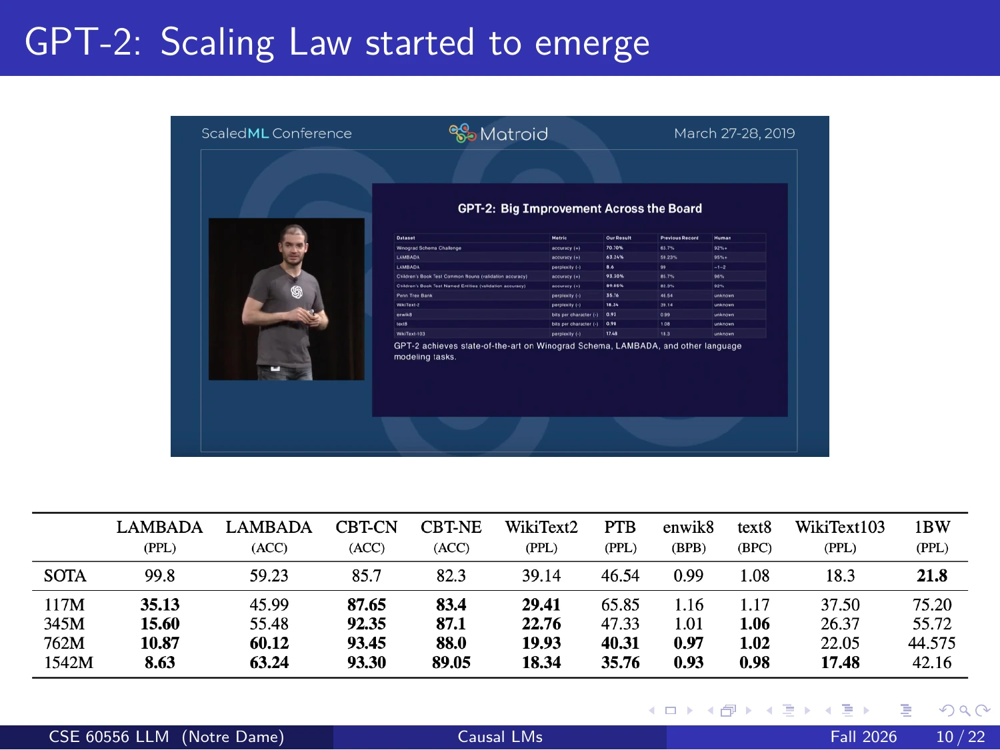{ loading=lazy }](../../assets/llm/section1/03-causal-lm/page-010.webp)

展开本页文字

<pre style="white-space:pre-wrap;overflow-wrap:anywhere">GPT-2: Scaling Law started to emerge</pre>

### 011 · Table of Contents

[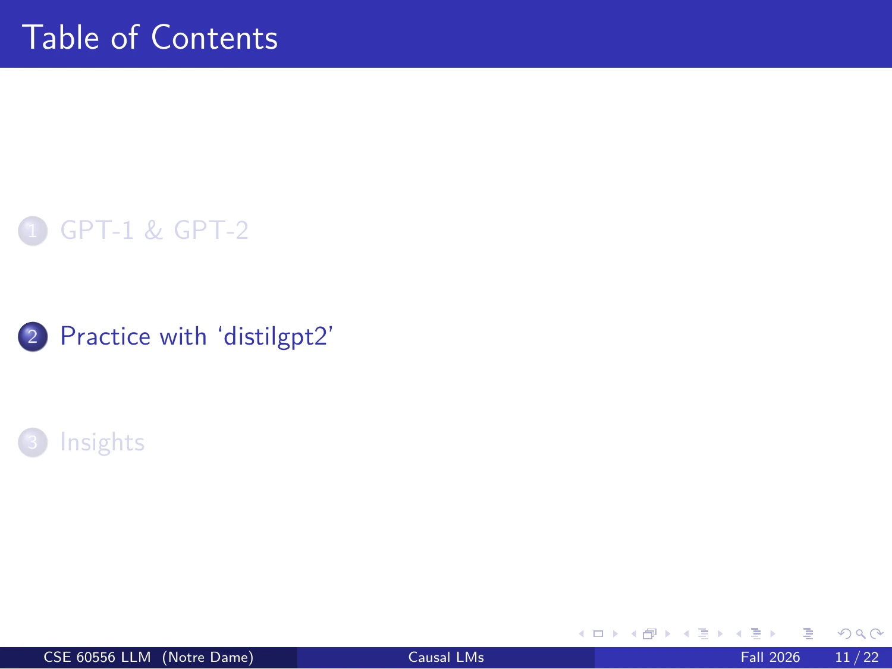{ loading=lazy }](../../assets/llm/section1/03-causal-lm/page-011.webp)

展开本页文字

<pre style="white-space:pre-wrap;overflow-wrap:anywhere">Table of Contents
1 GPT-1 &amp; GPT-2
2 Practice with ‘distilgpt2’
3 Insights</pre>

### 012 · Dive into Transformers with Hugging Face

[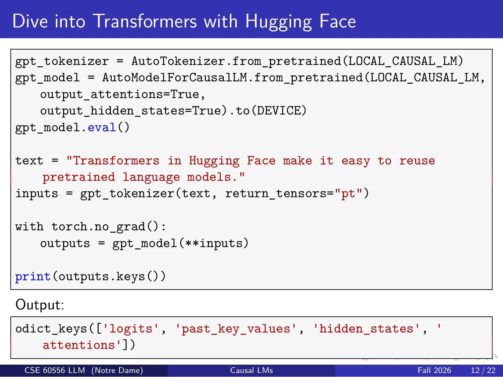{ loading=lazy }](../../assets/llm/section1/03-causal-lm/page-012.webp)

展开本页文字

<pre style="white-space:pre-wrap;overflow-wrap:anywhere">Dive into Transformers with Hugging Face
gpt_tokenizer = AutoTokenizer.from_pretrained(LOCAL_CAUSAL_LM)
gpt_model = AutoModelForCausalLM.from_pretrained(LOCAL_CAUSAL_LM,
output_attentions=True,
output_hidden_states=True).to(DEVICE)
gpt_model.eval()
text = &quot;Transformers in Hugging Face make it easy to reuse
pretrained language models.&quot;
inputs = gpt_tokenizer(text, return_tensors= &quot;pt&quot;)
with torch.no_grad():
outputs = gpt_model(**inputs)
print(outputs.keys())
Output:
odict_keys([&#x27;logits&#x27;, &#x27;past_key_values&#x27;, &#x27;hidden_states&#x27;, &#x27;
attentions&#x27;])</pre>

### 013 · Architecture Code

[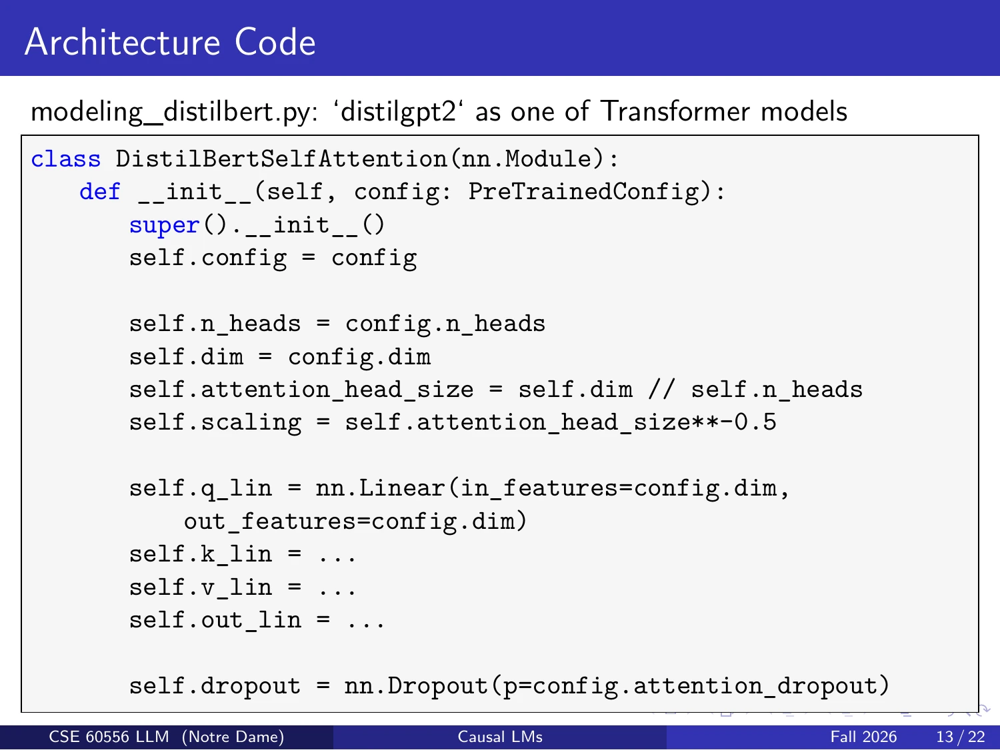{ loading=lazy }](../../assets/llm/section1/03-causal-lm/page-013.webp)

展开本页文字

<pre style="white-space:pre-wrap;overflow-wrap:anywhere">Architecture Code
modeling_distilbert.py: ‘distilgpt2‘ as one of Transformer models
class DistilBertSelfAttention(nn.Module):
def __init__(self, config: PreTrainedConfig):
super().__init__()
self.config = config
self.n_heads = config.n_heads
self.dim = config.dim
self.attention_head_size = self.dim // self.n_heads
self.scaling = self.attention_head_size**-0.5
self.q_lin = nn.Linear(in_features=config.dim,
out_features=config.dim)
self.k_lin = ...
self.v_lin = ...
self.out_lin = ...
self.dropout = nn.Dropout(p=config.attention_dropout)</pre>

### 014 · Architecture Code

[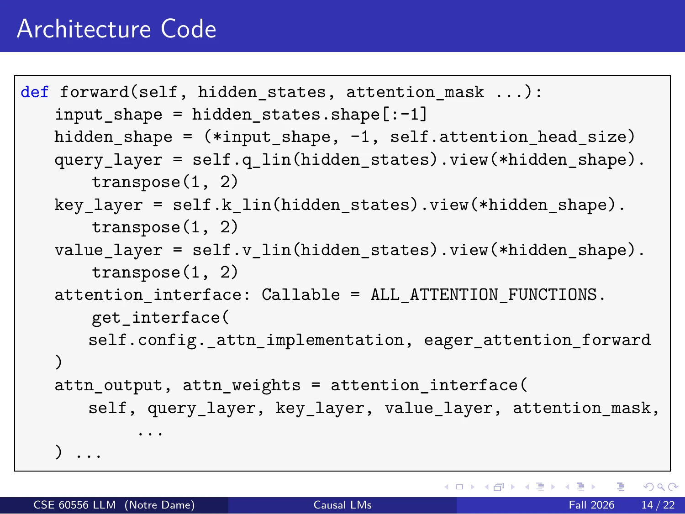{ loading=lazy }](../../assets/llm/section1/03-causal-lm/page-014.webp)

展开本页文字

<pre style="white-space:pre-wrap;overflow-wrap:anywhere">Architecture Code
def forward(self, hidden_states, attention_mask ...):
input_shape = hidden_states.shape[:-1]
hidden_shape = (*input_shape, -1, self.attention_head_size)
query_layer = self.q_lin(hidden_states).view(*hidden_shape).
transpose(1, 2)
key_layer = self.k_lin(hidden_states).view(*hidden_shape).
transpose(1, 2)
value_layer = self.v_lin(hidden_states).view(*hidden_shape).
transpose(1, 2)
attention_interface: Callable = ALL_ATTENTION_FUNCTIONS.
get_interface(
self.config._attn_implementation, eager_attention_forward
)
attn_output, attn_weights = attention_interface(
self, query_layer, key_layer, value_layer, attention_mask,
) ...</pre>

### 015 · Architecture Code

[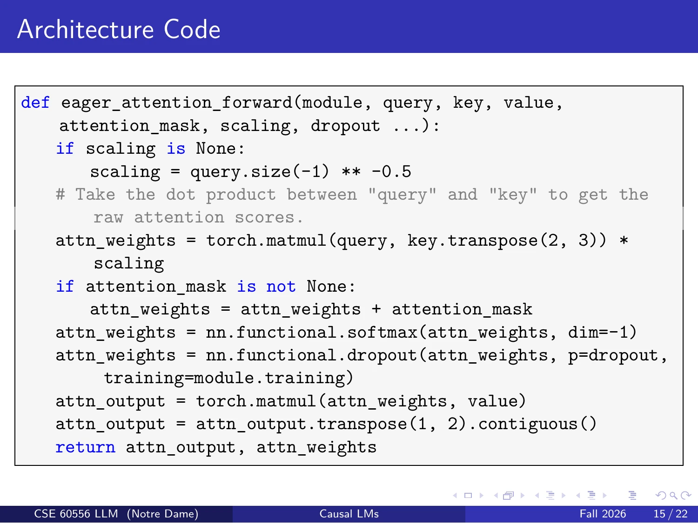{ loading=lazy }](../../assets/llm/section1/03-causal-lm/page-015.webp)

展开本页文字

<pre style="white-space:pre-wrap;overflow-wrap:anywhere">Architecture Code
def eager_attention_forward(module, query, key, value,
attention_mask, scaling, dropout ...):
if scaling is None:
scaling = query.size(-1) ** -0.5
# Take the dot product between &quot;query&quot; and &quot;key&quot; to get the
raw attention scores.
attn_weights = torch.matmul(query, key.transpose(2, 3)) *
scaling
if attention_mask is not None:
attn_weights = attn_weights + attention_mask
attn_weights = nn.functional.softmax(attn_weights, dim=-1)
attn_weights = nn.functional.dropout(attn_weights, p=dropout,
training=module.training)
attn_output = torch.matmul(attn_weights, value)
attn_output = attn_output.transpose(1, 2).contiguous()
return attn_output, attn_weights</pre>

### 016 · Dive into Transformers with Hugging Face

[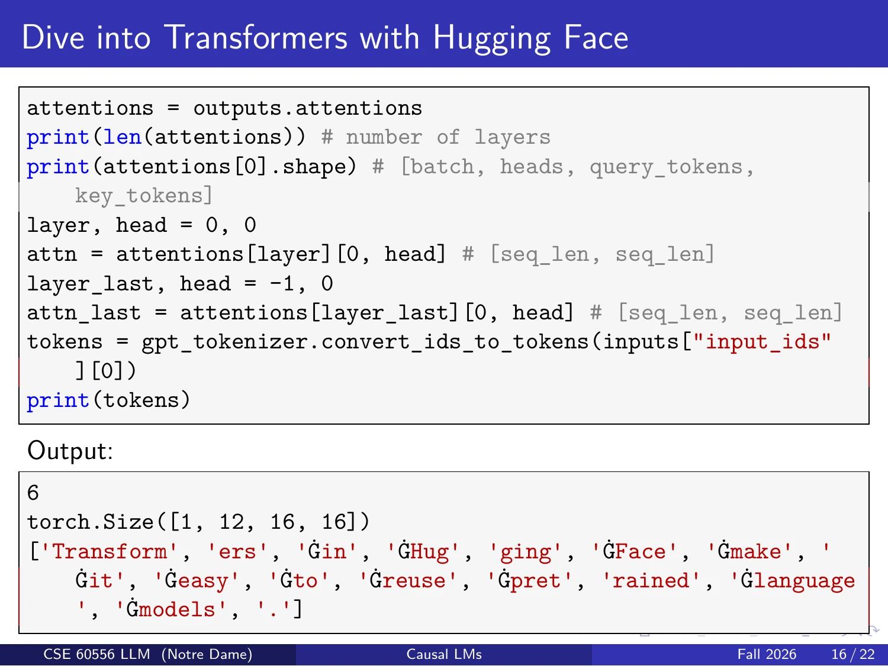{ loading=lazy }](../../assets/llm/section1/03-causal-lm/page-016.webp)

展开本页文字

<pre style="white-space:pre-wrap;overflow-wrap:anywhere">Dive into Transformers with Hugging Face
attentions = outputs.attentions
print(len(attentions)) # number of layers
print(attentions[0].shape) # [batch, heads, query_tokens,
key_tokens]
layer, head = 0, 0
attn = attentions[layer][0, head] # [seq_len, seq_len]
layer_last, head = -1, 0
attn_last = attentions[layer_last][0, head] # [seq_len, seq_len]
tokens = gpt_tokenizer.convert_ids_to_tokens(inputs[ &quot;input_ids&quot;
][0])
print(tokens)
Output:
6
torch.Size([1, 12, 16, 16])
[&#x27;Transform&#x27;, &#x27;ers&#x27;, &#x27;Ġin&#x27;, &#x27;ĠHug&#x27;, &#x27;ging&#x27;, &#x27;ĠFace&#x27;, &#x27;Ġmake&#x27;, &#x27;
Ġit&#x27;, &#x27;Ġeasy&#x27;, &#x27;Ġto&#x27;, &#x27;Ġreuse&#x27;, &#x27;Ġpret&#x27;, &#x27;rained&#x27;, &#x27;Ġlanguage
&#x27;, &#x27;Ġmodels&#x27;, &#x27;.&#x27;]</pre>

### 017 · Visualize Attentions

[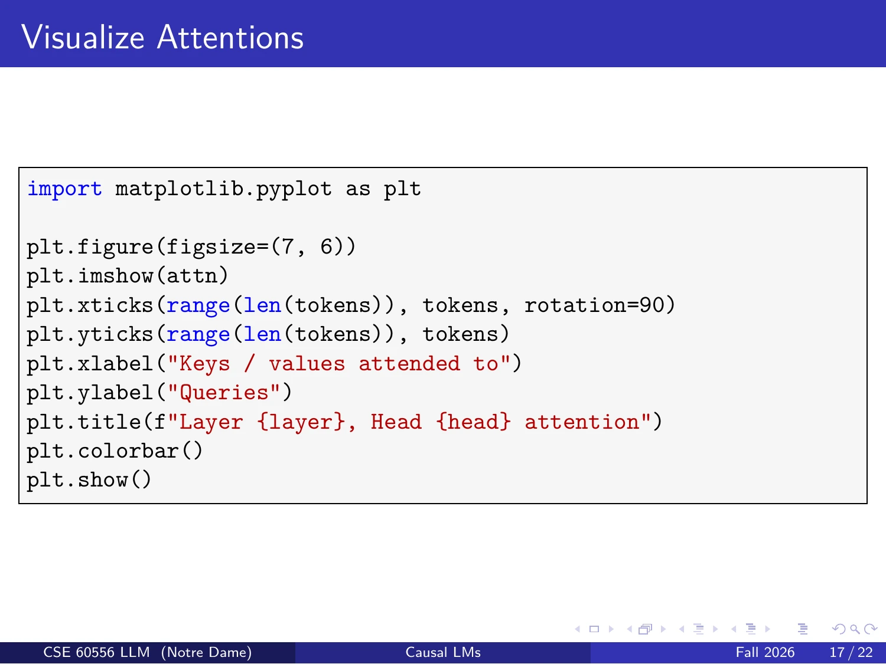{ loading=lazy }](../../assets/llm/section1/03-causal-lm/page-017.webp)

展开本页文字

<pre style="white-space:pre-wrap;overflow-wrap:anywhere">Visualize Attentions
import matplotlib.pyplot as plt
plt.figure(figsize=(7, 6))
plt.imshow(attn)
plt.xticks(range(len(tokens)), tokens, rotation=90)
plt.yticks(range(len(tokens)), tokens)
plt.xlabel(&quot;Keys / values attended to&quot;)
plt.ylabel(&quot;Queries&quot;)
plt.title(f&quot;Layer {layer}, Head {head} attention&quot;)
plt.colorbar()
plt.show()</pre>

### 018 · Visualize Attentions

[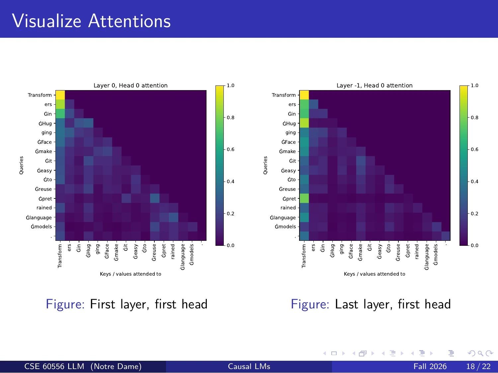{ loading=lazy }](../../assets/llm/section1/03-causal-lm/page-018.webp)

展开本页文字

<pre style="white-space:pre-wrap;overflow-wrap:anywhere">Visualize Attentions
Transform
ers
in
Hug
ging
Face
make
it
easy
to
reuse
pret
rained
language
models
Keys / values attended to
Transform
ers
in
Hug
ging
Face
make
it
easy
to
reuse
pret
rained
language
models
Queries
Layer 0, Head 0 attention
0.0
0.2
0.4
0.6
0.8
1.0
Figure: First layer, first head
Transform
ers
in
Hug
ging
Face
make
it
easy
to
reuse
pret
rained
language
models
Keys / values attended to
Transform
ers
in
Hug
ging
Face
make
it
easy
to
reuse
pret
rained
language
models
Queries
Layer -1, Head 0 attention
0.0
0.2
0.4
0.6
0.8
1.0 Figure: Last layer, first head</pre>

### 019 · Table of Contents

[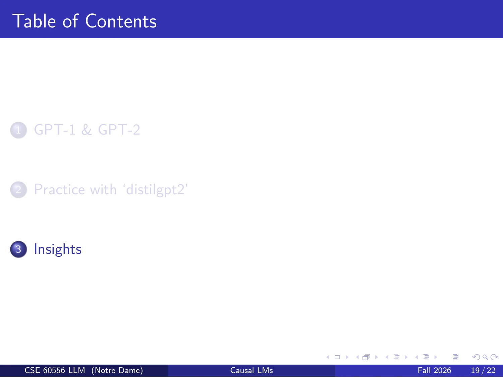{ loading=lazy }](../../assets/llm/section1/03-causal-lm/page-019.webp)

展开本页文字

<pre style="white-space:pre-wrap;overflow-wrap:anywhere">Table of Contents
1 GPT-1 &amp; GPT-2
2 Practice with ‘distilgpt2’
3 Insights</pre>

### 020 · Causal attention learns implicit positional encodings.

[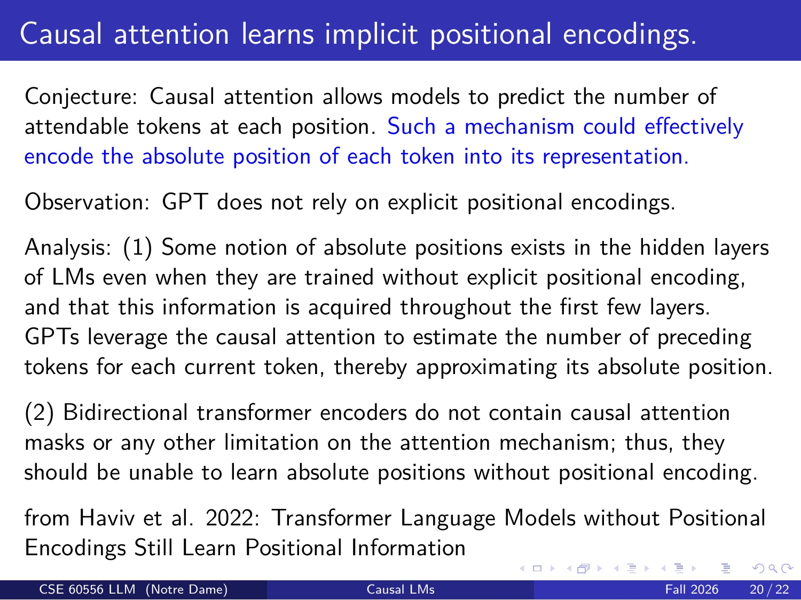{ loading=lazy }](../../assets/llm/section1/03-causal-lm/page-020.webp)

展开本页文字

<pre style="white-space:pre-wrap;overflow-wrap:anywhere">Causal attention learns implicit positional encodings.
Conjecture: Causal attention allows models to predict the number of
attendable tokens at each position. Such a mechanism could effectively
encode the absolute position of each token into its representation.
Observation: GPT does not rely on explicit positional encodings.
Analysis: (1) Some notion of absolute positions exists in the hidden layers
of LMs even when they are trained without explicit positional encoding,
and that this information is acquired throughout the first few layers.
GPTs leverage the causal attention to estimate the number of preceding
tokens for each current token, thereby approximating its absolute position.
(2) Bidirectional transformer encoders do not contain causal attention
masks or any other limitation on the attention mechanism; thus, they
should be unable to learn absolute positions without positional encoding.
from Haviv et al. 2022 : Transformer Language Models without Positional
Encodings Still Learn Positional Information</pre>

### 021 · Path to zero-shot Generalization?

[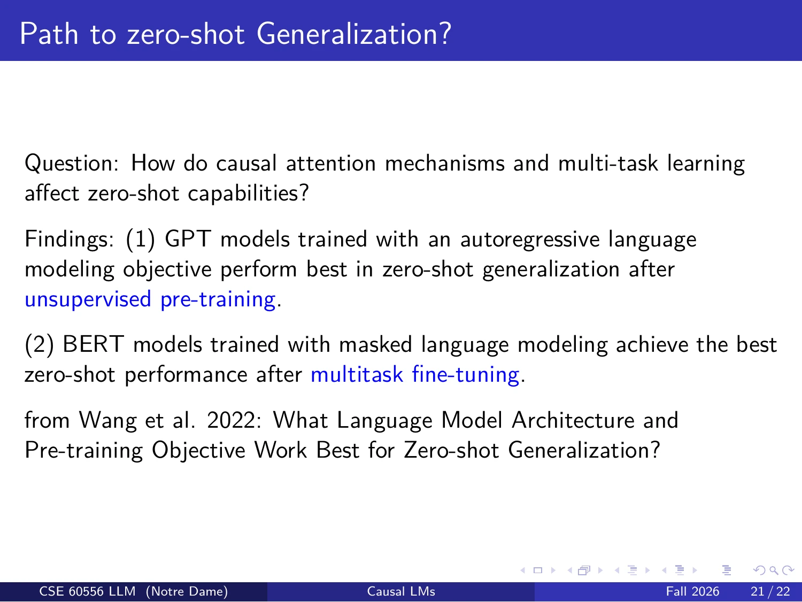{ loading=lazy }](../../assets/llm/section1/03-causal-lm/page-021.webp)

展开本页文字

<pre style="white-space:pre-wrap;overflow-wrap:anywhere">Path to zero-shot Generalization?
Question: How do causal attention mechanisms and multi-task learning
affect zero-shot capabilities?
Findings: (1) GPT models trained with an autoregressive language
modeling objective perform best in zero-shot generalization after
unsupervised pre-training .
(2) BERT models trained with masked language modeling achieve the best
zero-shot performance after multitask fine-tuning .
from Wang et al. 2022 : What Language Model Architecture and
Pre-training Objective Work Best for Zero-shot Generalization?</pre>

### 022 · Takeaways

[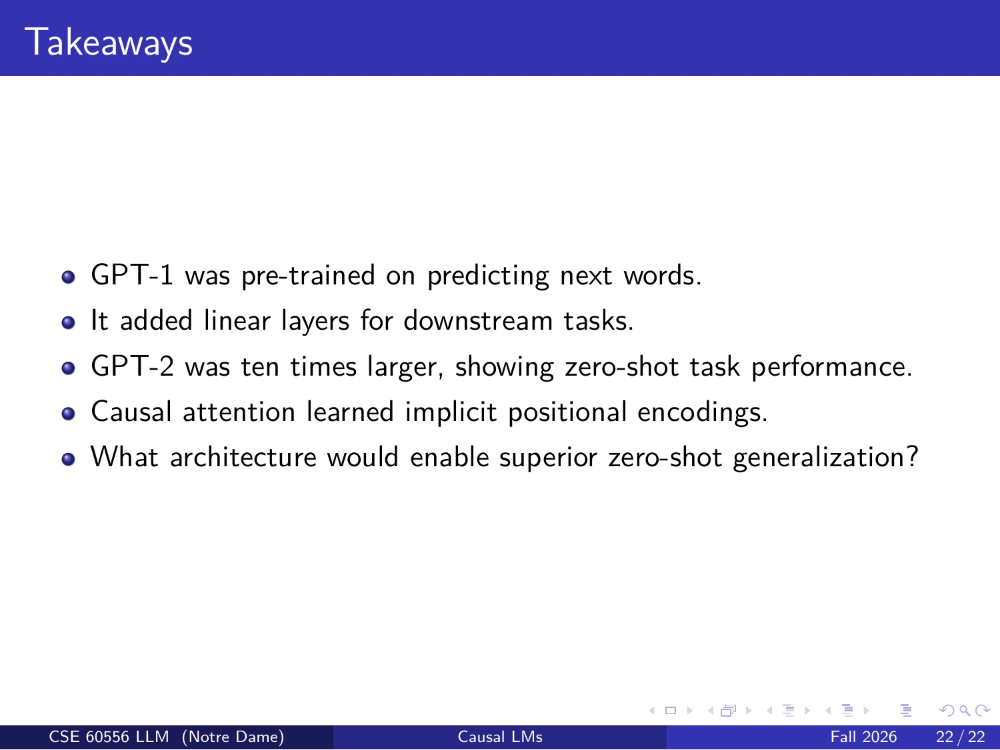{ loading=lazy }](../../assets/llm/section1/03-causal-lm/page-022.webp)

展开本页文字

<pre style="white-space:pre-wrap;overflow-wrap:anywhere">Takeaways
GPT-1 was pre-trained on predicting next words.
It added linear layers for downstream tasks.
GPT-2 was ten times larger, showing zero-shot task performance.
Causal attention learned implicit positional encodings.
What architecture would enable superior zero-shot generalization?</pre>

