# Scaling Laws、ICL 与 MoE

[返回 Section 1](index.md)

授课课件：Meng Jiang · CSE 60556 · Fall 2026。来源 `Chapter1-L03 (L05).pdf`，共 **40 页**。

[下载完整原课件 PDF](../../assets/llm/section1/04-scaling-icl-moe/slides.pdf)


## 1. Scaling law 在回答什么问题？

**Scaling law（尺度规律）**描述增加模型、数据或计算时，某种性能指标如何系统变化。它通常是经验拟合，不是保证所有模型都服从的自然定律。

设 \(N\) 是参数量，\(D\) 是训练 token 数，\(C\) 是计算量，\(L\) 是测试损失。我们希望在没训练最大模型之前，用较小实验估计扩大规模可能带来多少收益。

**Power law（幂律）**的一个形式是 \(L(N)=L_\infty+aN^{-\alpha}\)。\(L_\infty\) 表示拟合中的损失下限，\(a\) 是尺度系数，\(\alpha>0\) 控制下降速度。如果扣除下限后取对数，\(\log(L-L_\infty)=\log a-\alpha\log N\)，曲线接近直线。

把参数翻倍，并不意味着准确率翻倍。准确率与损失也不是同一个指标，不能把一种量的幂律直接套到另一种量上。

## 2. Model size、data size 和 compute 为什么必须一起看？

大模型若训练数据太少，能力可能没被充分训练出来；数据很多但模型太小，表示能力又可能成为限制。课件早期曲线里的 **plateau（平台）**就是继续增加某个资源后，性能改善很小。

一个常见的联合近似写成：

\[
L(N,D)=E+\frac{A}{N^\alpha}+\frac{B}{D^\beta}.
\]

\(E\) 是拟合的基础项，后两项分别反映参数与数据不足的影响。这提供“瓶颈可能在哪”的思路，不意味着现实中三个原因可以被完全独立识别。

**Compute budget（计算预算）**是在有限硬件时间里允许花费的运算量。**FLOP** 是一次浮点运算，**FLOPs** 常指运算总数；**FLOP/s** 才是每秒运算速度。GPU 数量本身不是计算量，还要看运行时间和实际效率。

## 3. 为什么课件写 \(C\approx6ND\)？

粗略地，一个参数对一个 token 的前向矩阵计算约涉及一次乘加，按两次浮点运算计；反向传播还要计算梯度，成本大约为前向的两倍。加起来给出约 \(6N\) FLOPs/token，再乘 \(D\)。

这是 dense Transformer 主体计算的常用近似。它省略了一些项，并依赖架构、序列长度和计数方式；不要当作显存公式或精确运行时间。

例子：\(N=10^9\) 个参数，\(D=2\times10^{10}\) 个 token，则：

\[
C\approx6\times10^9\times2\times10^{10}=1.2\times10^{20}\ \text{FLOPs}.
\]

若保持 \(C\) 不变，参数变为两倍，那么该近似下可训练的 token 数必须减半。这就是预算约束下的取舍。

## 4. Kaplan 与 Chinchilla 为什么给出不同建议？

两者都在问 **compute-optimal（计算最优）**：给定预算，怎样分配模型大小和数据量，让损失尽量低。

课件中的 Kaplan 路线倾向于随预算增大更快增加参数量；Chinchilla 的结果更强调同时扩大数据，参数和 token 数应更均衡增长。它们来自不同实验范围、训练安排和拟合选择，不能只把其中一个说成“更大就一定更好”。

用上面的联合损失作一个直观推导，代入 \(D=C/(6N)\)：

\[
L(N)=E+AN^{-\alpha}+B(6N/C)^\beta.
\]

第一项随 \(N\) 增大而下降，后一项因数据预算减少而上升。令导数为零得到 \(N_{\mathrm{opt}}\propto C^{\beta/(\alpha+\beta)}\)、\(D_{\mathrm{opt}}\propto C^{\alpha/(\alpha+\beta)}\)。若两个指数相近，就都接近平方根增长。这是该简化模型的推导，用来理解取舍。

**同预算训练最优**不等于**部署最便宜**。如果模型以后要回答海量请求，更小而训练更久的模型也可能有吸引力，因为推理成本进入了目标。

## 5. GPT-3 与 in-context learning 是什么？

**In-context learning（ICL，上下文学习）**指把任务示例放在 prompt 里，模型据此完成新的输入，而不在这次使用中更新参数。

例如给模型：

```text
Classify sentiment.
"I loved it." -> positive
"It was disappointing." -> negative
"It was wonderful." ->
```

模型利用上面的格式和标签规律继续输出 `positive`。示例是当前输入的一部分；不像 fine-tuning 那样做反向传播改权重。移走示例后，本次上下文带来的帮助也未必保留。

**Zero-shot** 给任务说明但不给示例；**one-shot** 给一个示例；**few-shot** 给少量示例。Zero-shot 不是“不能给指令”，也不保证训练中从没见过类似文本。

| 方法 | 例子放在哪里 | 本次使用是否改参数 | 直观类比 |
| --- | --- | --- | --- |
| ICL | 当前 prompt | 不改 | 现场拿着样例照规则做 |
| Fine-tuning | 训练数据 | 改 | 用练习和反馈长期调整 |

这个类比仅解释计算流程，不能推出模型以人类同样的方式学习。

## 6. 为什么例子的选择会重要？

ICL 的示例同时透露任务、输出格式、标签含义与数据风格。例子选得偏，模型可能推断错规则。例如所有积极句都提到 food，模型可能利用了不相关线索。顺序、示例数量和与新问题的相似程度也可能改变结果。

**Context window（上下文窗口）**是一次可处理的 token 范围。示例越多，占用窗口越多，计算也增加。更多例子不是无条件更好。

## 7. Meta-learning 和 Bayesian view 分别在说什么？

**Meta-learning（元学习）**是“学会如何适应任务”。在 ICL 研究中，一个观点是预训练使网络学到在前向计算中利用少量样例调整行为的机制。有研究把某些网络计算与优化步骤联系起来，但不能说模型在 prompt 内真的执行了普通 fine-tuning。

**Bayesian view（贝叶斯视角）**把样例看成对隐藏任务的证据：

\[
P(y\mid x,\mathcal D)=\sum_z P(y\mid x,z)P(z\mid\mathcal D).
\]

\(z\) 是可能的任务规则，\(\mathcal D\) 是 prompt 中的例子。比如单个“red→rouge”使翻译任务比情感分类更像合理解释。看到更多例子后，对规则的权重改变，预测也改变。

这是理解模型行为的理论视角；不意味着每个 LLM 内部都显式存着一张可读取的贝叶斯后验表。

## 8. Emergent abilities、MMLU 和 TriviaQA

**Emergent abilities（涌现能力）**描述某些任务在较小模型上表现很弱，而规模增大后明显出现的现象。要区分“某个评分曲线突然跳升”与“所有潜在能力真的发生不连续变化”。比如只按整道题全对才计分，本来逐渐改善的 token 预测也可能呈现陡峭的任务得分。

**MMLU** 是覆盖多学科的知识与推理测评集合；**TriviaQA** 是开放域问答基准。**Benchmark** 是用于系统比较的数据与评价规则。**Open-domain** 意味着问题来源不局限于一个狭窄领域，不是模型一定能联网找答案。

读图要看横轴是什么规模、纵轴是什么指标、是否 zero/few-shot，以及数据是否可能与训练重叠。课件说 ICL “只在大模型出现”应结合其比较范围理解，不能当成对所有小模型的绝对不可能结论。

## 9. MoE 的 expert 是一个什么东西？

**Mixture of Experts（MoE，专家混合）**在本章通常把 Transformer 中的 FFN 换成多个 FFN 专家，并用 router 为 token 选择少数专家。一个 **expert** 是一个可学习子网络，不是一个真人，也不一定对应“数学专家”“医学专家”这种明确领域标签。

**Dense（稠密）模型**每个 token 通常走过相同的大部分参数；**sparse MoE（稀疏专家模型）**只激活其中少数专家。**总参数**影响储存和容量；**激活参数**更接近单 token 用到的计算部分，但实际速度还受访存、通信和实现影响。

## 10. Router、top-k 和 weighted sum

**Router / gating network（路由器 / 门控网络）**根据输入 \(x\) 给专家打分。Top-k routing 保留得分最高的 k 个，计算其归一化权重：

\[
y=\sum_{i\in\mathcal K(x)}g_i(x)E_i(x).
\]

\(\mathcal K(x)\) 是被选中的专家集合，\(g_i\) 是路由权重，\(E_i(x)\) 是专家输出。

手算：选中两个专家，权重为 0.7、0.3，输出分别是 \((1,2)\)、\((3,0)\)，混合结果是 \((1.6,1.4)\)。这与 attention 同样出现加权和，但加权对象是不同专家的处理结果，而非不同 token 的 value。

## 11. Load balancing、Mixtral 与 DeepSeekMoE

**Load balancing（负载均衡）**防止 router 总选同几个专家。否则有的专家拥堵、有的几乎不训练。均衡可以通过训练目标、路由设计等方法鼓励，不是要求每个输入都平均调用全部专家。

**Mixtral** 是课件讨论的稀疏专家架构实例。型号里“8×7B”不能简单当作 8 个完整 7B 模型独立跑一遍再投票；attention 等模块可以共享，而且每次只选部分专家。

**Knowledge hybridity（知识混杂）**表示一个专家被迫处理多样信息，专门化不足；**knowledge redundancy（知识冗余）**表示多个专家重复学相同信息。它们是设计讨论中的问题描述，不是直接可观察的心理维度。

**Fine-grained expert segmentation（细粒度专家划分）**把专家拆得更细，让组合更灵活；**shared experts（共享专家）**承担较通用的部分，路由专家可更多学习差异。课件用 DeepSeekMoE 讨论这些思路。

## 12. 自测与课件数值提醒

**ICL 生成新答案后模型参数是否被保存为新版本？** 通常没有，本次只改变了输入上下文。

**MoE 参数更多，推理就一定更慢吗？** 不能仅由总参数判断；要看激活部分及通信等成本。

**同样预算，参数越多越好吗？** 不一定，会压缩可训练的数据量；需要考虑取舍。

课件将 GPT-3 写成 GPT-2 的 10 倍；若比较 175B 与 1.5B，则约为 117 倍。读模型规模时始终对照具体版本。下一讲：[Seq2Seq 和指令微调](05-instruction-tuning.md)。

## 全部 Beamer 页面

下面按原 PDF 页序完整呈现，包括目录、公式、图表、代码、例子与参考文献。点击图片可放大；每页下方可展开文字并搜索或复制。文字由 PDF 提取，公式和代码排版以原图及 PDF 为准；这里没有重建原始 LaTeX 源码。

### 001 · Scaling Laws and ”Large” Language Models

[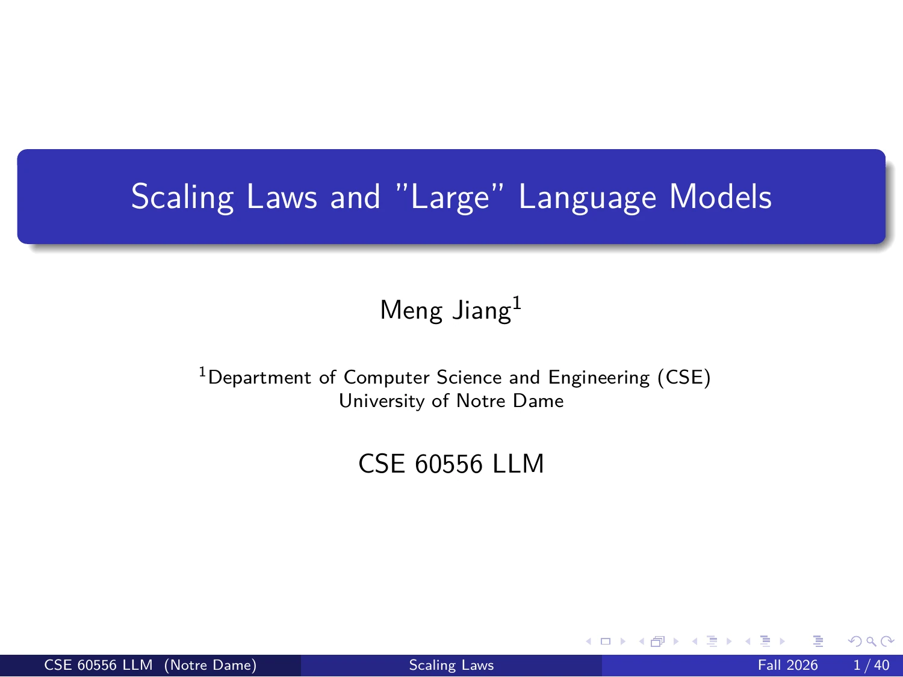{ loading=lazy }](../../assets/llm/section1/04-scaling-icl-moe/page-001.webp)

<details><summary>展开本页文字</summary>
<pre style="white-space:pre-wrap;overflow-wrap:anywhere">Scaling Laws and ”Large” Language Models
Meng Jiang 1
1Department of Computer Science and Engineering (CSE)
University of Notre Dame
CSE 60556 LLM</pre>
</details>

### 002 · Table of Contents

[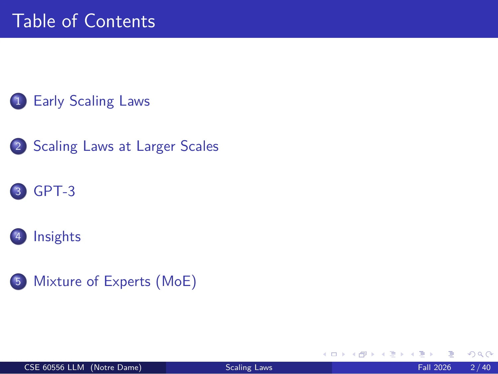{ loading=lazy }](../../assets/llm/section1/04-scaling-icl-moe/page-002.webp)

<details><summary>展开本页文字</summary>
<pre style="white-space:pre-wrap;overflow-wrap:anywhere">Table of Contents
1 Early Scaling Laws
2 Scaling Laws at Larger Scales
3 GPT-3
4 Insights
5 Mixture of Experts (MoE)</pre>
</details>

### 003 · Table of Contents

[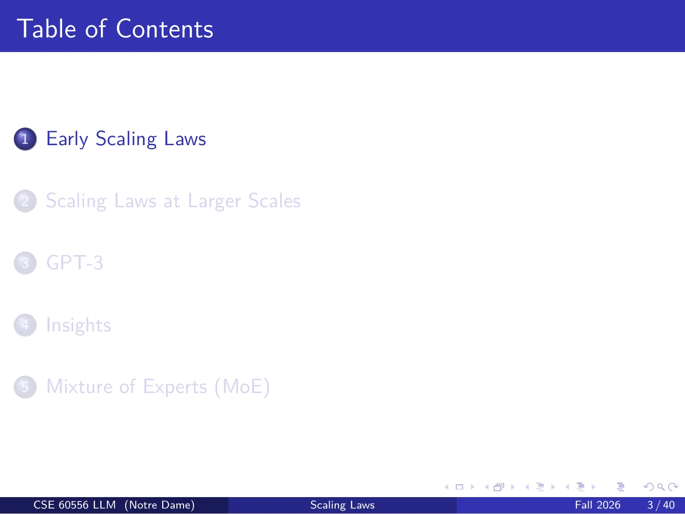{ loading=lazy }](../../assets/llm/section1/04-scaling-icl-moe/page-003.webp)

<details><summary>展开本页文字</summary>
<pre style="white-space:pre-wrap;overflow-wrap:anywhere">Table of Contents
1 Early Scaling Laws
2 Scaling Laws at Larger Scales
3 GPT-3
4 Insights
5 Mixture of Experts (MoE)</pre>
</details>

### 004 · What are scaling laws?

[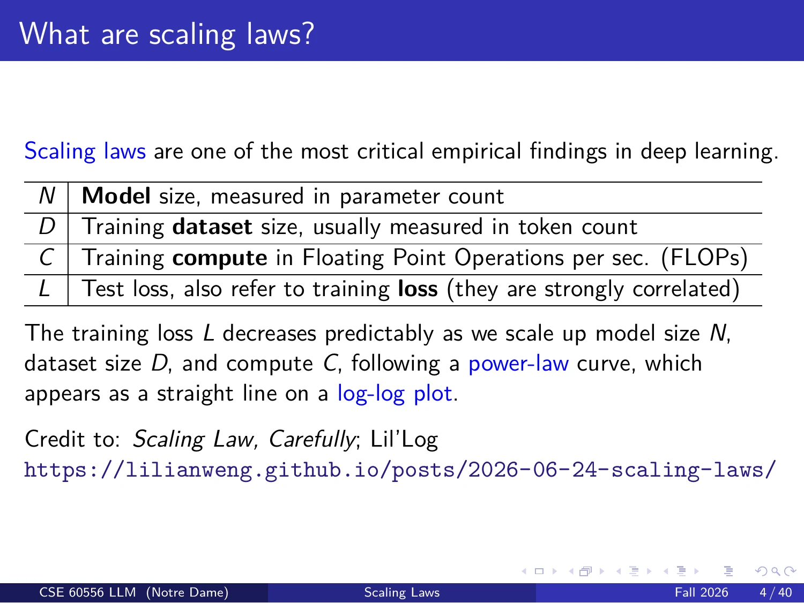{ loading=lazy }](../../assets/llm/section1/04-scaling-icl-moe/page-004.webp)

<details><summary>展开本页文字</summary>
<pre style="white-space:pre-wrap;overflow-wrap:anywhere">What are scaling laws?
Scaling laws are one of the most critical empirical findings in deep learning.
N Model size, measured in parameter count
D Training dataset size, usually measured in token count
C Training compute in Floating Point Operations per sec. (FLOPs)
L Test loss, also refer to training loss (they are strongly correlated)
The training loss L decreases predictably as we scale up model size N,
dataset size D, and compute C, following a power-law curve, which
appears as a straight line on a log-log plot .
Credit to: Scaling Law, Carefully ; Lil’Log
https://lilianweng.github.io/posts/2026-06-24-scaling-laws/</pre>
</details>

### 005 · Power laws are everywhere

[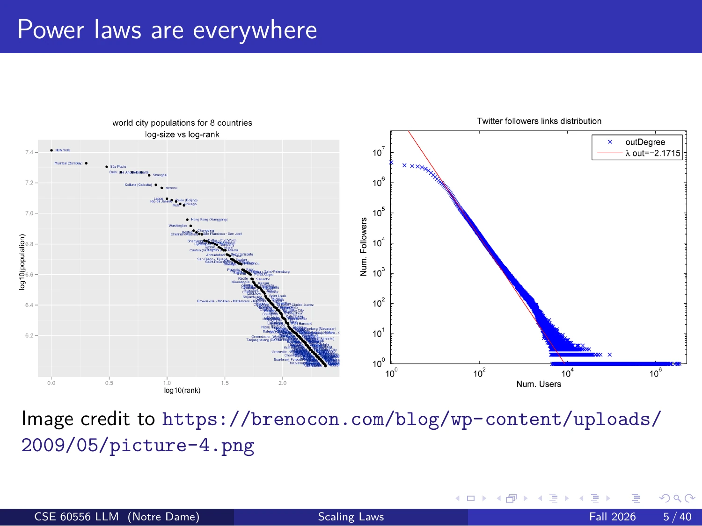{ loading=lazy }](../../assets/llm/section1/04-scaling-icl-moe/page-005.webp)

<details><summary>展开本页文字</summary>
<pre style="white-space:pre-wrap;overflow-wrap:anywhere">Power laws are everywhere
Image credit to https://brenocon.com/blog/wp-content/uploads/
2009/05/picture-4.png</pre>
</details>

### 006 · Why scaling laws are important for deep learning?

[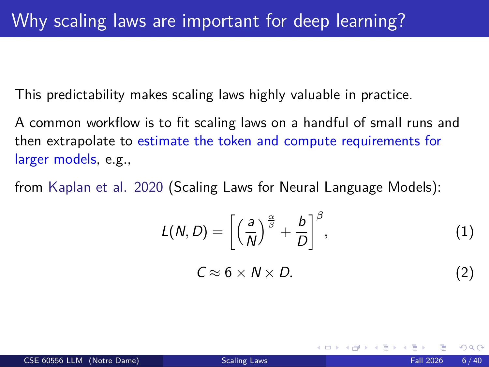{ loading=lazy }](../../assets/llm/section1/04-scaling-icl-moe/page-006.webp)

<details><summary>展开本页文字</summary>
<pre style="white-space:pre-wrap;overflow-wrap:anywhere">Why scaling laws are important for deep learning?
This predictability makes scaling laws highly valuable in practice.
A common workflow is to fit scaling laws on a handful of small runs and
then extrapolate to estimate the token and compute requirements for
larger models , e.g.,
from Kaplan et al. 2020 (Scaling Laws for Neural Language Models):
L(N, D) =
[( a
N
) α
β
+ b
D
]β
, (1)
C ≈ 6 × N × D. (2)</pre>
</details>

### 007 · Scaling Laws in Deep Learning

[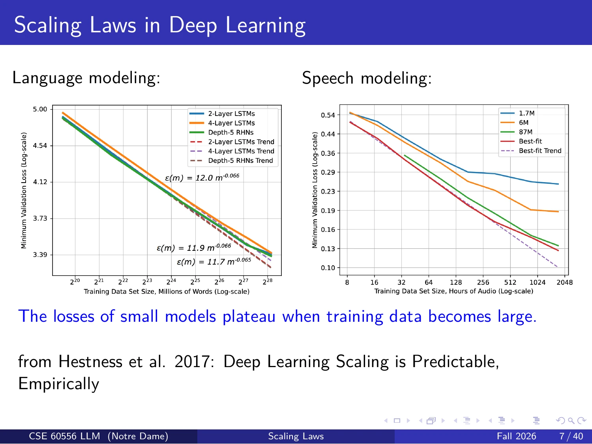{ loading=lazy }](../../assets/llm/section1/04-scaling-icl-moe/page-007.webp)

<details><summary>展开本页文字</summary>
<pre style="white-space:pre-wrap;overflow-wrap:anywhere">Scaling Laws in Deep Learning
Language modeling:
 Speech modeling:
The losses of small models plateau when training data becomes large.
from Hestness et al. 2017 : Deep Learning Scaling is Predictable,
Empirically</pre>
</details>

### 008 · Scaling Laws: 3D Landscape

[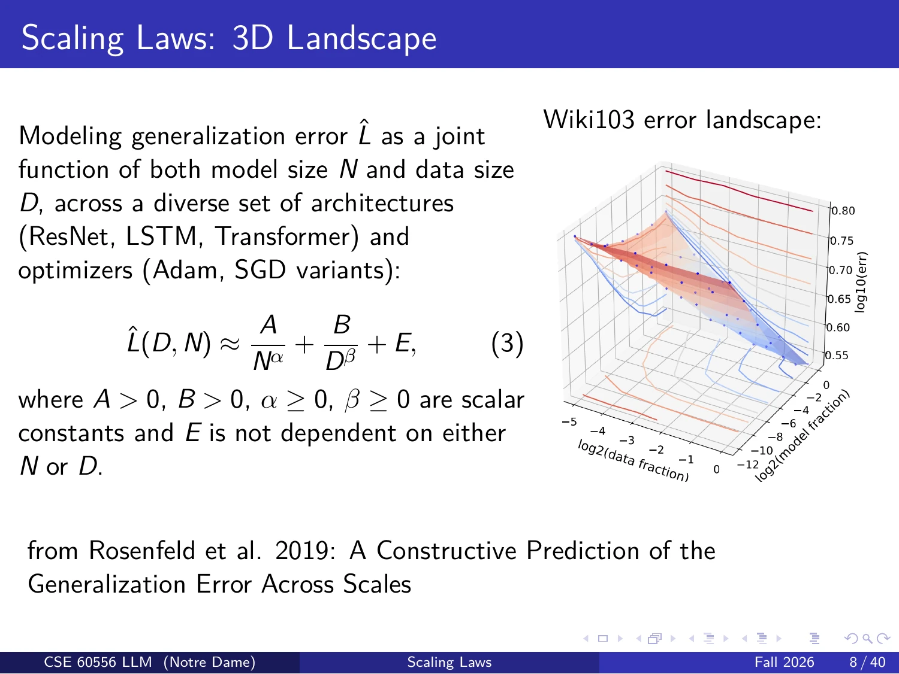{ loading=lazy }](../../assets/llm/section1/04-scaling-icl-moe/page-008.webp)

<details><summary>展开本页文字</summary>
<pre style="white-space:pre-wrap;overflow-wrap:anywhere">Scaling Laws: 3D Landscape
Modeling generalization error ˆL as a joint
function of both model size N and data size
D, across a diverse set of architectures
(ResNet, LSTM, Transformer) and
optimizers (Adam, SGD variants):
ˆL(D, N) ≈ A
Nα + B
Dβ + E, (3)
where A &gt; 0, B &gt; 0, α ≥ 0, β ≥ 0 are scalar
constants and E is not dependent on either
N or D.
Wiki103 error landscape:
from Rosenfeld et al. 2019 : A Constructive Prediction of the
Generalization Error Across Scales</pre>
</details>

### 009 · Table of Contents

[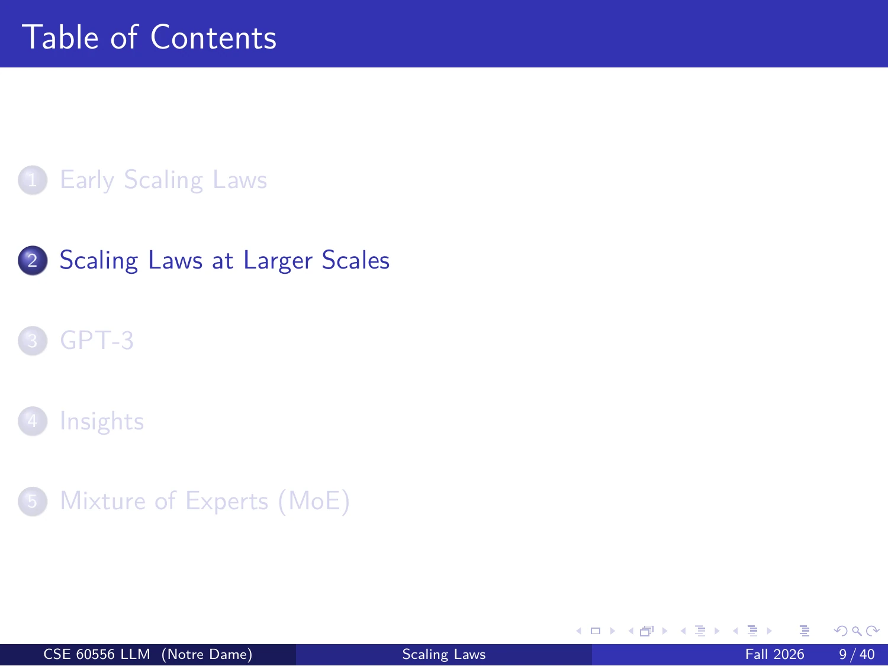{ loading=lazy }](../../assets/llm/section1/04-scaling-icl-moe/page-009.webp)

<details><summary>展开本页文字</summary>
<pre style="white-space:pre-wrap;overflow-wrap:anywhere">Table of Contents
1 Early Scaling Laws
2 Scaling Laws at Larger Scales
3 GPT-3
4 Insights
5 Mixture of Experts (MoE)</pre>
</details>

### 010 · Kaplan et al. ’s Scaling Laws

[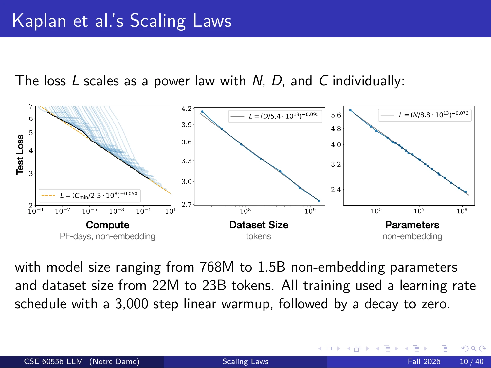{ loading=lazy }](../../assets/llm/section1/04-scaling-icl-moe/page-010.webp)

<details><summary>展开本页文字</summary>
<pre style="white-space:pre-wrap;overflow-wrap:anywhere">Kaplan et al. ’s Scaling Laws
The loss L scales as a power law with N, D, and C individually:
with model size ranging from 768M to 1.5B non-embedding parameters
and dataset size from 22M to 23B tokens. All training used a learning rate
schedule with a 3,000 step linear warmup, followed by a decay to zero.</pre>
</details>

### 011 · Kaplan et al. ’s Scaling Laws

[{ loading=lazy }](../../assets/llm/section1/04-scaling-icl-moe/page-011.webp)

<details><summary>展开本页文字</summary>
<pre style="white-space:pre-wrap;overflow-wrap:anywhere">Kaplan et al. ’s Scaling Laws
The loss L scales as a power law with N, D, and C individually:
with model size ranging from 768M to 1.5B non-embedding parameters
and dataset size from 22M to 23B tokens. All training used a learning rate
schedule with a 3,000 step linear warmup, followed by a decay to zero.</pre>
</details>

### 012 · Kaplan et al. ’s Scaling Laws

[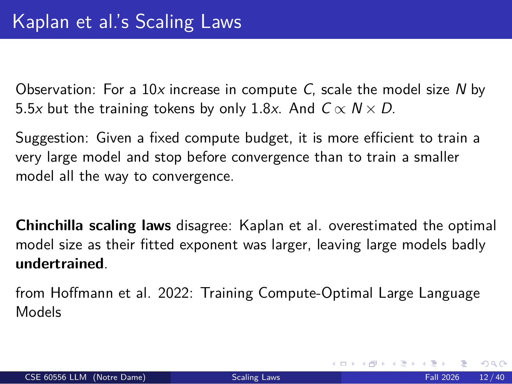{ loading=lazy }](../../assets/llm/section1/04-scaling-icl-moe/page-012.webp)

<details><summary>展开本页文字</summary>
<pre style="white-space:pre-wrap;overflow-wrap:anywhere">Kaplan et al. ’s Scaling Laws
Observation: For a 10 x increase in compute C, scale the model size N by
5.5x but the training tokens by only 1 .8x. And C ∝ N × D.
Suggestion: Given a fixed compute budget, it is more efficient to train a
very large model and stop before convergence than to train a smaller
model all the way to convergence.
Chinchilla scaling laws disagree: Kaplan et al. overestimated the optimal
model size as their fitted exponent was larger, leaving large models badly
undertrained.
from Hoffmann et al. 2022 : Training Compute-Optimal Large Language
Models</pre>
</details>

### 013 · Prove C ≈ 6ND

[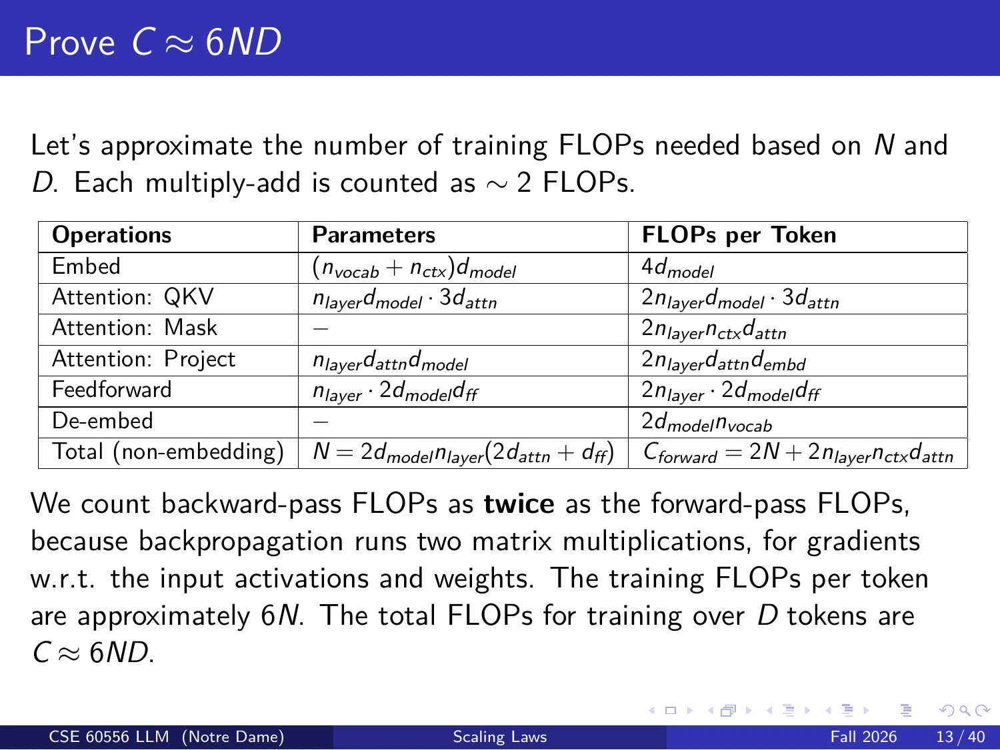{ loading=lazy }](../../assets/llm/section1/04-scaling-icl-moe/page-013.webp)

<details><summary>展开本页文字</summary>
<pre style="white-space:pre-wrap;overflow-wrap:anywhere">Prove C ≈ 6ND
Let’s approximate the number of training FLOPs needed based on N and
D. Each multiply-add is counted as ∼ 2 FLOPs.
Operations Parameters FLOPs per Token
Embed (nvocab+nctx)dmodel 4dmodel
Attention: QKV nlayerdmodel· 3dattn 2nlayerdmodel· 3dattn
Attention: Mask − 2nlayernctxdattn
Attention: Project nlayerdattndmodel 2nlayerdattndembd
Feedforward nlayer· 2dmodeldff 2nlayer· 2dmodeldff
De-embed − 2dmodelnvocab
Total (non-embedding)N=2dmodelnlayer(2dattn+dff) Cforward=2N+2nlayernctxdattn
We count backward-pass FLOPs as twice as the forward-pass FLOPs,
because backpropagation runs two matrix multiplications, for gradients
w.r.t. the input activations and weights. The training FLOPs per token
are approximately 6 N. The total FLOPs for training over D tokens are
C ≈ 6ND.</pre>
</details>

### 014 · Chinchilla Scaling Laws: Allocate resources given C ≈ 6ND

[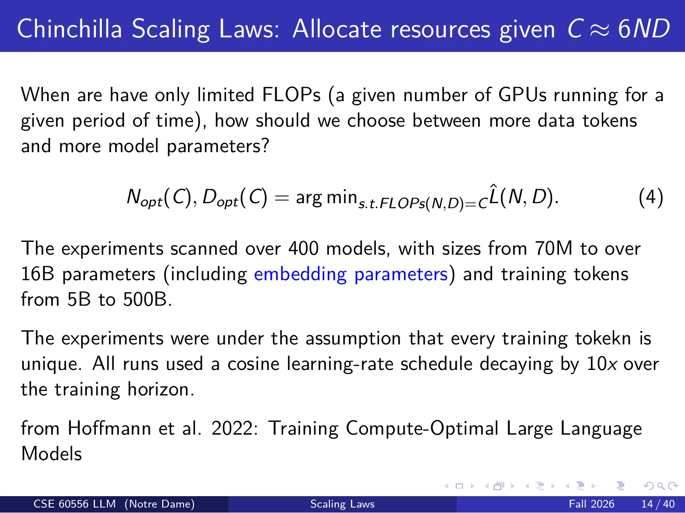{ loading=lazy }](../../assets/llm/section1/04-scaling-icl-moe/page-014.webp)

<details><summary>展开本页文字</summary>
<pre style="white-space:pre-wrap;overflow-wrap:anywhere">Chinchilla Scaling Laws: Allocate resources given C ≈ 6ND
When are have only limited FLOPs (a given number of GPUs running for a
given period of time), how should we choose between more data tokens
and more model parameters?
Nopt(C), Dopt(C) = arg min s.t.FLOPs(N,D)=CˆL(N, D). (4)
The experiments scanned over 400 models, with sizes from 70M to over
16B parameters (including embedding parameters ) and training tokens
from 5B to 500B.
The experiments were under the assumption that every training tokekn is
unique. All runs used a cosine learning-rate schedule decaying by 10 x over
the training horizon.
from Hoffmann et al. 2022 : Training Compute-Optimal Large Language
Models</pre>
</details>

### 015 · Chinchilla Scaling Laws: Learning from Statistics

[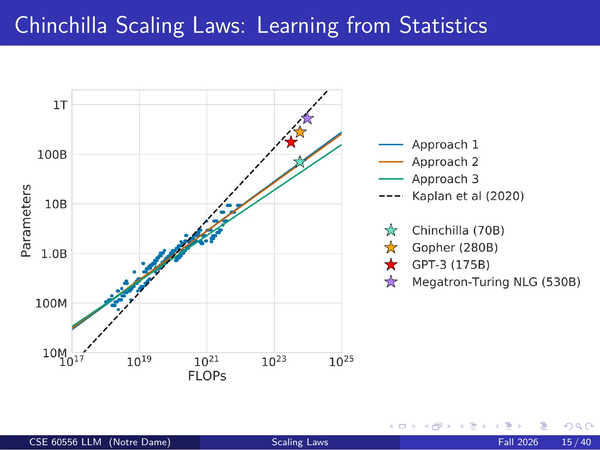{ loading=lazy }](../../assets/llm/section1/04-scaling-icl-moe/page-015.webp)

<details><summary>展开本页文字</summary>
<pre style="white-space:pre-wrap;overflow-wrap:anywhere">Chinchilla Scaling Laws: Learning from Statistics</pre>
</details>

### 016 · Chinchilla Scaling Laws: Design

[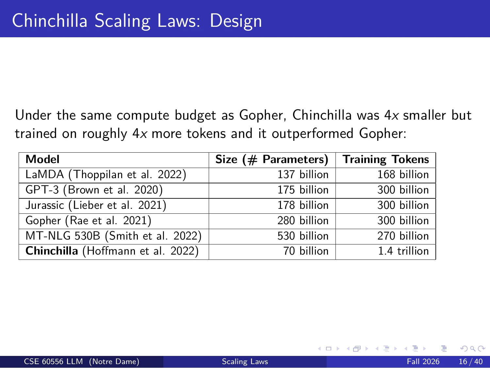{ loading=lazy }](../../assets/llm/section1/04-scaling-icl-moe/page-016.webp)

<details><summary>展开本页文字</summary>
<pre style="white-space:pre-wrap;overflow-wrap:anywhere">Chinchilla Scaling Laws: Design
Under the same compute budget as Gopher, Chinchilla was 4 x smaller but
trained on roughly 4 x more tokens and it outperformed Gopher:
Model Size (# Parameters)Training Tokens
LaMDA (Thoppilan et al. 2022) 137 billion 168 billion
GPT-3 (Brown et al. 2020) 175 billion 300 billion
Jurassic (Lieber et al. 2021) 178 billion 300 billion
Gopher (Rae et al. 2021) 280 billion 300 billion
MT-NLG 530B (Smith et al. 2022) 530 billion 270 billion
Chinchilla(Hoffmann et al. 2022) 70 billion 1.4 trillion</pre>
</details>

### 017 · Reconciling Kaplan and Chinchilla

[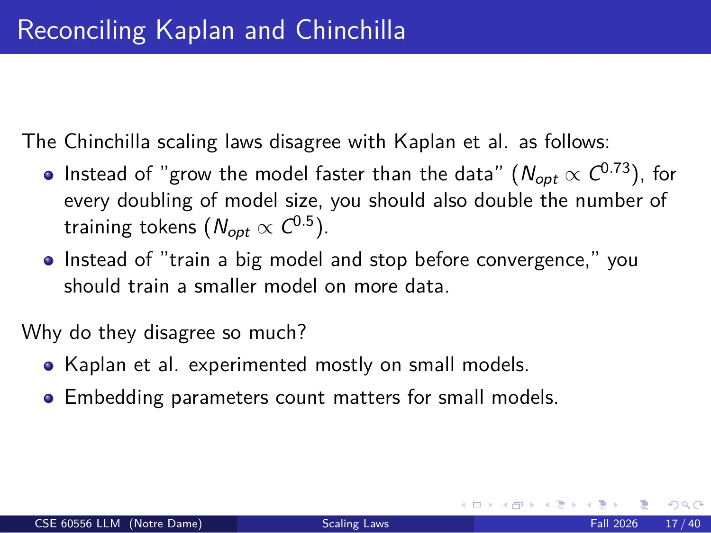{ loading=lazy }](../../assets/llm/section1/04-scaling-icl-moe/page-017.webp)

<details><summary>展开本页文字</summary>
<pre style="white-space:pre-wrap;overflow-wrap:anywhere">Reconciling Kaplan and Chinchilla
The Chinchilla scaling laws disagree with Kaplan et al. as follows:
Instead of ”grow the model faster than the data” ( Nopt ∝ C0.73), for
every doubling of model size, you should also double the number of
training tokens ( Nopt ∝ C0.5).
Instead of ”train a big model and stop before convergence,” you
should train a smaller model on more data.
Why do they disagree so much?
Kaplan et al. experimented mostly on small models.
Embedding parameters count matters for small models.</pre>
</details>

### 018 · Table of Contents

[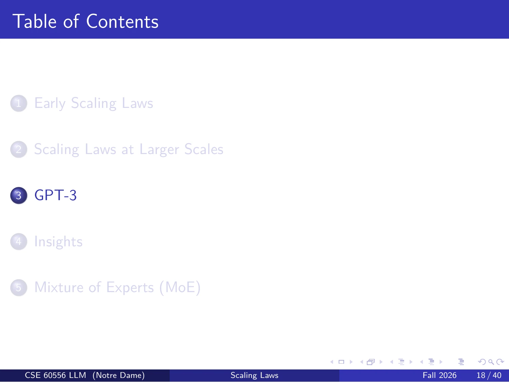{ loading=lazy }](../../assets/llm/section1/04-scaling-icl-moe/page-018.webp)

<details><summary>展开本页文字</summary>
<pre style="white-space:pre-wrap;overflow-wrap:anywhere">Table of Contents
1 Early Scaling Laws
2 Scaling Laws at Larger Scales
3 GPT-3
4 Insights
5 Mixture of Experts (MoE)</pre>
</details>

### 019 · Applying Scaling Laws: Model Size and Datasets

[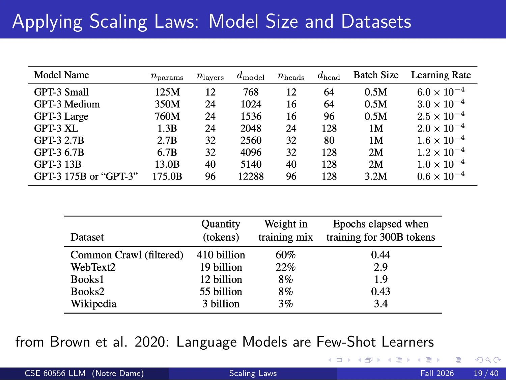{ loading=lazy }](../../assets/llm/section1/04-scaling-icl-moe/page-019.webp)

<details><summary>展开本页文字</summary>
<pre style="white-space:pre-wrap;overflow-wrap:anywhere">Applying Scaling Laws: Model Size and Datasets
from Brown et al. 2020 : Language Models are Few-Shot Learners</pre>
</details>

### 020 · Applying Scaling Laws: Crazy FLOPs

[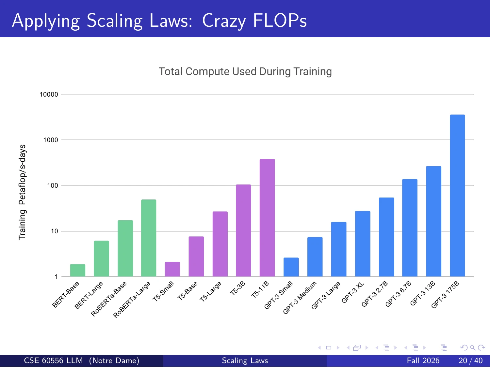{ loading=lazy }](../../assets/llm/section1/04-scaling-icl-moe/page-020.webp)

<details><summary>展开本页文字</summary>
<pre style="white-space:pre-wrap;overflow-wrap:anywhere">Applying Scaling Laws: Crazy FLOPs</pre>
</details>

### 021 · Smooth Scaling on Language Modeling

[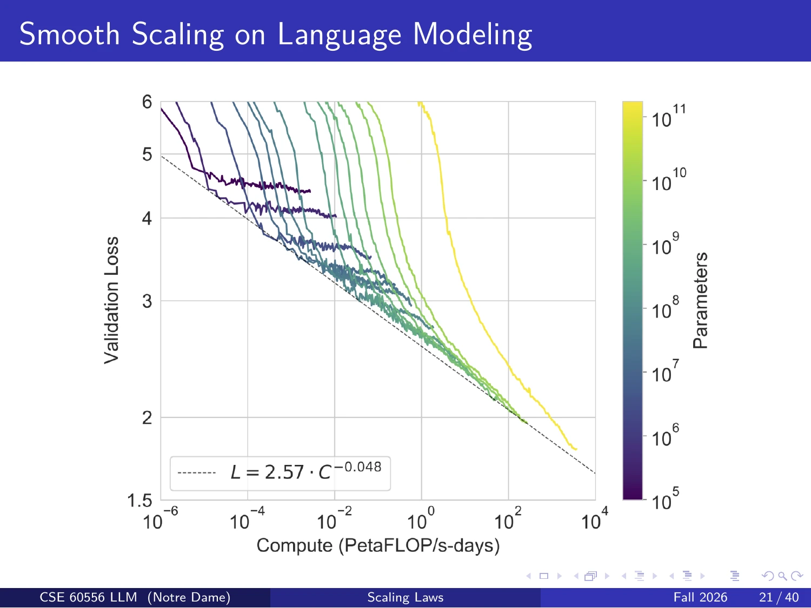{ loading=lazy }](../../assets/llm/section1/04-scaling-icl-moe/page-021.webp)

<details><summary>展开本页文字</summary>
<pre style="white-space:pre-wrap;overflow-wrap:anywhere">Smooth Scaling on Language Modeling</pre>
</details>

### 022 · In-Context Learning (ICL)

[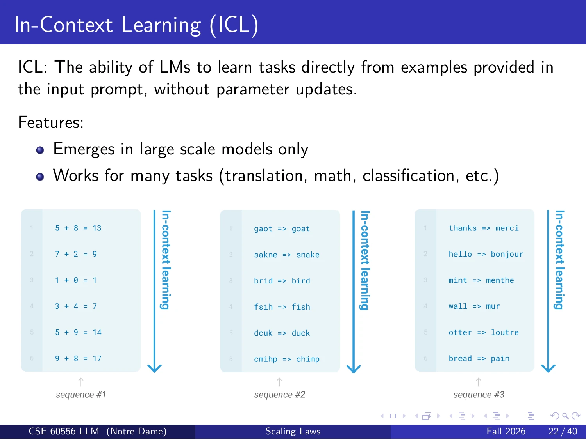{ loading=lazy }](../../assets/llm/section1/04-scaling-icl-moe/page-022.webp)

<details><summary>展开本页文字</summary>
<pre style="white-space:pre-wrap;overflow-wrap:anywhere">In-Context Learning (ICL)
ICL: The ability of LMs to learn tasks directly from examples provided in
the input prompt, without parameter updates.
Features:
Emerges in large scale models only
Works for many tasks (translation, math, classification, etc.)</pre>
</details>

### 023 · In-Context Learning (ICL)

[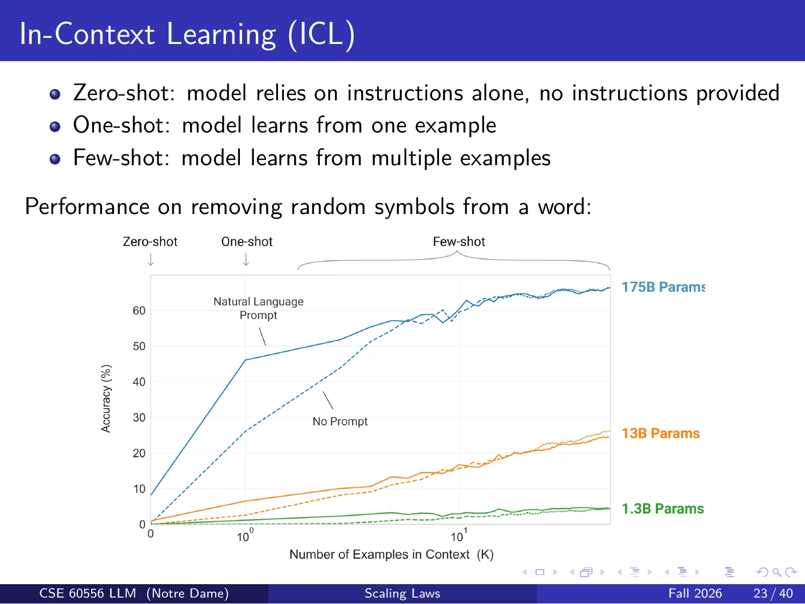{ loading=lazy }](../../assets/llm/section1/04-scaling-icl-moe/page-023.webp)

<details><summary>展开本页文字</summary>
<pre style="white-space:pre-wrap;overflow-wrap:anywhere">In-Context Learning (ICL)
Zero-shot: model relies on instructions alone, no instructions provided
One-shot: model learns from one example
Few-shot: model learns from multiple examples
Performance on removing random symbols from a word:</pre>
</details>

### 024 · ICL emerges in large models, aggregated across 42 tasks

[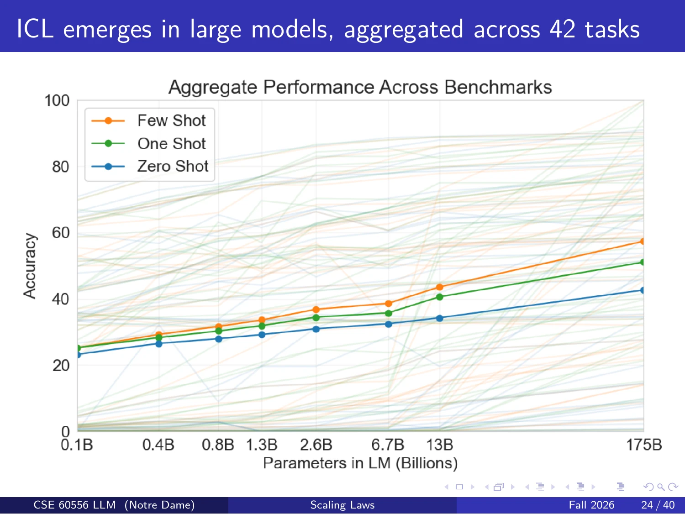{ loading=lazy }](../../assets/llm/section1/04-scaling-icl-moe/page-024.webp)

<details><summary>展开本页文字</summary>
<pre style="white-space:pre-wrap;overflow-wrap:anywhere">ICL emerges in large models, aggregated across 42 tasks</pre>
</details>

### 025 · On Open-Domain Question Answering: TriviaQA

[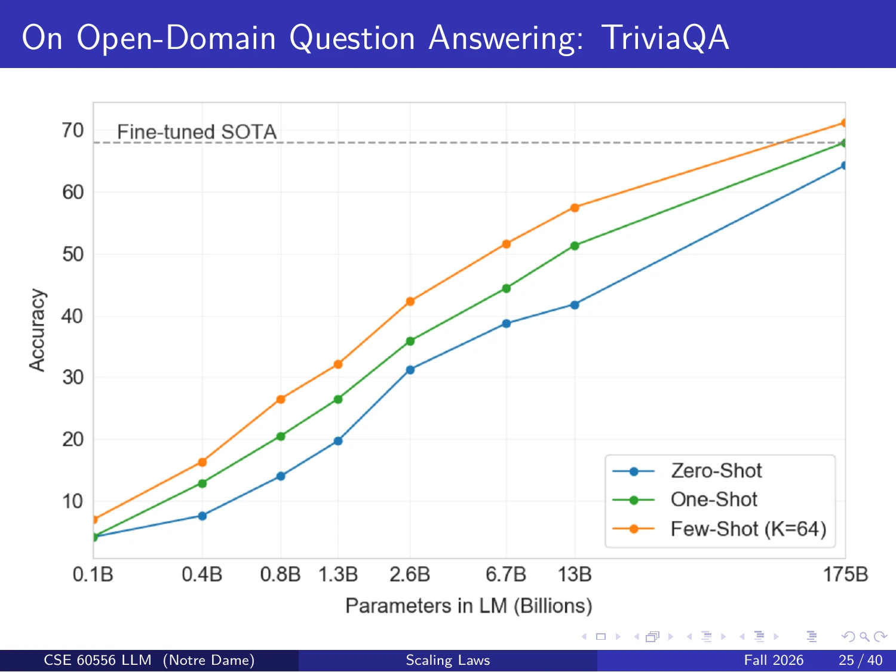{ loading=lazy }](../../assets/llm/section1/04-scaling-icl-moe/page-025.webp)

<details><summary>展开本页文字</summary>
<pre style="white-space:pre-wrap;overflow-wrap:anywhere">On Open-Domain Question Answering: TriviaQA</pre>
</details>

### 026 · Table of Contents

[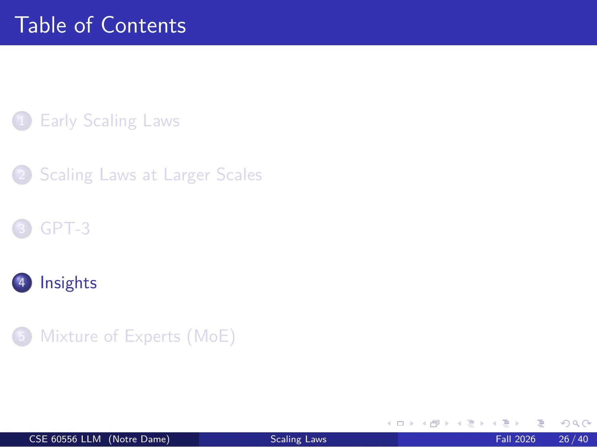{ loading=lazy }](../../assets/llm/section1/04-scaling-icl-moe/page-026.webp)

<details><summary>展开本页文字</summary>
<pre style="white-space:pre-wrap;overflow-wrap:anywhere">Table of Contents
1 Early Scaling Laws
2 Scaling Laws at Larger Scales
3 GPT-3
4 Insights
5 Mixture of Experts (MoE)</pre>
</details>

### 027 · Why ICL works: Meta-Learning Hypothesis

[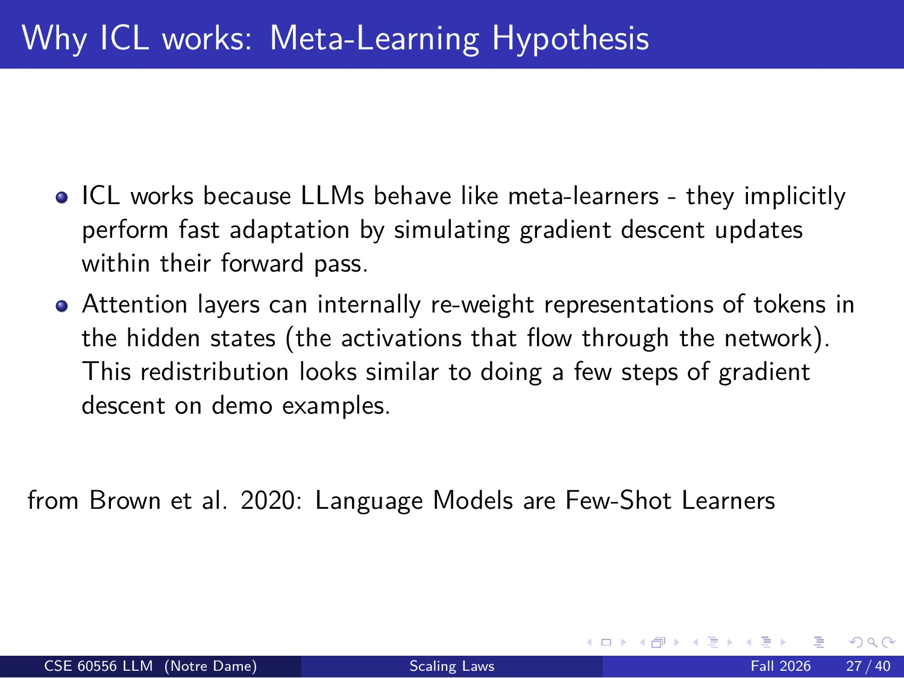{ loading=lazy }](../../assets/llm/section1/04-scaling-icl-moe/page-027.webp)

<details><summary>展开本页文字</summary>
<pre style="white-space:pre-wrap;overflow-wrap:anywhere">Why ICL works: Meta-Learning Hypothesis
ICL works because LLMs behave like meta-learners - they implicitly
perform fast adaptation by simulating gradient descent updates
within their forward pass.
Attention layers can internally re-weight representations of tokens in
the hidden states (the activations that flow through the network).
This redistribution looks similar to doing a few steps of gradient
descent on demo examples.
from Brown et al. 2020 : Language Models are Few-Shot Learners</pre>
</details>

### 028 · Why ICL works: Bayesian Inference View

[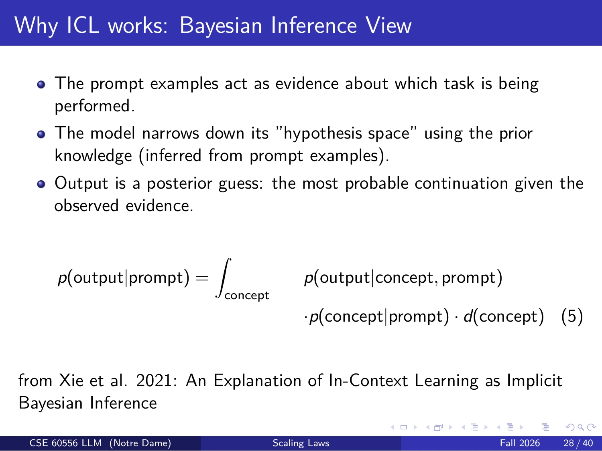{ loading=lazy }](../../assets/llm/section1/04-scaling-icl-moe/page-028.webp)

<details><summary>展开本页文字</summary>
<pre style="white-space:pre-wrap;overflow-wrap:anywhere">Why ICL works: Bayesian Inference View
The prompt examples act as evidence about which task is being
performed.
The model narrows down its ”hypothesis space” using the prior
knowledge (inferred from prompt examples).
Output is a posterior guess: the most probable continuation given the
observed evidence.
p(output|prompt) =
∫
concept
p(output|concept, prompt)
·p(concept|prompt) · d(concept) (5)
from Xie et al. 2021 : An Explanation of In-Context Learning as Implicit
Bayesian Inference</pre>
</details>

### 029 · Emergent Abilities of LARGE Language Models

[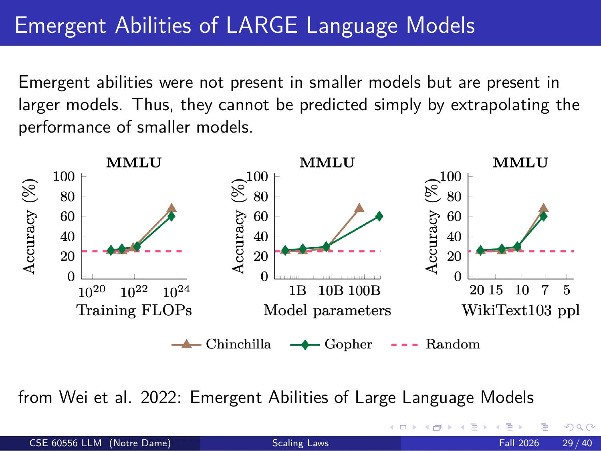{ loading=lazy }](../../assets/llm/section1/04-scaling-icl-moe/page-029.webp)

<details><summary>展开本页文字</summary>
<pre style="white-space:pre-wrap;overflow-wrap:anywhere">Emergent Abilities of LARGE Language Models
Emergent abilities were not present in smaller models but are present in
larger models. Thus, they cannot be predicted simply by extrapolating the
performance of smaller models.
from Wei et al. 2022 : Emergent Abilities of Large Language Models</pre>
</details>

### 030 · Massive Multitask Language Understanding (MMLU)

[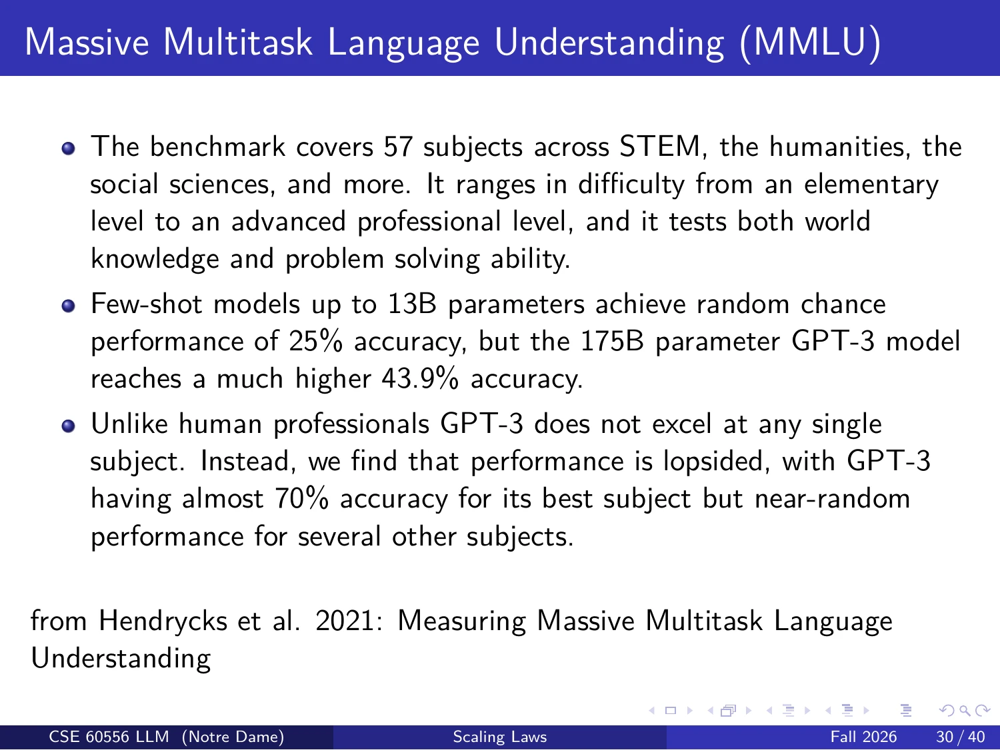{ loading=lazy }](../../assets/llm/section1/04-scaling-icl-moe/page-030.webp)

<details><summary>展开本页文字</summary>
<pre style="white-space:pre-wrap;overflow-wrap:anywhere">Massive Multitask Language Understanding (MMLU)
The benchmark covers 57 subjects across STEM, the humanities, the
social sciences, and more. It ranges in difficulty from an elementary
level to an advanced professional level, and it tests both world
knowledge and problem solving ability.
Few-shot models up to 13B parameters achieve random chance
performance of 25% accuracy, but the 175B parameter GPT-3 model
reaches a much higher 43.9% accuracy.
Unlike human professionals GPT-3 does not excel at any single
subject. Instead, we find that performance is lopsided, with GPT-3
having almost 70% accuracy for its best subject but near-random
performance for several other subjects.
from Hendrycks et al. 2021 : Measuring Massive Multitask Language
Understanding</pre>
</details>

### 031 · Emergent Abilities: More Results

[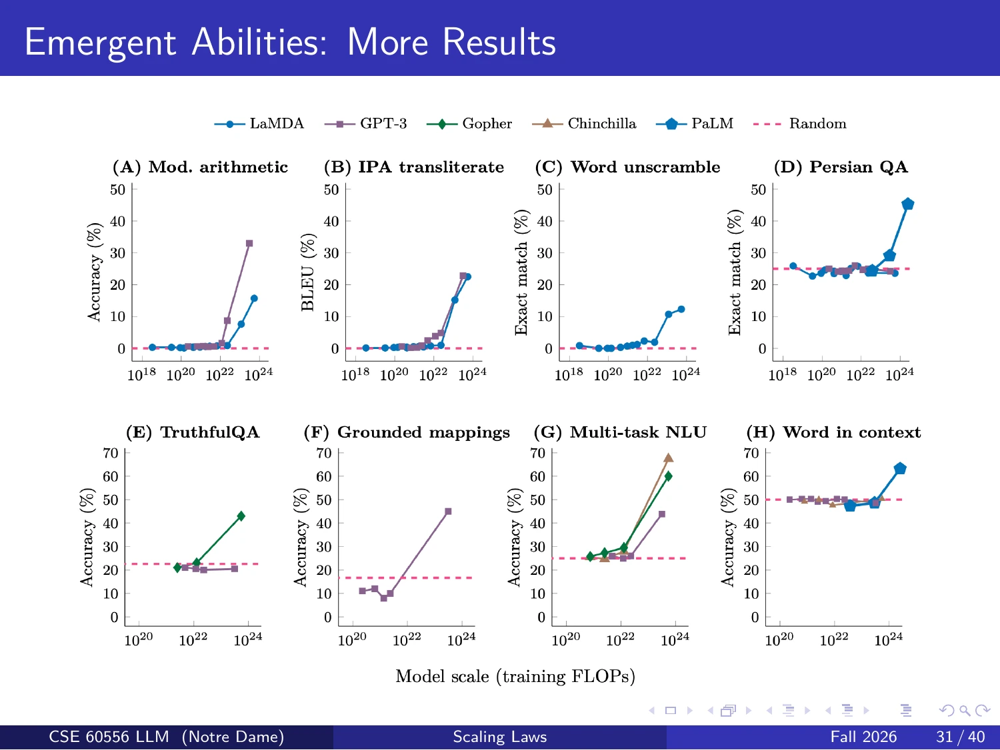{ loading=lazy }](../../assets/llm/section1/04-scaling-icl-moe/page-031.webp)

<details><summary>展开本页文字</summary>
<pre style="white-space:pre-wrap;overflow-wrap:anywhere">Emergent Abilities: More Results</pre>
</details>

### 032 · Table of Contents

[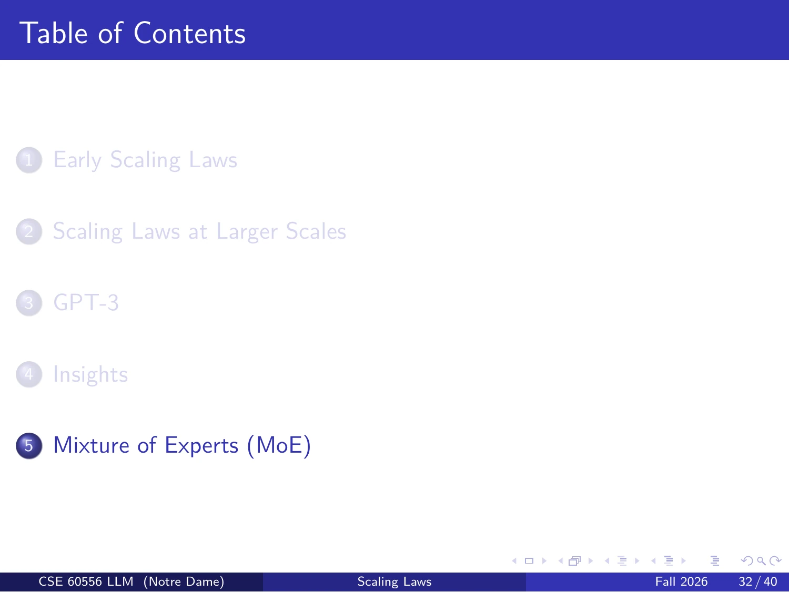{ loading=lazy }](../../assets/llm/section1/04-scaling-icl-moe/page-032.webp)

<details><summary>展开本页文字</summary>
<pre style="white-space:pre-wrap;overflow-wrap:anywhere">Table of Contents
1 Early Scaling Laws
2 Scaling Laws at Larger Scales
3 GPT-3
4 Insights
5 Mixture of Experts (MoE)</pre>
</details>

### 033 · Why MoE?

[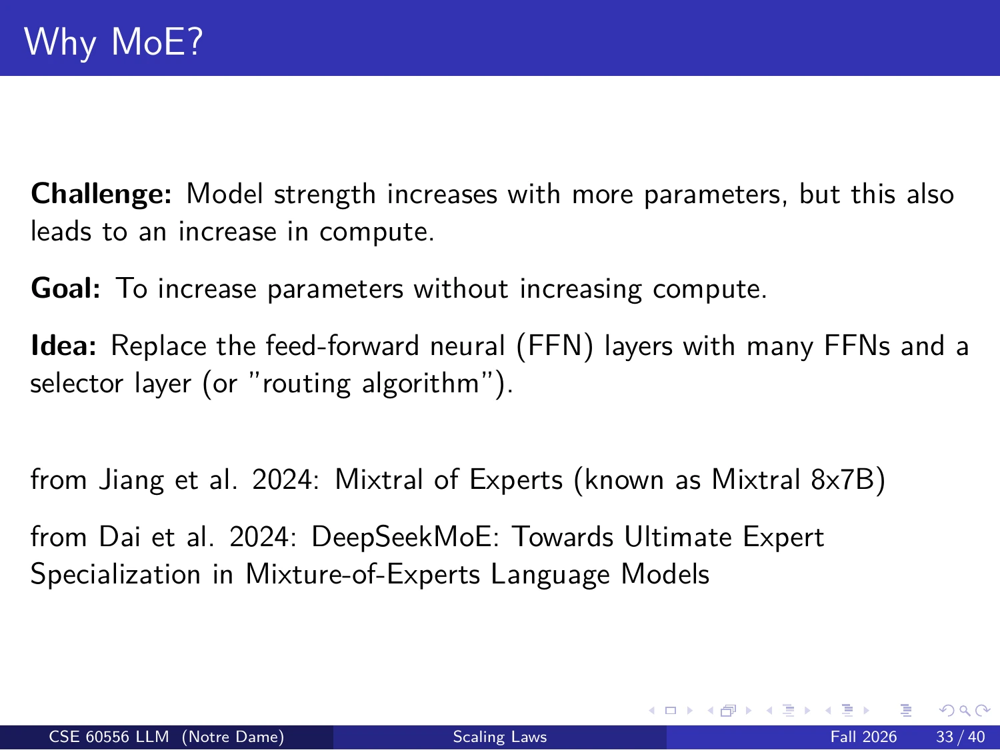{ loading=lazy }](../../assets/llm/section1/04-scaling-icl-moe/page-033.webp)

<details><summary>展开本页文字</summary>
<pre style="white-space:pre-wrap;overflow-wrap:anywhere">Why MoE?
Challenge: Model strength increases with more parameters, but this also
leads to an increase in compute.
Goal: To increase parameters without increasing compute.
Idea: Replace the feed-forward neural (FFN) layers with many FFNs and a
selector layer (or ”routing algorithm”).
from Jiang et al. 2024 : Mixtral of Experts (known as Mixtral 8x7B)
from Dai et al. 2024 : DeepSeekMoE: Towards Ultimate Expert
Specialization in Mixture-of-Experts Language Models</pre>
</details>

### 034 · MoE: Implementation

[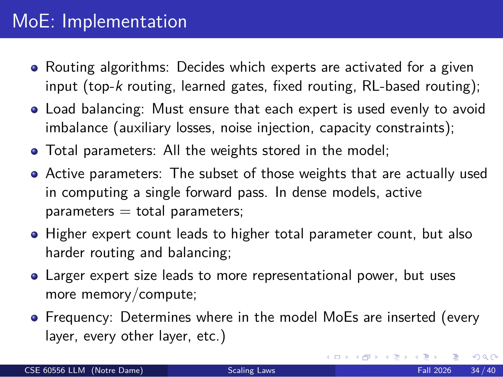{ loading=lazy }](../../assets/llm/section1/04-scaling-icl-moe/page-034.webp)

<details><summary>展开本页文字</summary>
<pre style="white-space:pre-wrap;overflow-wrap:anywhere">MoE: Implementation
Routing algorithms: Decides which experts are activated for a given
input (top- k routing, learned gates, fixed routing, RL-based routing);
Load balancing: Must ensure that each expert is used evenly to avoid
imbalance (auxiliary losses, noise injection, capacity constraints);
Total parameters: All the weights stored in the model;
Active parameters: The subset of those weights that are actually used
in computing a single forward pass. In dense models, active
parameters = total parameters;
Higher expert count leads to higher total parameter count, but also
harder routing and balancing;
Larger expert size leads to more representational power, but uses
more memory/compute;
Frequency: Determines where in the model MoEs are inserted (every
layer, every other layer, etc.)</pre>
</details>

### 035 · Mixtral Model Architecture

[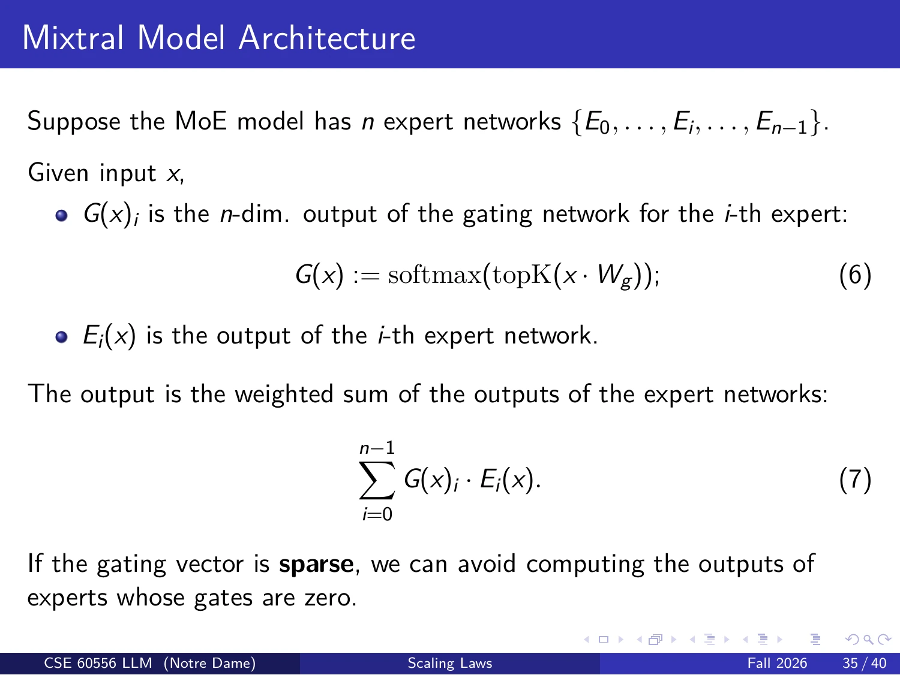{ loading=lazy }](../../assets/llm/section1/04-scaling-icl-moe/page-035.webp)

<details><summary>展开本页文字</summary>
<pre style="white-space:pre-wrap;overflow-wrap:anywhere">Mixtral Model Architecture
Suppose the MoE model has n expert networks {E0, . . . ,Ei, . . . ,En−1}.
Given input x,
G(x)i is the n-dim. output of the gating network for the i-th expert:
G(x) := softmax(topK(x · Wg)); (6)
Ei(x) is the output of the i-th expert network.
The output is the weighted sum of the outputs of the expert networks:
n−1∑
i=0
G(x)i · Ei(x). (7)
If the gating vector is sparse, we can avoid computing the outputs of
experts whose gates are zero.</pre>
</details>

### 036 · Mixtral Results

[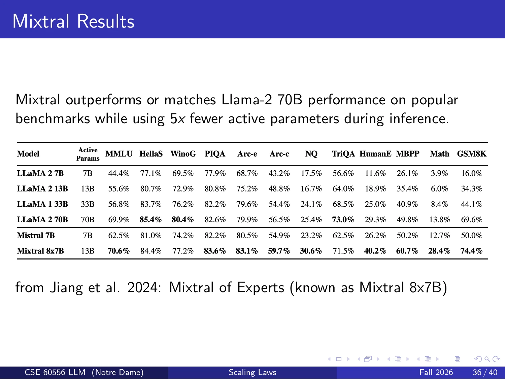{ loading=lazy }](../../assets/llm/section1/04-scaling-icl-moe/page-036.webp)

<details><summary>展开本页文字</summary>
<pre style="white-space:pre-wrap;overflow-wrap:anywhere">Mixtral Results
Mixtral outperforms or matches Llama-2 70B performance on popular
benchmarks while using 5 x fewer active parameters during inference.
from Jiang et al. 2024 : Mixtral of Experts (known as Mixtral 8x7B)</pre>
</details>

### 037 · DeepSeekMoE Results

[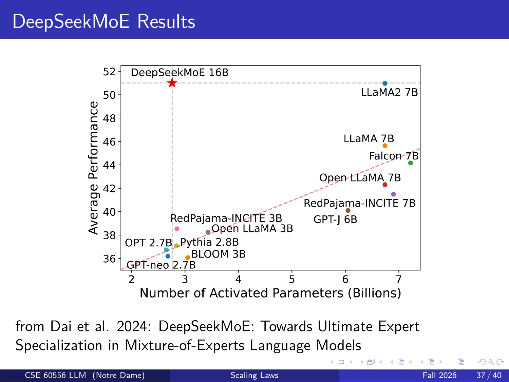{ loading=lazy }](../../assets/llm/section1/04-scaling-icl-moe/page-037.webp)

<details><summary>展开本页文字</summary>
<pre style="white-space:pre-wrap;overflow-wrap:anywhere">DeepSeekMoE Results
from Dai et al. 2024 : DeepSeekMoE: Towards Ultimate Expert
Specialization in Mixture-of-Experts Language Models</pre>
</details>

### 038 · Challenges in MoE

[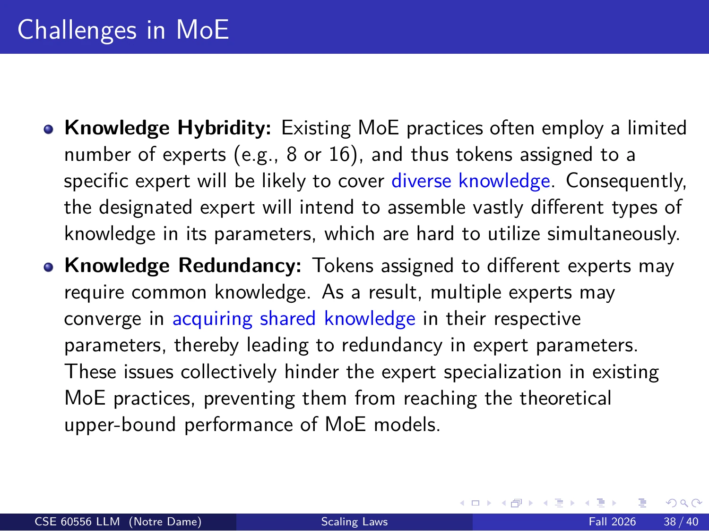{ loading=lazy }](../../assets/llm/section1/04-scaling-icl-moe/page-038.webp)

<details><summary>展开本页文字</summary>
<pre style="white-space:pre-wrap;overflow-wrap:anywhere">Challenges in MoE
Knowledge Hybridity: Existing MoE practices often employ a limited
number of experts (e.g., 8 or 16), and thus tokens assigned to a
specific expert will be likely to cover diverse knowledge. Consequently,
the designated expert will intend to assemble vastly different types of
knowledge in its parameters, which are hard to utilize simultaneously.
Knowledge Redundancy: Tokens assigned to different experts may
require common knowledge. As a result, multiple experts may
converge in acquiring shared knowledge in their respective
parameters, thereby leading to redundancy in expert parameters.
These issues collectively hinder the expert specialization in existing
MoE practices, preventing them from reaching the theoretical
upper-bound performance of MoE models.</pre>
</details>

### 039 · DeepSeekMoE Innovations

[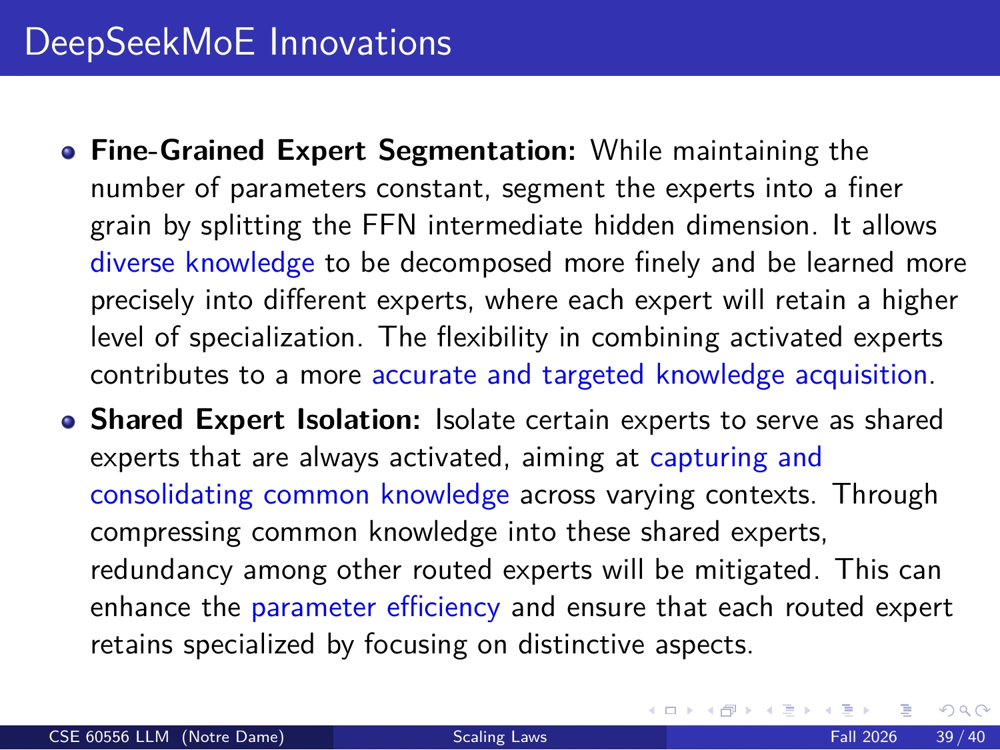{ loading=lazy }](../../assets/llm/section1/04-scaling-icl-moe/page-039.webp)

<details><summary>展开本页文字</summary>
<pre style="white-space:pre-wrap;overflow-wrap:anywhere">DeepSeekMoE Innovations
Fine-Grained Expert Segmentation: While maintaining the
number of parameters constant, segment the experts into a finer
grain by splitting the FFN intermediate hidden dimension. It allows
diverse knowledge to be decomposed more finely and be learned more
precisely into different experts, where each expert will retain a higher
level of specialization. The flexibility in combining activated experts
contributes to a more accurate and targeted knowledge acquisition .
Shared Expert Isolation: Isolate certain experts to serve as shared
experts that are always activated, aiming at capturing and
consolidating common knowledge across varying contexts. Through
compressing common knowledge into these shared experts,
redundancy among other routed experts will be mitigated. This can
enhance the parameter efficiency and ensure that each routed expert
retains specialized by focusing on distinctive aspects.</pre>
</details>

### 040 · Takeaways

[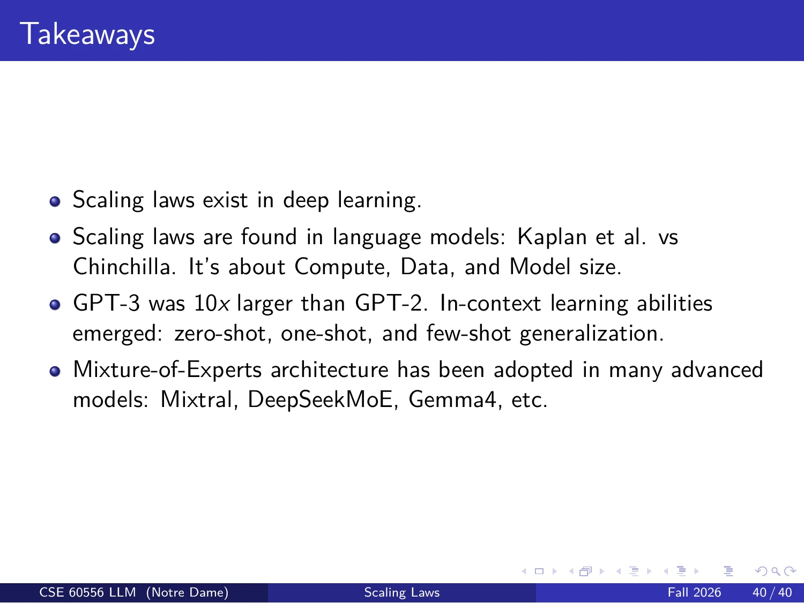{ loading=lazy }](../../assets/llm/section1/04-scaling-icl-moe/page-040.webp)

<details><summary>展开本页文字</summary>
<pre style="white-space:pre-wrap;overflow-wrap:anywhere">Takeaways
Scaling laws exist in deep learning.
Scaling laws are found in language models: Kaplan et al. vs
Chinchilla. It’s about Compute, Data, and Model size.
GPT-3 was 10 x larger than GPT-2. In-context learning abilities
emerged: zero-shot, one-shot, and few-shot generalization.
Mixture-of-Experts architecture has been adopted in many advanced
models: Mixtral, DeepSeekMoE, Gemma4, etc.</pre>
</details>
